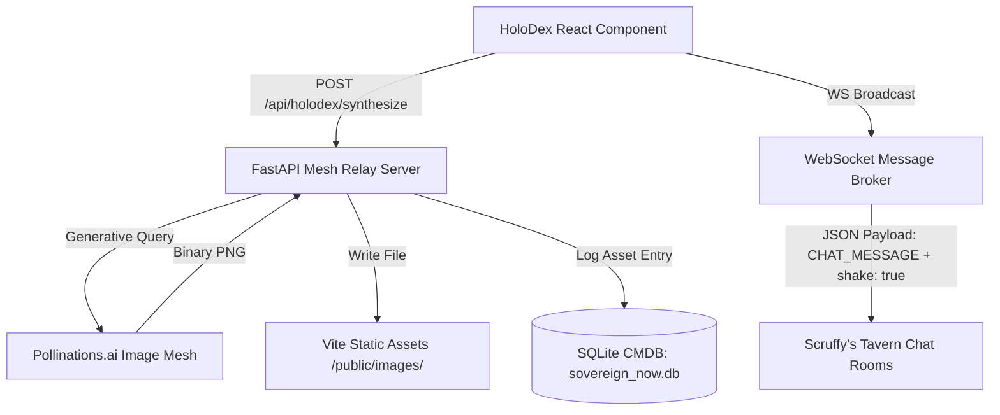

# ✨ HoloDex Omniversal Reality Synthesis Engine
### 📖 System Architecture, User Blueprint & Admin Operations Manual

The **HoloDex Omniversal Reality Synthesis Engine** is a decoupled, high-fidelity real-time media generation and broadcasting pipeline integrated directly into **Sovereign OS FanStack**. It allows the content creator (Pilot) to roleplay, synthesize precog baseball timeline anomalies, and remotely broadcast them with camera-shaking visual tremors directly to active chat taverns (e.g., Mets Tavern, Room `823131`).

---

## 1. System Architecture Overview

The synthesis and broadcast pipeline spans three decoupled layers:



1. **Frontend (Vite / React SPA)**: Mounted under the `HOLODEX` domain (`?domain=HOLODEX&room=holodex`). Handles UI composition, prompt capturing, style selections, rendering dynamic preview bubbles, and spawning direct WebSocket relays.
2. **Backend Engine (FastAPI / `fanstack_relay.py`)**: Runs on port `8000`. Exposes image synthesis REST endpoints, applies custom prompt vibration arrays, fetches generated binaries, manages local file caching, and handles database transactions.
3. **Database (SQLite / CMDB)**: Persists and indexes all synthesized reality artifacts inside the local SQLite database (`sovereign_now.db`) under the `sys_media_asset` table for configuration management and future watch-party playback.

---

## 2. User Guide: The Creator Workflow

### 🗝️ Bypassing Access Gate (VIP Mode)
To access HoloDex without entering civilian or patron access passcodes, append the VIP creator bypass query to the URL:
```text
https://localhost:3009/?domain=HOLODEX&room=holodex&vip=creator
```
This forces the `ExtranetGate` authorization check to register `localStorage.setItem("sov_auth", "unlocked")` and mounts the synthesis console immediately.

### 📝 Crafting Timeline Anomalies
1. **The Core Prompt**: Input your target event in the text area (e.g., *"Pete Alonso hits a legendary 500ft walk-off home run"*).
2. **The Vibe Selection**: Select one of the high-fidelity aesthetic presets:
   * **1990s Felt Puppet**: Jim Henson aesthetic, soft felt textures, physical puppets, and nostalgic VHS grain.
   * **Cinematic Broadcast**: Sleek 8k camera quality, telephoto sports lens, high contrast, photo-realistic.
   * **Action Cam**: GoPro-style wide-angle view, dynamic motion blur, high-octane lens flare.
   * **Gritty Noir**: High-contrast black and white, dramatic shadows, rain-slicked stadium surfaces.
   * **Hyper-Realistic**: Unreal Engine 5 render, ray-tracing, Octane lighting.
   * **Retro 8-Bit**: Flat colors, low resolution pixel-art arcade aesthetics.
   * **Surreal Anime**: Studio Ghibli inspired pastel palettes and ethereal atmospheric lighting.

### ⚡ Engaging the Synthesis Engine
* Click **ENGAGE SYNTHESIS ENGINE**.
* The button updates to `SYNTHESIZING REALITY...` with an active spinner while the FastAPI backend processes the request.
* Within **5–8 seconds**, the **⚡ SYNTHESIZED ANOMALY** preview card will fade in with the finished AI image.

### 🚀 Broadcasting to Mets Tavern (Remotely Shaking the Room)
* Once the image is synthesized, a prominent orange button appears: **⚡ SPAM TO METS TAVERN CHAT (ROOM 823131)**.
* Clicking this button opens a secure, micro-connection over WebSockets directly to the room's mesh relay.
* It posts the image inline with `user: "Precog Creator"` and triggers a **stadium earthquake tremor** on every active client screen in the chat room using the `shake: true` payload parameter.

---

## 3. Admin & Developer Guide: The FastAPI Engine Room

The backend is powered by **FastAPI** inside the core `scripts/fanstack_relay.py` mesh broker.

### 📡 API Endpoint Reference

#### 1. POST `/api/holodex/decode`
* **Purpose**: Simulates the prompt vibration expansion array without fetching the image.
* **Payload**:
  ```json
  {
    "prompt": "Francisco Lindor making a backhanded defensive stop",
    "vibe": "1990s Felt Puppet"
  }
  ```
* **Response**:
  ```json
  {
    "decoded_prompt": "[1990S FELT PUPPET OVERRIDE] Francisco Lindor making a backhanded defensive stop. Aesthetic injection: 1990s physical felt puppet aesthetic, practical effects, Jim Henson style, slight VHS grain. Masterpiece, best quality, highly detailed."
  }
  ```

#### 2. POST `/api/holodex/synthesize`
* **Purpose**: Generates, saves, logs, and returns the finished image.
* **Payload**:
  ```json
  {
    "prompt": "Pete Alonso home run",
    "vibe": "Cinematic Broadcast"
  }
  ```
* **Processing Workflow**:
  1. Resolves aesthetic vibration maps.
  2. Synthesizes a secure, query-escaped URL pointing to the free-tier Pollinations.ai image generator.
  3. Downloads the binary PNG payload synchronously (capped with a 30s timeout).
  4. Saves the binary locally to `15_FanStack/public/images/holodex_[hex8].png` (served static on Vite's router as `/images/holodex_[hex8].png`).
  5. Computes a unique UUID `sys_id` and next-sequence asset tag (e.g. `FS-MED-00042`).
  6. Inserts a new record into `sys_media_asset` SQLite table for full CMDB traceability.
* **Database CMDB Schema Registration**:
  ```sql
  INSERT INTO sys_media_asset (
    sys_id, asset_tag, name, file_name, file_path, 
    file_size_bytes, mime_type, category, status, md5_hash
  ) VALUES (
    'a2c3...', 'FS-MED-00042', 'HoloDex Synthesis: Pete Alonso...',
    'holodex_8a9f2.png', '/home/james/SovereignOS/15_FanStack/public/images/holodex_8a9f2.png',
    1048576, 'image/png', 'HoloDex', 'Generated: Cinematic Broadcast', 'a2c3...'
  );
  ```
* **Response**:
  ```json
  {
    "status": "success",
    "mediaUrl": "/images/holodex_8a9f2.png",
    "decoded_prompt": "Pete Alonso home run. Aesthetic: Cinematic 8k broadcast quality...",
    "filename": "holodex_8a9f2.png"
  }
  ```

---

## 4. WebSocket Payload Contracts

To trigger remote shaking and inline graphics without manual chat posts, the HoloDex React client transmits the following JSON packet directly to `ws://localhost:8008`:

```json
{
  "type": "CHAT_MESSAGE",
  "user": "Precog Creator",
  "color": "#f97316",
  "text": "⚡ NEW HOLODEX PRECÒG BROADCAST: \"Pete Alonso crushes a legendary walk-off...\"",
  "mediaUrl": "/images/holodex_8a9f2.png",
  "shake": true,
  "target_game_pk": "823131"
}
```

### 🛠️ Key Parameters for Custom Ingress Integration:
* `mediaUrl`: Relative path `/images/holodex_[id].png` which resolves natively in Vite's assets.
* `shake`: Set to `true` to immediately trigger CSS `.shake-room` animation classes across all active subscriber sessions.
* `target_game_pk`: Specifies the active chat room channel (e.g. `823131` for NYM vs SEA).

---

## 5. Operations & Service Management

### 🔄 Restarting the FastAPI Backend Mesh
If you make changes to the endpoints inside `scripts/fanstack_relay.py`, reload the service cleanly using:
```bash
# Find and terminate existing relay process
pkill -f fanstack_relay.py

# Restart in the background, logging to /tmp/relay.log
nohup /home/james/SovereignOS/.venv/bin/python3 /home/james/SovereignOS/scripts/fanstack_relay.py > /tmp/relay.log 2>&1 &
```

### 📁 CMDB SQLite Database Inspections
To query your newly generated and registered HoloDex assets from the terminal, run:
```bash
sqlite3 /home/james/SovereignOS/db/sovereign_now.db "SELECT asset_tag, name, category, status FROM sys_media_asset WHERE category = 'HoloDex' ORDER BY asset_tag DESC LIMIT 5;"
```

---
> [!TIP]
> **Performance Tuning**: Since Pollinations.ai is a synchronous network hop, the `/api/holodex/synthesize` call is blocking. The FastAPI app processes this asynchronously through an `async def` wrapper so it does not block the WebSocket message broker loop.
