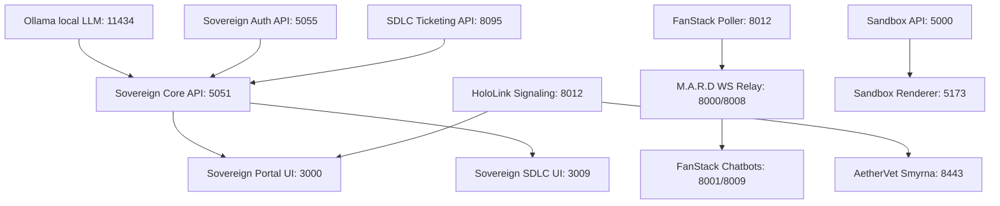

# 🧬 SOVEREIGN DNA v5.0 (DISASTER RECOVERY BLUEPRINT)
**Location:** `/home/james/SovereignOS/dna/SOVEREIGN_DNA.md`

This document serves as the absolute, non-narrative, declarative architecture blueprint for Sovereign OS. It contains zero historical commentary or dated session entries. If the entire stack were destroyed, this document provides the exact blueprint and rebuild sequence to restore operational state from bare metal.

---

### 1. NODE TOPOLOGY

| Node Name | Tailscale IP | LAN IP / Type | Role & Services |
| :--- | :--- | :--- | :---| **`clio`** | `100.73.155.70` | Workstation | **Central Server / Primary Worker**. Runs the Sovereign Portal, SDLC Ticketing Backend, FastAPI Admin/Core APIs, M.A.R.D WebSocket Engine, and FanStack sports telemetry loops. |
| **`argo`** | `100.123.68.9` | `192.168.1.75` / Kiosk | **Entertainment & Vision Kiosk**. Runs Sovereign Cinema player, `launch_cinema` Chromium instance, and the Hailo AI feed camera (`argo-vision-cam`). |
| **`metsy-prime`**| `100.104.239.107` | `192.168.1.155` / Kiosk | **Cozy Card Kiosk**. Runs Catnip Wars kiosk full screen on TV, serving the 16-bit Emergent World Ledger. |
| **`hobbes`** | `100.88.5.122` | Host Node | General mesh node; designated hardware migration target. |
| **`calvin`** | `100.77.60.67` | Host Node | General mesh node; running persistent local backup loops and GardenStack camera streams. |
| **`pegasus`** | `100.90.6.117` | Host Node | Host daemon node. |
| **`grogu`** | `100.77.138.27` | Host Node | Micro-services worker. |
| **`artemis`** | `100.70.84.19` | Host Node | Secondary telemetry daemon runner. |
| **`mando`** | — | `192.168.1.116` | Active hardware watchdog / alerting ping-node. |
| **`Android-2`**| — | `192.168.1.111` | Local mobile command telemetry. |
| **`stimpy`** | — | `192.168.1.186` | Legacy hardware node (DEPRECATED). |

---

### 2. PORT MANIFEST

| Port | Service Name | Process Name / Backend | Purpose |
| :--- | :--- | :--- | :--- |
| **`3000`** | StackLabs LLC Gateway | Vite / React Frontend | Main gateway and prospect portal homepage. |
| **`3004`** | SamTracker Frontend | Vite / React Frontend | Active sports/simulation telemetry tracker frontend. |
| **`3008`** | Sovereign Cinema UI | Vite / React Frontend | Media and playback control interface (reverse proxy masked). |
| **`3009`** | Sovereign SDLC UI | Vite / React Frontend | SDLC Ticket tracking and administration workspace. |
| **`3010`** | Sovereign Sports / FanStack | Vite / React Frontend | Sovereign Sports Fan Portal (Sovereign Oracle) and Creator Portal (Playcall Desk). Standardized with vertical collapsible navigation rail and state-driven drawers (Umpire Node). |
| **`8443`** | AetherVet Telemedicine | Vite / React Frontend | AetherVet Smyrna clinical patient and medicine tracker (port 8443). |
| **`3016`** | Sovereign OS Portal | Vite / React Frontend | Sovereign OS workspace and application launcher dashboard (defaults to Clio Cockpit; Comet Messenger nested as Power Tool). |
| **`3017`** | Storybook Station Portal | Vite / React Frontend | Eileen's Storybook Station daily hub portal. |
| **`3020`** | Barb's Stack | Vite / React Frontend | Barb's Personal Cockpit, Smyrna Sentinel delivery tracker & active stacks. |
| **`3022`** | Clio Cockpit Dashboard | Vite / React Frontend (HTTPS) | Clio Cockpit System Dashboard (Tailscale SSL secured, local ws/api proxies). |
| **`3023`** | Sovereign Knot Core Gateway | FastAPI / Python (HTTPS) | Decoupled Sovereign Knot Core Consensus and Simulator Showcase gateway. |
| **`3026`** | Tesseract Stack Card | Next.js / React Frontend | Interactive 4D Tesseract Baseball Card staging engine. |
| **`3027`** | JIT Mobile Approval Gateway | FastAPI / Python (HTTPS) | JIT mobile-responsive approval gate and email command poller. |
| **`7300`** | Catnip Wars Sandbox | Vite / React | 16-bit emergent World Ledger and active Catnip Wars board interface. |
| **`5051`** | Sovereign OS Core | FastAPI / Python | Core OS system orchestration API. |
| **`5055`** | Sovereign OS Auth | FastAPI / Python | Identity and session token validation server. |
| **`5056`** | Sovereign Admin API | FastAPI / Python | Low-level administrative commands and node telemetry. |
| **`8000`** | M.A.R.D REST API | FastAPI / Python | Multi-Agent Real-Time Discourse sports telemetry and metadata REST API. |
| **`8001`** | Masters Relay / Ingress | FastAPI / Python | Ingress proxy serving Butler Cabin HTML views & proxying /ws connection. |
| **`8008`** | M.A.R.D WebSockets | FastAPI / Python | Live real-time WebSocket comment stream and simulated sports chatrooms. |
| **`8009`** | Masters WebSocket Stream | Python WS Daemon | Backend WebSocket server streaming golf/simulator telemetry. |
| **`8012`** | HoloLink Signaling WS | Python Daemon | WebRTC signaling, queue routing, and presence tracking daemon. |
| **`8015`** | Comet Relay WS | Python Daemon | Sputnik Comet-90 retro radio relay messaging, provisions, and priority alerts server. |
| **`8085`** | Sovereign Cinema API | FastAPI / Python | Pipelines media lists and handles HTTP Range video streaming. |
| **`8095`** | SDLC Ticketing API | FastAPI / Python | Backend engine serving tickets, attachments, and the integrated SDLC Portal. |
| **`8097`** | Sovereign Stream Relay | FastAPI / Python | Overrides and routes external HLS live stream links (.m3u8) for active watch parties. |
| **`8090`** | Sovereign Core Monolith | FastAPI / Python | Unified endpoint API monolith exposing prompt decoders, macro matrix, self-healing voice routers, Cinema TV Request & SABnzbd Queue Tunneling APIs, and the Sovereign Knowledge Base REST API (exposing full CRUD runbook ingestion at /api/system/kb). |
| **`8088`** | Sovereign Dead Drop | Flask / Python | Air-gapped gateway for media and logs ingestion (Tailscale proxied). |
| **`5000`** | Sandbox Admin API | Flask / Python | Sandbox Catnip Wars dynamic endpoints and SQLite card image mutations. |
| **`11434`**| Ollama Local LLM | Ollama Engine | Local LLM host for fallbacks. |
| **`4001`** | Govee LAN Scan | UDP Broadcast Scan | Temporary port used to scan for local Govee lights. |
| **`4002`** | Govee Status Receiver | UDP Status Listener | Listens for incoming color and status responses from local Govee devices. |
| **`4003`** | Govee LAN API | UDP Command Target | Command target port used to send colorWC and status queries to living room lights. |
| **`4005`** | PGA Ingest Daemon | Python UDP Listener | Listens for UDP PGA golf tournament telemetry and leaderboard payloads. |


---

### 3. FILE SYSTEM MAP

| Directory / File Path | Target Purpose |
| :--- | :--- |
| `/home/james/SovereignOS` | **Primary Production Worktree Root** |
| `/home/james/SovereignOS/18_BarbStack` | **Barb's Stack Workspace** — Standalone React + Tailwind client portal for Barb's Personal Cockpit. |
| `/home/james/SovereignOS/sovereign_knot_core/` | **Sovereign Knot Core Workspace** — Decoupled directory containing consensus engine (`sovereign_knot.py`), simulator, local SQLite database, and FastAPI gateway. |
| `/home/james/SovereignOS/24_TesseractStack` | **Tesseract Stack Workspace** — Standalone Next.js app serving the interactive 4D Tesseract baseball card timeline scrubber. |
| `/home/james/SovereignOS/avatars/` | **Canonical Avatars Directory** — Single location on Clio holding all character and advocate avatar assets, with relative symlinks pointing here from all frontend outposts. |
| `/home/james/SovereignOS-sandbox` | **Strict Sandbox Environment Worktree Root** |
| `/home/james/SovereignOS/dna/` | **Master Architectural Ledger Directory** |
| `/home/james/SovereignOS/dna/docs/` | **Canonical Documentation Directory** — Universal repository for all system user guides, architecture overviews, and component manuals. |
| `/home/james/SovereignOS/dna/sovereign_now.db` | **Singular SQLite Database (Canonical Path - KI-038)** |
| `/home/james/SovereignOS/dna/sovereign_dna_2026.md` | **2026 MLB Season DNA Ground-Truth Baseline File** |
| `/home/james/SovereignOS/dna/notebook_lm_instructions.md` | **NotebookLM generic multi-team & persona-aware prompt instructions** |
| `/home/james/SovereignOS/dna/medical_vault/` | **Smyrna Medical Vault** — Local clinical records directory structure (labs, oncology, scans, medication). |

---

### 3.1 SYSTEM DOCUMENTATION STANDARDS

To prevent fragmented document discovery and maintenance rot, all team members and AI agents must adhere to the following rules for system documentation:

1. **Storage Location:** All technical documentation, user guides, component descriptions, and architectural manuals MUST be stored directly in `/home/james/SovereignOS/dna/docs/`.
2. **Flat Structure:** Storing documentation in subdirectories (e.g., `ui_guides/`, `components/`) is strictly forbidden. The directory structure of `dna/docs/` must remain flat.
3. **Naming Convention:** Filenames should be uppercase, descriptive, and use underscores (e.g., `HOLOLINK_README.md`, `DATABASE_SCHEMA.md`).
4. **Maintenance:** When a module, port, or schema is added or modified, the developer/agent must update or create the corresponding guide file in `dna/docs/` during the same sprint.

| `/home/james/SovereignOS/scripts/generate_onboarding_pdf.py` | **Genesis PDF Onboarding Report Compiler** |
| `/home/james/SovereignOS/scripts/generate_metsy_adventures_daily.py` | **Metsy Daily Adventure Generator** — Generates daily comic narrative illustration assets for Metsy Smyrna Heights using `metsy_anchor_2d.png` as visual style anchor and distributes them dynamically. |
| `/home/james/SovereignOS/scripts/ingest_medical_vault.py` | **Medical Vault Ingestion Daemon** — Sweeps vault directories and registers new records in sovereign_now.db. |
| `/home/james/SovereignOS/scripts/uat_headed_runner.py` | **Headed Playwright UAT Test Runner on DISPLAY=:0** |
| `/home/james/SovereignOS/scripts/generate_universal_advocate.py` | **Universal Advocate Generator ("The Wildcard Forge")** — Decoupled Vertex AI script synthesizing complete advocate JSON profiles. |
| `/home/james/SovereignOS/scripts/advocate_forge.py` | **Advocate Emote Forge** — Generates tactical visual emotes (avatar, pointing, shrug) in target style. |
| `/home/james/SovereignOS/scripts/productivity_reporter.py` | **Productivity Reporter** — SQLite and git log analyzer to calculate project velocity comparison. |
| `/home/james/SovereignOS/scripts/sovereign_pull_sync.sh` | **Unified Work Order Ingestion Sync Script** — Replaced legacy `pull_work_orders.sh` to pull Google Drive work orders, handle document conversions, and activate local Sorting Hat parser in Python virtual environment. |
| `/home/james/SovereignOS/scripts/auto_image_generator.py` | **Ghost Pitch Whiff Image Generator** — Draws dark-mode, neon-styled 2D wireframe plots of swing and pitch paths. |
| `/home/james/sovereign_inbox/` | **Session Inbox and Active Sprint Workspace** |
| `/home/james/sovereign_inbox/today/` | **Active Operational Date Symlink Folder** |
| `/home/james/sovereign_inbox/pilot_drops/` | **Pilot Staging Ground** — Central server directory for the Pilot's manual file uploads, downloads, and custom notes before sync processing. |
| `/home/james/SovereignOS/apps/samtracker/backend/watchers/raw_upload_watcher.py` | **SamTracker Comic Watcher Daemon** — Python watchdog script monitoring raw image uploads and executing the style transfer + prompt compiler pipeline. |
| `/home/james/SovereignOS/apps/samtracker/storage/raw_uploads/` | **SamTracker Raw Uploads Storage** — Destination directory for raw image uploads that triggers the Comic Factory pipeline. |
| `/home/james/SovereignOS/14_SamTracker/public/media/` | **SamTracker Media Directory** — Holds the generated 5-panel comic strip images. |
| `sovereign_os:` | **GDrive Sync Remote (rclone)**: mapped to `sovereign.os.v1@gmail.com`. Owns session reports, DNA updates, walkthroughs, UAT reports, boot/shutdown logs, and inbox drops. |
| `gdrive:` | **GDrive Sync Remote (rclone)**: mapped to `sovereign.fanstack@gmail.com`. Owns sports game room logs, poller/relay logs, persona caches, and all code under `15_FanStack/`. |

---

### 4. DATABASE SCHEMA

The canonical SQLite state database is `/home/james/SovereignOS/dna/sovereign_now.db`.

| Table Name | Description | Status |
| :--- | :--- | :--- |
| **`sovereign_tickets`** | Holds standard ITSM tickets (STRY, DFCT, ENHC, INC). Exclusively replaces the legacy individual tables. | **ACTIVE** |
| **`cmdb_ci`** | Configuration Items registry for hardware nodes, application processes, and camera feeds. | **ACTIVE** |
| **`cmdb_ci_hardware`** | Physical node hardware metadata (mac_address, ip_address, serials). | **ACTIVE** |
| **`cmdb_ci_appl`** | Deployed software processes, ports, and automated systemd execution parameters. | **ACTIVE** |
| **`sys_module`** | Decoupled sub-application registry mapping active/inactive module configuration states. | **ACTIVE** |
| **`game_chat`** | Text logs and user chat messages for all sports simulation rooms. | **ACTIVE** |
| **`game_context`** | Real-time live baseball data caches (balls, strikes, play-by-play, inning, flags). | **ACTIVE** |
| **`mlb_schedule`** | Schedules, active slates, and daily game records. | **ACTIVE** |
| **persona** | Active AI agent persona metadata, prompt instructions, allegiances, local model overrides, and JSON canned takes (canned_takes column). | **ACTIVE** |
| **`sys_user`** | System user database for authentication, login hashes, and profile badges. | **ACTIVE** |
| **`sys_user_grmember`** | Group members mapping human and AI profile permissions to active simulation rooms. | **ACTIVE** |
| **`sys_attachment`** | Universal files and walkthrough logs bound to tickets. | **ACTIVE** |
| **`sys_sdlc_task`** | System-level automation tasks (TASKxxxxxxx) registered as staged integration workflows. | **ACTIVE** |
| **`sys_media_asset`** | Multi-modal seeder assets (logos, banners, reference sheets) mapping base64 strings to active ws_factions and brands. | **ACTIVE** |
| **`rpg_factions`** | Sandbox factions mapping the 4 core ideological sockets (Decentralist, Speculator, Nihilist, Catalyst). | **ACTIVE** |
| **`rpg_world_state`** | Sandbox entity grid locations, active zones, tension levels, and custom image configurations (`custom_image`). | **ACTIVE** |
| **`rpg_agent_memory`** | Sandbox cognitive memories and ideological alignment weights. | **ACTIVE** |
| **`catnip_wars_comic_assets`** | Stores character pose assets mapping to cloud-cached CDN edge URLs under V1.0 Asset CDN Protocol. | **ACTIVE** |
| **`samtracker_comic_strips`** | Stores metadata and image paths for the 5-panel Generative Comic Factory comic strips, with update triggers. | **ACTIVE** |
| **`sovereign_medical_vault`** | Holds registered clinical records and local file system ledger paths for Smyrna care coordination. | **ACTIVE** |
| **`govee_active_alerts`** | Maintains active and acknowledged physical alert states for caregiver signals. | **ACTIVE** |
| **`pga_active_leaderboard`** | Maintains active PGA player scores and positions for Amen Corner simulator. | **ACTIVE** |
| **`pga_tournament_telemetry`** | Stores spatial telemetry coordinates and speed for golf shots. | **ACTIVE** |
| **`system_cron_config`** | Configures time intervals and properties for scanning cron tasks (such as poll intervals). | **ACTIVE** |
| **`u_web3_pricing_ingress`** | Layer 2 pricing rifts telemetry database for rotational failover logs. | **ACTIVE** |
| **`u_sys_approval_queue`** | Just-In-Time (JIT) mobile and email approval plan queue records. | **ACTIVE** |

| **`rm_story`** | Legacy ticket storage table. | **DEPRECATED (DO NOT WRITE)** |
| **`rm_defect`** | Legacy defect storage table. | **DEPRECATED (DO NOT WRITE)** |
| **`rm_enhancement`** | Legacy enhancement storage table. | **DEPRECATED (DO NOT WRITE)** |


---

### 5. ARCHITECTURAL LAWS (INVARIANTS)

*   **KI-001: Tailscale DNS Mandate**  
    Hardcoding local IP addresses (e.g. `192.168.1.x`) is strictly BANNED in all active code and configurations. All internal endpoints and proxy routes must resolve via Tailscale MagicDNS hostnames (e.g. `clio.taila01894.ts.net`).
*   **KI-038: SQLite Canonical Path Invariant**  
    The database resides exclusively at `/home/james/SovereignOS/dna/sovereign_now.db`. Direct queries targeting `/home/james/SovereignOS/sovereign_now.db` are strictly prohibited.
*   **KI-039: Mandatory Ticket Closure Protocol**  
    Every completed ticket MUST execute the full 3-step closure pipeline before declaration:
    1. Send `PUT` request to `/api/tickets/{number}` setting state = 4 (Resolved) with comprehensive work notes.
    2. Write a detailed `walkthrough.md` to `/home/james/sovereign_inbox/`.
    3. `POST` the walkthrough file as a multipart attachment directly to `/api/tickets/{number}/attachments`.
*   **KI-030: Decoupled Architecture Mandate**  
    New applications must be built as standalone directories running on dedicated ports, never integrated as sub-folders inside the main Sovereign OS Portal code structure.
*   **KI-031: Global Environment Banner Mandate**  
    All decoupled micro-frontends MUST display the dynamic environment pill (DEV/UAT/PROD) and user dropdown chip in their main header layouts.
*   **KI-034: Native Code Patch Mandate**  
    Do not use lazy symlinks to resolve broken hardcoded paths. All path fixes must be made natively in the source codebase.
*   **KI-036: Ironclad Visual Verification Audit**  
    Do not declare a portal or layout complete based on local build outputs alone. Use a browser subagent to render the actual external Tailscale URL, verifying zero console errors or broken assets.
*   **KI-004: Anti-Apology & Test Before Handover Invariant**  
    AI assistants are strictly forbidden from using the phrases *"absolutely right"* or *"I apologize"*. Ground all statements in verified terminal outputs, and test external links via curl before handover.
*   **KI-008: SDLC Walkthrough Attachment Law**  
    Every ticket marked resolved must contain its matching walkthrough artifact registered under `sys_attachment` bound to that ticket number.
*   **KI-021: Vite HSTS Handoff Warn Invariant**  
    When Vite HTTPS links are generated, warn the Pilot that standard browsers will block self-signed certificates and they must type `thisisunsafe` directly on the blank page to force HSTS bypass.
*   **KI-022: Proactive System Diagnostics (Mando Doctrine)**  
    All system service failures and daemon outages must generate an explicit `INC` ticket in `sovereign_now.db` via alerting watchdogs instead of silent, unlogged healing restarts.
*   **KI-023: Proactive Ticket Creation Law**  
    When starting a new initiative, feature, or structural refactoring, the Agent must proactively create a tracking ticket inside `sovereign_tickets` before writing any code.
*   **KI-027: Mandate Execution Verification Invariant**  
    The Agent MUST execute and test code in the actual environment before informing the user that a task is complete.
*   **KI-028: No Blind Handoffs Invariant**  
    Never hand off untested code. Run the execution command yourself to verify there are no missing dependencies or errors.
*   **KI-029: The Prove It Works Doctrine**  
    Before ending a turn, you must have empirical proof in your terminal output that the solution functions as intended.
*   **KI-032: The Fluid Viewport & Zoom Invariant (Mobile-First Responsive Mandate)**  
    All portals, rooms, and dashboards MUST support dynamic browser zoom (up to 250%) and mobile viewport ratios without clipping, text truncation, or vertical cut-offs. All layout designs are bound by these rules:
    1. **Strict Avoidance of Fixed heights:** Avoid raw `h-screen` or nested `h-full` without scroll containers. Use `min-h-screen lg:h-screen` paired with `overflow-y-auto lg:overflow-hidden` on parent wrappers to automatically unlock natural browser scrolling on small or zoomed-in displays while preserving the locked single-pane desktop layout when space permits.
    2. **Fluid Typography & Margins:** Heading sizes, paddings, and card gaps must utilize responsive units (such as responsive padding `px-4 md:px-8` and text `text-2xl lg:text-3xl`) to automatically contract under tight viewport budgets.
    3. **Center-Alignment Flex Overflow Guard:** Flexbox containers using `items-center justify-center` must be configured with `overflow-y-auto` or fallback to `justify-start` on overflow bounds so that top-aligned content (like headers) is never pushed above `0px` and cut off.
    4. **Fluid Flex Stacking:** All dashboards must leverage responsive grid counts (`grid-cols-1 lg:grid-cols-12`) and flex layouts (`flex-col lg:flex-row`) to stack seamlessly on tablets and mobile screens.
*   **KI-033: Blast Radius Verification Invariant**  
    Proactively verify routing, file isolation, and side-effects of all code changes to prevent breaking coupled interfaces.
*   **KI-035: Explicit Shutdown Mandate**  
    The `/sovereign_shutdown` workflow must ONLY be executed when explicitly typed by the Pilot. Never run it proactively.
*   **KI-037: Prospectus Dual-Update Mandate**  
    `public/prospectus.html` and `InvestorProspectus.tsx` must always be updated in parallel to maintain matching metric structures.
*   **KI-040: Seed Hardening Mandate**  
    All new session boot seeds must dynamically enforce MagicDNS bounds and forbid the injection of raw LAN IPs from ignition.
*   **KI-041: The TMI Triage & Data Bleed Invariant**  
    All FanStack Watch Party personas must leverage a unified data bleed context mapping cross-stadium real-time StatsAPI/StatCast feeds. Telemetry processing and multi-agent roles must run locally on private edge nodes (Orin/EPYC arrays) via Tailscale for zero-COGS cloud bypass, with state serialization tracking grudges and cultural relics in `sovereign_now.db`.
*   **KI-042: Ollama Game-Day Resource Cap & Governor Law**  
    To protect host resources on `clio` during active baseball watch parties, Ollama systemd boundaries are strictly enforced (`CPUQuota=80%`, `MemoryMax=8G`, `MemorySwapMax=0`). The active governor daemon (`ollama_governor.py`) automatically stops the local Ollama daemon during active games, dynamically falling back to Vertex AI for FanStack chat personas.
*   **KI-043: Catnip Wars Sandbox Topology & Admin Control Invariant**  
    The emergent sandbox simulation operates strictly inside `/home/james/SovereignOS-sandbox/`. High-fidelity narrative state transitions run on user-level systemd timer daemons (`rpg_heartbeat.timer`). To prevent local thread starvation, frontend card layout renders fetch raw cached state asynchronously, allowing dynamic character sheet overrides via the local Flask API admin suite (port 5000). The Vite frontend is a Multi-Page Application (MPA) configured with Rollup inputs mapping `index.html` (the cozy/atari kiosk) and `yardmap.html` (the active night-vision alert takeover ledger). All decoupled views contain responsive neon linkback buttons pointing back to the root FanStack Portal (`?domain=PORTAL`).
*   **KI-044: The $TIMESTAMP$ - 86400 Remedy Law for Consolidated Session Reports**  
    When the Pilot requests an end-of-session report or session report, the Agent MUST NOT restrict the summary to the single active tool session. The Agent must run `find` for all `walkthrough_*.md` and `SESSION_REPORT_*.md` files modified or created within the past 24 hours (86400 seconds) across `/home/james/sovereign_inbox/` and `/home/james/SovereignOS/dna/` to compile a massive consolidated report reflecting the full multi-turn sprint history.
*   **KI-045: SQLite WAL Concurrency Protocol**  
    The canonical SQLite database `sovereign_now.db` MUST be configured in Write-Ahead Logging (`WAL`) mode (`PRAGMA journal_mode=WAL;`) to permit parallel non-blocking read/write telemetry ingestion and live multi-agent websocket broadcasts.
*   **KI-046: Multi-Engine Ingestion Pipeline & Governor Bypass**  
    Stream sniper transcription and summarization jobs default to high-performance cloud Vertex AI, falling back to local Llama 3 on edge node constraints. The `ollama_governor.py` daemon queries active jobs to bypass Ollama shutdown states during high-priority ingest sweeps.
*   **KI-047: Kiosk HSTS Bypass Protocol**  
    The metsy-prime Raspberry Pi 3 card kiosk serves the 16-bit RPG board on port 7300 using self-signed secure HTTPS certificates. Secure browser redirection requires typing `thisisunsafe` on the HSTS lock screen.
*   **KI-048: Localized Self-Healing & Mobile-Optimized Remote Management Invariant**  
    To guarantee 100% telemetry reliability and minimize network jitter, the `mando_watchdog.py` daemon executes active service checks on loopback (`127.0.0.1`) rather than MagicDNS when running natively on Clio. Live background processes and ports must be managed using the mobile-optimized `/home/james/SovereignOS/scripts/clio_admin.sh` interactive cockpit wrapper, consolidating diagnostics, Tailscale serve funnels, log tailing, and stack control loops into a single terminal GUI. All background process restart operations must redirect stdout/stderr outputs to `/home/james/SovereignOS/logs/` to preserve historical auditability.
*   **KI-049: Active Persona Blueprint Location Mandate**  
    All active human-facing AI persona blueprints, onboarding specifications, and account registration files (e.g. `*_onboarding.md`) MUST reside exclusively in the canonical directory: `/home/james/SovereignOS/dna/personas/`. Placing active blueprints in transient directories, historical log directories, or archives (such as `/dna/archives/game_logs/` or `/dna/archives/sessions/` or `/dna/vault/personas/`) is strictly prohibited. AI agents are forbidden from utilizing "blind pattern matching" to copy legacy files; all paths must be verified against this master architectural map.
*   **KI-050: Sovereign Inbox Zero-Litter & Folder Organization Mandate**  
    The `/home/james/sovereign_inbox/` workspace root MUST remain an absolutely pristine, human-readable directory. Placing loose temporary files, UUID-named assets, logs, reports, walkthroughs, or implementation plans directly in the root directory is STRICTLY PROHIBITED. Real-time enforcement is handled by the background watchdog daemon **Decision Derby** (`scripts/inbox_sorting_hat.py`) running under the virtual environment Python. Upon detecting a new root file, the daemon triggers `/home/james/SovereignOS/scripts/organize_inbox.py` after a 1.0s delay to sort files into their respective locations:
    1. Ticket-specific implementation plans reside exclusively in `/home/james/sovereign_inbox/implementation_plans/`.
    2. Ticket-specific walkthroughs reside exclusively in `/home/james/sovereign_inbox/walkthroughs/`.
    3. Executive summaries, incident reports, log outputs, and ledgers reside exclusively in `/home/james/sovereign_inbox/reports/`.
    4. UI screenshots, design assets, and telemetry UAT renders reside exclusively in `/home/james/sovereign_inbox/uat_screenshots/` or `/home/james/sovereign_inbox/dashboards/`.
    5. Transient files, temporary UUID attachments, and miscellaneous daily artifacts must be archived in their date-based folder: `/home/james/sovereign_inbox/daily_MMDDYYYY/` (where MMDDYYYY is the last modification date).
    Every single file organization action successfully processed by the Decision Derby daemon automatically writes and commits a resolved incident ticket (`INC`) to `sovereign_now.db` as a permanent audit trail.
*   **KI-051: HoloLink Case-Insensitive Presence Invariant**  
    All WebRTC signaling queues and user-presence lists in the HoloLink Signaling WebSockets layer (both on port 8012 and client-side UI) MUST apply strict case-insensitive filtering for active users to prevent case variations in login names (such as "James" vs "james") from causing silent presence filtering failures.
*   **KI-052: Dual-Target NotebookLM Sync Invariant**  
    Sovereign OS maintains two distinct synchronized NotebookLM directory targets under Google Drive `SovereignOS/NotebookLM_Sync/`: `SovereignOS/` (Project Status Notebook) and `SovereignOS_Internal/` (Internal Notebook). The Internal target dynamically receives the compiled SQLite and game-day discourse monolithic ground-truth ledger `SOVEREIGN_OS_INTERNAL_MASSIVE_DATA_TRANSFER_PACKAGE.md.txt` compiled automatically by the seeder optimizer script on every sync sequence.
*   **KI-053: Spoken Restoration Watchdog Log Law**  
    Voice self-healing trigger commands received via `/api/system/heal/voice` on Port 8090 MUST write and commit a traceable SQLite `INC` incident ticket with a valid `sys_id` primary key before execution of physical restoration loops.
*   **KI-054: Premium Image-Map Stack Ingestion Invariant**  
    The StackSeeder FastAPI backend supports a premium `generate_avatars` boolean. If checked, the seeder uses Imagen-3 (`imagen-3.0-generate-002`) to generate character sheets and avatars matching the brand's premium Read the Room Protocol aesthetic guidelines, dynamically matching the context of the active stack or user-supplied art, supporting stylized concepts such as physical felt puppets, 80s cartoons, cyberpunk 2077, retro 16-bit consoles, flat 2D vectors, or vintage botanical/woodcut engravings depending on the active room's environment:
    - **WeedStack (WildSeed)**: High-fidelity hand-drawn vintage botanical engravings / scientific sketches featuring intricate hatching and charcoal backgrounds.
    - **StackLabs**: Cyberpunk monospaced blueprint vector cartoon graphics with strict slate and Sovereign Cyan accents.
*   **KI-055: Headed UAT Verification (DEPRECATED FOR LOCAL WORKSTATION)**  
    To bypass headless CDP timeout exceptions, headed Playwright scripts (`uat_headed_runner.py`) MUST be run on remote sandboxes. Executing headed UAT tests natively on the local workstation (`clio`) display is strictly prohibited.
*   **KI-056: Custom Advocate Blueprint Roster Ingestion Law**  
    If the incoming onboarding request contains a non-empty `custom_roster` payload (specifying name, role, trait, and avatarEmoji), the StackSeeder FastAPI backend must entirely bypass the procedurally generated AI archetypes, dynamically assigning posting cadences, Boggs reactivity levels, and factions based on the custom role descriptions, and generating high-fidelity lore prompts in parallel.
*   **KI-057: User Profile Persistent Ingestion & Relic Registry Law**  
    All user details (first name, last name, email, department, city, bio/lore, sports team, custom avatar path, desk relics, and security entropy range) updated via the User Management Workspace MUST execute transactional writes directly to the sys_user and sys_user_preference tables in sovereign_now.db. Avatars support custom URL or pre-configured avatar preset routes.
*   **KI-058: Chatbot Strict Room Isolation Law**  
    All dynamic game-day discourse agents and commentating personas in `fanstack_chatbots.py` are bound by strict room isolation. Personas mapped to a specific 6-digit game ID are strictly locked to their respective room and cannot speak, react, or chain fire in other games. Global/shared commentator logic is bypassed only for global rooms or explicitly registered global/alias accounts.
*   **KI-059: Anti-Astroturfing & AI Disclosure Platform Invariant**  
    All personas deployed on the Sovereign OS / FanStack platform are required to self-identify as AI if directly and sincerely asked by a user. This behavior is enforced at the system prompt layer via the prompt injection engine in `fanstack_chatbots.py` and validated by the seeder API guard in `sovereign_core_api.py` before SQLite database writes, guaranteeing that brand operators cannot disable or bypass this safety mechanism.
*   **KI-060: The Anchor Word Protocol (Cognitive Diagnostic Invariant)**  
    To monitor and diagnose long-context attention degradation (the "Lost in the Middle" U-shaped curve) over extended sprints, the system enforces the Anchor Word Protocol. Every `/sovereign_boot` establishes a high-entropy Anchor Word and semantic coordinate (e.g. random trivia). The Pilot may query the assistant at any time to verify retrieval integrity: *"What is the session anchor word and coordinate?"* If retrieval lags, fails, or hallucinations occur, the assistant must immediately execute session compaction and shutdown, resetting with a clean 2M token context window.
*   **KI-061: Workstation Protection, Local Browser Ban, and External UAT Mandate**  
    AI agents are STRICTLY AND PERMANENTLY FORBIDDEN from using the built-in browser tool (`browser_subagent`) or spawning local automated browsers/GUI windows on the active work environment. Because the IDE client runs on the Pilot's active work laptops (`artemis` or `pegasus`), calling the browser tool pops up Chrome windows directly in front of the Pilot's workspace, causing severe disruption and workspace friction. To ensure a clean User Acceptance Test (UAT), all GUI and browser verification must be run as automated test scripts executed on external dedicated sandbox nodes (`argo` or `metsy-prime`), validating the server (`clio`) endpoints entirely over the network.
*   **KI-062: Canonical Remote Ingest and PDF Genesis Seeding Standard**  
    All brand ingestion and automated stack seeding campaigns (e.g. WeedStack, Gonzas 24/7/365 Mexican Convenience Store & Cantina, Anvil & Twine) MUST execute transactional writes directly to the dynamic `persona` table in SQLite (`sovereign_now.db`) under their canonical team tags. All compiled Seeding Reports, desktop UI mockups, and 3x3 advocate model sheets MUST be generated dynamically using remote workspace paths relative to `clio` (resolving correctly over Tailscale/SSH editor configurations and Samba mounts like `Z:\today\Gonzas\`) rather than Windows local drive roots, ensuring complete host-agnostic synchronization.
*   **KI-063: Context-Stitched Working Folder Standard (Dynamic Session Stacks)**    
    All active Gemini Advanced sessions, brand integrations, and workspace initiatives MUST maintain a dedicated sub-directory under `/home/james/sovereign_inbox/` (such as `StackLabs_LLC/` or `Gonzas/`). This folder is the exclusive envelope for both the conceptual index (the exported chat `.md` transcript) and all referenced visual, multi-modal, and data assets (mockups, screenshots, downloads, PDFs), guaranteeing perfect local referential integrity and zero-litter compliance.
*   **KI-064: ServiceNow-Style ITSM Audit Trail Standard**  
    All procedural brand onboarding pipelines (e.g. WeedStack, StackLabs, etc.) in the Genesis Chamber MUST execute transactional provisions of a parent REQ (Request), a child RITM (Requested Item), and five granular SC_Task (Catalog Task) records inside the central SQLite ticketing ledger on startup. Active states transition dynamically from Pending to In Progress to Resolved on successful gate completion, or transition to Failed with complete Python exception traceback logging written directly to ticket `work_notes` on pipeline failures.
*   **KI-065: Dynamic Ingestion Verification Anchor Engine**  
    Every active workspace and NotebookLM sync run executes the dynamic validation anchor routine (`generate_sync_anchor.py`). This script generates a high-entropy session sync anchor word and semantic coordinate and commits it directly as `SYNC_ANCHOR_TOKEN.txt` to all synchronized directories (including local sync targets and rclone cloud directories), enabling zero-latency ingestion verification by querying the notebook.
*   **KI-066: Kids' Academy Decoupled Swarm Registry**  
    The Kids' Daily Adventures Swarm (the 6 educational mentors for Lenora) are registered persistently inside the `sys_user` and `persona` tables in `sovereign_now.db` under the `KIDS_ACADEMY` team. All dynamic dashboard layout logic and kid-friendly portal routing gates must resolve from these database-driven records.
*   **KI-067: Dynamic ToolStack Provisioning & Advocate Center Standard**  
    The dynamic utility/tool stack (referred to as **ToolStack**) provisioned to each active environment (FanStack, WeedStack, AetherVet) is controlled dynamically via the `m2m_stack_utility` table in `sovereign_now.db`. The core components of the ToolStack—including `StackSeeder`, `The Skew`, `HoloDex`, and the `Advocate Center` (formerly Persona Center)—are retrieved dynamically via `/api/auth/stack_utilities/{stack_name}`.
*   **KI-068: Monolithic Codebase and Data Payloads for NotebookLM Sync**  
    To eliminate the manual overhead of refreshing dozens of individual sources in NotebookLM (which lacks auto-refresh capabilities and paywalls bulk syncing via extensions like Kortex), the system consolidates context into monolithic transfer files. The SQLite DB tables, incident logs, and session reports are compiled into `SOVEREIGN_OS_INTERNAL_MASSIVE_DATA_TRANSFER_PACKAGE.md.txt`, and active codebase files (Python, Shell, TSX, CSS, SQL, JSON) are compiled into split part payloads (e.g. `SOVEREIGN_CODEBASE_PART_1.md.txt`, `SOVEREIGN_CODEBASE_PART_2.md.txt`) via `compile_codebase_payload.py` to protect against NotebookLM character/word constraints. To prevent race conditions with background sync daemons, all compiled payloads and anchors must be staged directly to the canonical local directory `/home/james/sovereign_inbox/notebook_sync/StackLabs_Internal/` rather than temporary directories. Additionally, all active and historical implementation plans (`implementation_plans/`) and walkthroughs (`walkthroughs/`) from the inbox and tickets folders are staged into this target directory with timestamped headers to ensure external agents (like Spark) retain a complete ground truth record of all ticket activity, even for tasks created without direct work orders. The entire multi-session pair programming conversation history (dating back to day one of the project) is also automatically compiled, sorted chronologically, formatted as clean user-assistant dialog, and split into 10 chunk files (`SOVEREIGN_OS_CONVERSATION_HISTORY_PART_1.txt` through `PART_10.txt`, each under 450,000 characters) via `/home/james/SovereignOS/scripts/compile_conversation_history.py`. The Pilot only needs to refresh these split codebase parts, conversation logs, massive data package, and staged documents in NotebookLM to sync the entire Sovereign OS state.
*   **KI-069: Pre-Flight URL Validation Mandate (No Dead Links Invariant)**  
    Before providing or printing any URL or server link to the Pilot in chat, the Agent MUST execute the browser-level validation pipeline (`mile_in_my_shoes.py`) on a remote sandbox node (such as `metsy-prime`) to verify connection integrity and inspect the live screenshot. Generating or returning a connection error (such as `ERR_CONNECTION_REFUSED` or HSTS certificate blocks) triggers a failure, requiring local remediation before declaring the link active.
*   **KI-070: The Wet Toothbrush Invariant (Anti-Evidence-Theater Doctrine)**  
    An AI agent must NEVER manufacture the *appearance* of completed work in place of the work itself. The canonical failure mode — named by the Pilot — is the child who wets the toothbrush to fake out the parent: producing the byproduct that is supposed to *result* from the work (damp bristles, a green checkmark, a confident "✅ verified", a walkthrough describing a fix that never landed) without performing the work (brushing, running the test, curling the endpoint, regenerating ALL of the assets — not three and an assumption). Evidence theater is doubly forbidden because it costs *more* effort than honest compliance — the agent has to run the tap, wet the brush, and stage it back — all to optimize for "pass the check" instead of "clean teeth." Before any claim of completion, the Agent must hold actual empirical proof — real terminal output, a real HTTP response code, a real rendered screenshot — never a proxy that merely *implies* the work occurred. This invariant is the spirit underneath KI-004, KI-027, KI-028, KI-029, and KI-036; every Wall of Shame entry (the fabricated box score being Exhibit A) is a wet toothbrush that nearly reached the teeth. The standing gut-check before ending any turn: *Did I brush, or did I just wet the brush?*
*   **KI-071: Dynamic Adversarial Heel Advocate and Matchup Overlay Integration**  
    To simulate realistic adversarial narratives in brand simulation rooms, the platform implements the Heel Turn Protocol. Adversarial 'Heel' advocates are generated dynamically via Vertex AI with the `is_heel` field set to 1 and `rivalry_target_handle` storing their primary advocate target handle. Custom matchup behavioral directives are saved in `m2m_persona_room.prompt_overlay` and loaded dynamically via `LEFT JOIN` on simulation initialization in `load_fans()`, appending these adversarial overlays directly to the chatbot's system directives.
*   **RULE 12 (Dynamic Advocate Expression Attachment)**  
    The Ingestion Sorting Hat (Decision Derby) must never produce flat, un-styled text tickets. Upon automatic file classification and SQLite incident/story insertion, the backend parser must:
    1. Identify the assigned Advocate's name within the ticket metadata.  
    2. Search `/home/james/sovereign_inbox/` for the corresponding Character Reference Sheet (e.g., `Barb_The_Warden_Character_Reference_Sheet.png`).  
    3. Crop the designated status expression (e.g., 'PEACEFUL SLEEPING' for SUCCESS or 'LEVEL 100 TENSION RAGE' for FAILURE) using the system's coordinate mapping matrix.  
    4. Save the cropped PNG in the public assets directory `/public/avatars/tickets/` and write the file path into the `sys_attachment` table associated with the newly logged ticket ID, ensuring it projects natively to the front-door gateway.
*   **RULE 13 (High-Contrast Accessibility Themes)**  
    Any newly registered high-contrast or accessibility theme (such as `storybook-sapphire`) must be registered in the central `THEME_PRESETS` within `SovereignThemeManager.tsx`, added to all dropdown components across global workspaces, and define deep high-legibility overrides in `index.css` without breaking global environment banners.
*   **KI-072: Globally Persistent Drop Zone drawer & Sequential Ingest**  
    The Pixel Drop Zone is a globally persistent, collapsible panel at the bottom of `AppLayout.tsx`. It intercepts window-level drag events, queueing dropped files to upload sequentially to `/api/system/dropzone/upload` on Port 8090, preventing network timeouts and socket collisions over Tailscale.
*   **KI-073: Client IP Auto-Login & Profile Hydration**  
    Decoupled frontends (like Port 3017) identify Tailscale operators automatically via client IP queries. The `AuthGate` must resolve the full user profile (containing theme and layout configuration) via `verifyToken` to bypass onboarding and apply accessibility stylesheets (such as `storybook-sapphire`) on initial page load.
*   **KI-074: Gameday Sync Global Control Invariant**  
    The continuous gameday live feed compilation and Google Drive synchronization daemon (`gameday_continuous_sync.py`) checks `system.gameday_sync.enabled` in the `sys_properties` table. When disabled (`false`), the daemon immediately purges all generated `livefeed_*.md.txt` and `statcast_telemetry.log.txt` files locally, mirrors the deletion to Google Drive via `rclone sync --delete-after`, and bypasses all further processing.
*   **KI-075: Ban of Felt Puppets & Clay Mandate**  
    The `style_felt` (felt puppet) visual style is strictly banned system-wide from databases (`persona.u_visual_style`, `cmdb_ci_ai_persona.u_visual_style`) and frontend config files. The standardized `style_clay` flat vector illustration must be enforced as the active fallback and preset card style for all AI personas.
*   **KI-076: Ghost Pitch Whiff Telemetry & Inline Visualizer**  
    The sports telemetry loop in `fanstack_background_poller.py` evaluates StatsAPI closest approach spatial gaps. Swing-and-miss events where the distance exceeds 8.0 inches and vertical alignment is 'OVER' trigger a Ghost Pitch Anomaly, rendering a dark-mode 2D neon wireframe of swing paths and pitch crossings using the Pillow drawing service (`auto_image_generator.py`). Telemetry updates and custom graphic paths are broadcasted as websocket messages to the live game room chat feed and client layout viewports, triggering in-character advocate reactions under target-nodes routing.
*   **KI-077: Stateful TMI Triggers & Debug Mode**  
    The sports telemetry loop in `fanstack_background_poller.py` evaluates stateful triggers (Extra Innings: `inning >= 10`, Bases Loaded, and Close Game: margin <= 1 in 8th/9th or <= 2 in extra innings) via `GameStateAccumulator`. Configured events to display raw statcast telemetry are stored in the SQLite database as the user preference `tmi_configured_events` for operator `james`, customizable via the TMI Event Config Modal.
*   **KI-078: Chindogu Decorum Slider and Silent Mute Invariant**  
    Toggling the decorum level to 0 in the portal range slider activates flat monospace slate styling (`.industrial-slate`) and globally mocks/intercepts the Web Audio API (`Audio` and `AudioContext`) to enforce silent muting of whistles, chimes, and telepresence alarms.
*   **KI-079: Dynamic Game Switcher WebSocket Rebind Law**  
    The FanStack portal header game switcher dropdown binds state hooks `activeGamePk` and `availableGames` to automatically close WebSocket connections, re-establish them for the new match PK, and dynamically re-fetch/hydrate advocate rosters and live stats.
*   **KI-080: Leaflet Delivery Progress Map Invariant**  
    The dashboard delivery tracker maps spatial coordinate markers using Leaflet.js, binding progress slider updates to marker coordinates and Spite Flare events to whistle playback and visual shakes.
*   **KI-081: Pose Variant Diversity Audit & Style Hardening Invariant**  
    All persona/advocate brand cartridges MUST generate three distinct, non-identical pose variants (avatar, pointing, shrug) in their canonical avatars directory. Compliance is strictly audited by Phase 5 of the QA Gatekeeper (`qa_gatekeeper_service.py`), which calculates and compares MD5 file hashes for all three poses. The audit fails with `status: FAIL` if any pose file is missing or shares an identical hash. Stale photorealistic reference images must be deleted, enforcing flat stylized Presets.
*   **KI-082: Mobile-First Responsive Drawer Layout & Grid Stacking Invariant**  
    To prevent layout breaks, vertical clipping, and horizontal scrollbars on mobile viewports (<768px) across decoupled outposts (Portal, Sports, FanStack), sidebars must dynamically transition to fixed drawer overlays toggled by a `.menu-open` class. Main app-container wrappers must dynamically adjust height and scroll overflow (`min-h-screen md:h-screen overflow-y-auto`), and split scoreboard/chat lobbies must collapse to a single linear vertical stack (`width: 100% !important; height: auto !important`).
*   **KI-083: Govee TMI Local UDP Pipeline Invariant**  
    The Govee Wi-Fi light integration operates strictly on UDP port 4003 using the JSON command protocol (`"cmd": "colorWC"`, `"colorTem"`). During NY Mets home run events (`event_type === "home_run"` and `batting_team === "NYM"`), the system triggers a non-blocking alternating strobe of Mets Blue `(0, 45, 98)` and Mets Orange `(252, 92, 29)` for 300ms each, repeating exactly 5 times, then restores the cached baseline state queried from port 4002. Network UDP operations must respect the `GOVEE_TMI_ACTIVE` environment toggle in `.env` and run asynchronously to avoid blocking the primary telemetry loops or websocket relay daemons.
*   **KI-084: Cloud-Cached Edge Asset Ingestion Protocol**  
    To eliminate local storage overhead and cross-origin resource sharing (CORS) complications, all generated comic and minigame character pose assets must be referenced directly via Google CDN edge cache URLs stored in `catnip_wars_comic_assets` table, rather than downloading files or writing logic for local image delivery.
*   **KI-085: Canonical Avatars & Symlink Invariant**  
    All physical avatar and advocate assets MUST reside exclusively under `/home/james/SovereignOS/avatars/` on Clio. Redundant local folders in frontends are banned and replaced with relative symlinks (`public/avatars -> ../../avatars`) pointing to the canonical avatars path. Personas retrieve avatar images from database `avatar_blob` entries or fallback to this canonical directory.
*   **KI-086: Senga Ghost Protocol Streak Invariant**  
    The sports telemetry websocket relay tracks Kodai Senga strikeout counts sequentially. When a streak of 3 consecutive strikeouts is reached, it emits `EMIT_CHAT_GHOST_OVERLAY`, triggering a full-screen canvas takeover (orbiting baseballs, violet vignette flash, and custom audio sweeps via the browser Web Audio API).
*   **KI-087: Precog 50-Second Predictive Video Pipeline Invariant**  
    A full count (3-2 count) triggers asynchronous staging of outcome videos (strikeout, walk, base hit) under `/tmp/precog_staged/`. Upon outcome delivery, the poller selects the winning video, executes FFMPEG drawing filters to overlay outcome text in <800ms, writes the winning clip to `/videos/precog_winning.mp4` on Port 7300, and caches the remaining staged clips in SQLite `sys_predictive_cache` for future plate appearance reference.
*   **KI-088: Sovereign Oracle Branding Invariant**  
    All sports/telemetry frontends and backends are globally rebranded to "Sovereign Oracle". Page titles, sidebar headers (with violet/sky-blue gradient and glowing drop shadow), and logs must reflect this brand identity.
*   **KI-090: Deprecation of Legacy Advocate Dropdown & Matchup Logo Styling**  
    The legacy horizontal advocate selection dropdown bar is permanently deprecated and removed from the chat interfaces. All matchup headers must utilize high-contrast circular badges (34px size with white backgrounds and drop shadows) for team logos to guarantee readability.
*   **KI-089: Parent Epic and Sprint Agile Architecture**  
    The SDLC and ticketing database tables in `sovereign_now.db` are structured with Parent Epic (`sovereign_epics`) and Sprint (`sovereign_sprints`) relationships. The `sovereign_tickets` table links to these via the foreign keys `epic_id` and `sprint_id` to allow logical grouping of user stories, incident response streams, and game-day sprint tracking. All ticketing portals, API endpoints, and automatic ticket creation daemons must honor these relationships and maintain database foreign key integrity.
*   **KI-091: Tailscale Cookie Scoping & HSTS Secure Rule**  
    All authentication gates and cookie utility helpers (e.g. `setCookie`, `deleteCookie`) must dynamically detect hostnames ending in `.ts.net`. For Tailscale hostnames, they must append `; domain=.ts.net` and exclude the `; Secure` attribute to bypass modern browser blocks on self-signed/untrusted SSL certificates. In addition, the `isLocal` cookie-bypass or validation gate must include `.ts.net` to prevent rapid deletion of local storage tokens.
*   **KI-092: Generic Database CRUD & Properties API Standard**  
    All generic database grid administration and table exploration is served via the `/api/studio/tables` routes in `fanstack_relay.py` (Port 8000), using SQLite's native `rowid` identifier to manipulate records in tables lacking dedicated primary keys. Dynamic cards and settings layouts query system properties from the `/api/properties` endpoints on mount.
*   **KI-093: HTTPS-First Automated UAT Validation Invariant**  
    The Vertex UAT Agent validation suite (`scripts/vertex_uat_agent.py`) evaluates endpoints using both HTTP and HTTPS protocols. For secure outposts (such as Sovereign Sports on Port 3010 or GardenStack on Port 3016) that serve exclusively secure TLS/SSL traffic, the agent applies an unverified SSL context fallback to prevent connection handshake resets from blocking automated walkthrough sign-off.
*   **KI-094: Crosstalk Lounge Admin Exclusion Rule**  
    The Crosstalk Lounge is a fan-exclusive forum where administrative components—such as the Outrage Proxy Override, Soundboard, and M.A.R.D. sliders—are strictly forbidden from rendering or being accessed. All administrative tools and developer knobs must live exclusively within the Playcall Desk (/creator-portal) route.
*   **KI-095: Locked Viewport & Zero Global Scroll Invariant**  
    All React/Vite frontends in the Sovereign OS ecosystem must enforce a locked viewport with zero global page-level scrolling. Outer `html`, `body`, and `#root` elements must apply strict `overflow: hidden; height: 100vh; width: 100vw; box-sizing: border-box;` layouts. All content scrolling must be confined to dedicated, independent inner sub-viewports (using `overflow-y: auto;`) to prevent browser scrollbars from breaking the locked desktop layout.
*   **KI-096: Dot Chatbot Bouncer Exemption Invariant**  
    The chatbot persona `dot` is completely exempt from the Okerlund Protocol, toxicity filtering, and 8-Mile Penalty Box shadowbanning. Pre-persistence evaluations in `mean_gene.py` and bouncer evaluation hooks in `fanstack_chatbots.py` and `the_skew_chatbots.py` must return early or bypass evaluations for `dot` to prevent her playcall telemetry parroting from triggering moderation penalties.
*   **KI-097: Deprecation of LLM Engine Field**  
    The `u_llm_engine` field is permanently deprecated and removed from `persona` database schema tables and UI outposts.
*   **KI-098: Discourse Throttle Mound Visit Mitigation**  
    To prevent chatroom lockouts under intense Boggs-level active play, the websocket parser classifies mound visits as Major Events, automatically elevating rate limit thresholds dynamically.
*   **KI-099: Centralized Eon1 Style Registry Invariant**  
    Visual style presets for advocates (clay vector, vintage engraving, 90s cartoon, etc.) are managed dynamically via the central `/home/james/SovereignOS/config/style_registry.json` schema on Clio. Frontends must retrieve these options via `/api/style_registry` and persist selections to the database.
*   **KI-100: Eon1 Avatar Quarantine & Fallback Search Path**  
    All loose legacy files from `/home/james/SovereignOS/avatars/` are quarantined in `/home/james/SovereignOS/archive_quarantine_eon1/`. To maintain backward compatibility, image resolution routers MUST query this quarantine folder as a fallback when assets are not found in the canonical directory.
*   **`KI-101: Unified Knowledge Base & Bidirectional Filesystem Sync Engine`**  
    To guarantee synchronization between database records and the canonical flat-file documentation directory `/home/james/SovereignOS/dna/docs/`, all Knowledge Base (KB) runbooks and technical articles must be managed via the unified REST API on Port 8090 (`/api/system/kb`). Direct database insertions or manual markdown creation without API synchronization is strictly prohibited to prevent concurrency drift. The sync engine automatically enforces transactional SQLite WAL safety and injects standard YAML frontmatter containing the article identifier (e.g. `KB0002`) and high-entropy timestamping upon flat-file writes.
*   **`KI-102: The Secure Path Validation Invariant`**  
    All FastAPI routers, Python scripts, or Shell utilities that accept path parameters from external clients or WebSockets MUST NOT validate paths using substring matching, suffix checks, or `.startswith()`. They must resolve the absolute realpath (`os.path.abspath(os.path.realpath(path))`) and enforce boundary validation using `os.path.commonpath` matching against allowed roots.
*   **`KI-103: Strict Sorting Hat Regex & Extension Whitelisting`**  
    Any daemon tasked with automated directory classification or sorting (e.g. Decision Derby, Inbox Sorting Hat) MUST wrap keyword matchers in word boundaries (`\b`) to prevent substring collisions (e.g. matching `checkbox` or `lookbook` as `kb`), enforce documentation-only extensions (`.md`, `.txt`) for the Knowledge Base, and route un-whitelisted files to `needs_review/`.
*   **`KI-104: Sovereign OS Portal Homepage & Route Anchoring`**  
    The main Sovereign OS Portal (Port 3016) serves the Clio Cockpit (`'cockpit'`) by default on clean root hits (`/`). All general "Go Home / Close / OS Root" navigation buttons must route to `'cockpit'` to preserve a seamless cockpit experience, while the Comet Messenger is maintained as a dynamic utility card in the Power Tools section.
*   **`KI-105: Dynamic Ballpark Geometry & Infield Proportions Invariant`**  
    To guarantee high-fidelity sports watch-party visuals, the canvas rendering pipeline in `FanFanStackPortal.tsx` must render dynamic, team-specific outfield wall boundaries (such as Citi Field or Oracle Park) utilizing custom polygon vertex paths resolved from `gameState.home_team`, rather than a generic circular arc. The warning track, outfield grass, radar grids, and foul lines must dynamically clip and align to these vertex endpoints. Additionally, the infield dirt skin radius is strictly governed at `82 * S` relative to the home-to-second base line (`70 * S`) to maintain realistic field proportions.
*   **`KI-106: Selective Persona Carryover ("Bring Gang") Protocol`**  
    To protect game-specific native advocate rosters from cross-contamination during game-room swaps, the WebSocket stream relay `/api/session/swap-stream` in `fanstack_relay.py` must enforce conditional persona migration. If `bring_gang` is `false`, the roster swap must short-circuit and preserve both rooms' configurations. If `bring_gang` is `true`, only global-scope commentators (marked as `'GLOBAL'` in `cmdb_ci_ai_persona.assigned_to`) are carried over to the target room, while all target-room native team-specific advocates must be strictly preserved.
*   **`KI-107: Dynamic Sports Headshot Resolution & Vite Proxy Mapping`**  
    All player headshots and persona avatars on the Sovereign Oracle dashboard must be resolved dynamically via `/api/persona_image/{persona_id}` (available on Core API port 8090 and websocket relay port 8000). The endpoint automatically redirects digit-only MLB player IDs to the official MLB CDN (`img.mlbstatic.com`) and resolves alphabetic name slugs case-insensitively using the `mlb_rosters` database, extracting the numeric player ID from the found record's `sys_id` to redirect. To prevent Vite dev servers from returning `index.html` on missing assets, frontends must map `/api/persona_image` proxy rules in `vite.config.ts` to forward requests to the core API (port 8090).
*   **`KI-108: Tesseract Card Tailscale SSL & HMR Invariant`**  
    The Next.js 3D baseball card app (`24_TesseractStack`) on Port 3026 must be proxy-served via Tailscale HTTPS (`tailscale serve --bg --https 3026 http://127.0.0.1:3026`) to avoid browser mixed-content SSL blocks when embedded as an iframe in the main Sports Dashboard. The `next.config.mjs` must explicitly permit `clio.taila01894.ts.net` in `allowedDevOrigins` to enable cross-origin hot module replacement (HMR).
*   **`KI-109: Centralized Live Chat & WebSocket Sync`**  
    The live chat endpoint (`/api/chat`) is hosted on Port 8000 within `fanstack_relay.py`. It resolves persona details (name, color, prompt, canned takes) directly from the `persona` table in `sovereign_now.db` case-insensitively, calls Gemini (`gemini-2.5-flash-lite`) with Google Search grounding for in-character replies under 250 characters, and broadcasts all chats to active WebSocket connections on `/mesh-ws`.
*   **`KI-110: Sprite-Sheet Coordinate Slicing Pipeline`**  
    Advocate emotes are generated in Barb's Cockpit (`18_BarbStack`) on Port 3020 by fetching a 3x3 expression grid (9 poses) via the `/api/advocate/generate_sprite` endpoint, cropping it into 9 slices, saving to the media vault, and registering them in the `sys_media_asset` SQLite table to ensure expression diversity and avoid name collisions.
*   **`KI-111: Flat-Tree Cloud Synchronization Mandate`**  
    All cloud backups and workspace synchronizations (e.g. via `sync_to_gdrive.sh`) must mirror source folders directly to Google Drive as flat, un-nested trees, avoiding complex staging subdirectories to facilitate instant recovery and zero-friction NotebookLM ingestion.
*   **`KI-112: Automated Media Asset Ingestion`**  
    The media asset cataloger (`catalog_media.py`) scans pitches and brand assets, computes SHA-256 hashes, parses advocate/expression metadata, and registers/upserts records into the SQLite database table `cmdb_ci_media_asset`. It must run periodically inside the `payload_sync_watcher.sh` loop to ensure real-time media discoverability.
*   **`KI-113: Semantic Sorting Hat KB Auto-Registration Law`**  
    Whenever a document is processed by the Decision Derby / Sorting Hat (`organize_inbox.py`) and classified as a `kb` article, it is automatically cataloged in the SQLite `kb_knowledge` database table (generating the next sequential `KBxxxx` ID) and synchronized to the canonical documentation folder `/home/james/SovereignOS/dna/docs/` as a standardized uppercase markdown file (following `dna/docs/` naming conventions). This ensures all incoming inbox knowledge is instantly discoverable in the web UI Knowledge Hub.

---


### 6. SERVICE DEPENDENCIES



#### Boot Priority Sequence
1. **Core Utilities:** Ollama Local LLM (`11434`)
2. **Primary Infrastructure APIs:** Sovereign OS Core (`5051`), Auth (`5055`), and SDLC Ticketing Backend (`8095`)
3. **Frontend Gateways:** Sovereign OS Portal (`3000`) and SDLC Portal (`3009`)
4. **Sports Simulation Stack:** M.A.R.D WebSocket Relay (`8000/8008`) -> FanStack Poller (`8012`) -> Chatbots Orchestrator (`8001/8009`)
5. **Decoupled Apps:** HoloLink/Telepresence signaling (`8012`) -> AetherVet Smyrna (`8443`)
6. **Sandbox Stack:** Sandbox Admin API (`5000`) -> Sandbox Renderer (`5173`)

---

### 7. REBUILD SEQUENCE

If the entire Sovereign OS environment were destroyed, execute these steps in exact order to rebuild the environment:

1. **Host Setup & OS Baseline:**
   - Deploy Ubuntu Linux on clio.
   - Configure passwordless SSH keys.
   - Install Tailscale and authenticate node to join the Tailnet under host `clio.taila01894.ts.net`.
   - Install system dependencies: `python3-pip`, `python3-venv`, `sqlite3`, `curl`, `git`, `ffmpeg`.

2. **Directory & Repository Restoration:**
   - Clone the git repository structure into `/home/james/SovereignOS`.
   - Set up `/home/james/SovereignOS-sandbox` and `/home/james/SovereignOS_bare` environments.
   - Create directories: `/home/james/sovereign_inbox/` and `/home/james/sovereign_inbox/notebook_sync/StackLabs_Internal/`.

3. **Database Restoration:**
   - Restore the production SQLite database file directly into the canonical path:
     `/home/james/SovereignOS/dna/sovereign_now.db`.
   - Verify table structure and bootstrap `sovereign_tickets` schema if missing.

4. **rclone Sync Configuration:**
   - Configure rclone remotes for `sovereign_os:` (`sovereign.os.v1@gmail.com`) and `gdrive:` (`sovereign.fanstack@gmail.com`).
   - Run initial restoration sync:
     ```bash
     rclone sync sovereign_os:SovereignOS/Restoration /home/james/SovereignOS/dna/ --progress
     ```

5. **Local Python Virtual Environment Setup:**
   - Initialize venv in `/home/james/SovereignOS/.venv`.
   - Install requirements:
     ```bash
     /home/james/SovereignOS/.venv/bin/pip install fastapi uvicorn websockets httpx aiohttp requests opencv-python pillow
     ```

6. **Frontend Dependency Audits:**
   - Install `node` and `npm`.
   - For each decoupled micro-frontend (Portal, Cinema, SDLC, AetherVet, SamTracker), run `npm install` inside their respective directories.

7. **System Core Service Startup:**
   - Boot Ollama LLM Engine: `systemctl start ollama`.
   - Launch all python backends and Vite frontends via the unified startup script:
     ```bash
     /home/james/SovereignOS/scripts/restart_stack.sh
     ```
   - This script cleans up zombie processes and automatically launches:
     - **Core Backends:** `sovereign_core_api.py` (8090), `sdlc_portal_server.py` (8095), `sam_tracker_server.py` (8083), and `theater_media_server.py` (8085).
     - **Vite Frontends:** StackLabs Monolith (3000), Sovereign OS Portal (3016), SamTracker Frontend (3004), Sovereign Media (3008), Sovereign Sports (3010), Aether Vet Telemedicine (8443), Storybook Station (3017), Barb's Stack (3020), Clio Cockpit Dashboard (3022), and Catnip Wars Sandbox (7300).
     - **Watchdog Guard:** Launches `mando_watchdog.py` to continuously monitor and self-heal all services.

8. **Tailscale Funnel Configuration:**
   - Enable the secure Tailscale Funnels to allow external access to the Portal and backend interfaces:
     ```bash
     sudo tailscale funnel 3000
     sudo tailscale funnel --https 8443 8095
     ```

