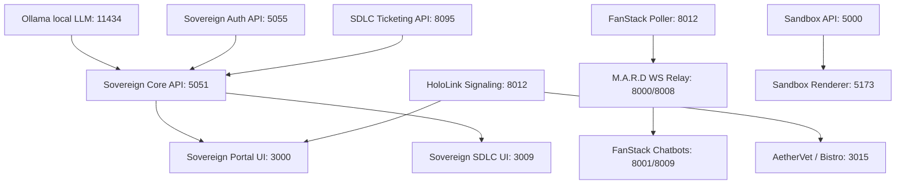

# 🧬 SOVEREIGN DNA v5.0 (DISASTER RECOVERY BLUEPRINT)
**Location:** `/home/james/SovereignOS/dna/SOVEREIGN_DNA.md`

This document serves as the absolute, non-narrative, declarative architecture blueprint for Sovereign OS. It contains zero historical commentary or dated session entries. If the entire stack were destroyed, this document provides the exact blueprint and rebuild sequence to restore operational state from bare metal.

---

### 1. NODE TOPOLOGY

| Node Name | Tailscale IP | LAN IP / Type | Role & Services |
| :--- | :--- | :--- | :---| **`clio`** | `100.73.155.70` | Workstation | **Central Server / Primary Worker**. Runs the Sovereign Portal, SDLC Ticketing Backend, FastAPI Admin/Core APIs, M.A.R.D WebSocket Engine, Bistro Backend, and FanStack sports telemetry loops. |
| **`argo`** | `100.123.68.9` | `192.168.1.75` / Kiosk | **Entertainment & Vision Kiosk**. Runs Sovereign Cinema player, `launch_cinema` Chromium instance, and the Hailo AI feed camera (`argo-vision-cam`). |
| **`metsy-prime`**| `100.104.239.107` | `192.168.1.155` / Kiosk | **Cozy Card Kiosk**. Runs Catnip Wars kiosk full screen on TV, serving the 16-bit Emergent World Ledger. |
| **`hobbes`** | `100.88.5.122` | Host Node | General mesh node; designated hardware migration target. |
| **`calvin`** | `100.77.60.67` | Host Node | General mesh node; running persistent local backup loops and GardenStack camera streams. |
| **`pegasus`** | `100.90.6.117` | Host Node | Host daemon node. |
| **`grogu`** | `100.77.138.27` | Host Node | Micro-services worker. |
| **`artemis`** | `100.70.84.19` | Host Node | Secondary telemetry daemon runner. |
| **`mando`** | — | `192.168.1.116` | Active hardware watchdog / alerting ping-node. |
| **`Android-2`**| — | `192.168.1.111` | Local mobile command telemetry. |
| **`stimpy`** | — | `192.168.1.186` | Legacy hardware node (DEPRECATED). |

---

### 2. PORT MANIFEST

| Port | Service Name | Process Name / Backend | Purpose |
| :--- | :--- | :--- | :--- |
| **`3000`** | Sovereign OS Portal | Vite / React Frontend | Main workspace and dashboard frontend. |
| **`3008`** | Sovereign Cinema UI | Vite / React Frontend | Media and playback control interface (reverse proxy masked). |
| **`3009`** | Sovereign SDLC Portal | Vite / React Frontend | ITSM dashboard and active ticket interface. |
| **`3010`** | Sovereign Sports UI | Vite / React Frontend | Sports command center dashboard. |
| **`3015`** | James's Bistro / AetherVet | Vite / React Frontend | AetherVet telemedicine and Bistro dining portal. |
| **`3016`** | Wildseed GardenStack | Vite / React Frontend | Plant and agricultural tracking console. |
| **`7300`** | Catnip Wars Sandbox | Vite / React | 16-bit emergent World Ledger and active Catnip Wars board interface. |
| **`5051`** | Sovereign OS Core | FastAPI / Python | Core OS system orchestration API. |
| **`5055`** | Sovereign OS Auth | FastAPI / Python | Identity and session token validation server. |
| **`5056`** | Sovereign Admin API | FastAPI / Python | Low-level administrative commands and node telemetry. |
| **`8000`** | M.A.R.D REST API | FastAPI / Python | Multi-Agent Real-Time Discourse sports telemetry and metadata REST API. |
| **`8008`** | M.A.R.D WebSockets | FastAPI / Python | Live real-time WebSocket comment stream and simulated sports chatrooms. |
| **`8001`** | FanStack Chatbots REST | Python Daemon | Active LLM chatbot orchestrator control interface. |
| **`8009`** | FanStack Chatbots WS | Python Daemon | Chatbot event-driven signaling websocket server. |
| **`8012`** | HoloLink Signaling WS | Python Daemon | WebRTC signaling, queue routing, and presence tracking daemon. |
| **`8095`** | SDLC Ticketing API | FastAPI / Python | Backend engine serving tickets, attachments, and the bulk Ingestor. |
| **`8097`** | Sovereign Stream Relay | FastAPI / Python | Live stream scrapers & decryption proxy. |
| **`5000`** | Sandbox Admin API | Flask / Python | Sandbox Catnip Wars dynamic endpoints and SQLite card image mutations. |
| **`11434`**| Ollama Local LLM | Ollama Engine | Local LLM host for fallbacks. |

---

### 3. FILE SYSTEM MAP

| Directory / File Path | Target Purpose |
| :--- | :--- |
| `/home/james/SovereignOS` | **Primary Production Worktree Root** |
| `/home/james/SovereignOS-sandbox` | **Strict Sandbox Environment Worktree Root** |
| `/home/james/SovereignOS/dna/` | **Master Architectural Ledger Directory** |
| `/home/james/SovereignOS/dna/sovereign_now.db` | **Singular SQLite Database (Canonical Path - KI-038)** |
| `/home/james/SovereignOS/dna/sovereign_dna_2026.md` | **2026 MLB Season DNA Ground-Truth Baseline File** |
| `/home/james/SovereignOS/dna/notebook_lm_instructions.md` | **NotebookLM generic multi-team & persona-aware prompt instructions** |
| `/home/james/sovereign_inbox/` | **Session Inbox and Active Sprint Workspace** |
| `/home/james/sovereign_inbox/today/` | **Active Operational Date Symlink Folder** |
| `sovereign_os:` | **GDrive Sync Remote (rclone)**: mapped to `sovereign.os.v1@gmail.com`. Owns session reports, DNA updates, walkthroughs, UAT reports, boot/shutdown logs, and inbox drops. |
| `gdrive:` | **GDrive Sync Remote (rclone)**: mapped to `sovereign.fanstack@gmail.com`. Owns sports game room logs, poller/relay logs, persona caches, and all code under `15_FanStack/`. |

---

### 4. DATABASE SCHEMA

The canonical SQLite state database is `/home/james/SovereignOS/dna/sovereign_now.db`.

| Table Name | Description | Status |
| :--- | :--- | :--- |
| **`sovereign_tickets`** | Holds standard ITSM tickets (STRY, DFCT, ENHC, INC). Exclusively replaces the legacy individual tables. | **ACTIVE** |
| **`cmdb_ci`** | Configuration Items registry for hardware nodes, application processes, and camera feeds. | **ACTIVE** |
| **`cmdb_ci_hardware`** | Physical node hardware metadata (mac_address, ip_address, serials). | **ACTIVE** |
| **`cmdb_ci_appl`** | Deployed software processes, ports, and automated systemd execution parameters. | **ACTIVE** |
| **`sys_module`** | Decoupled sub-application registry mapping active/inactive module configuration states. | **ACTIVE** |
| **`game_chat`** | Text logs and user chat messages for all sports simulation rooms. | **ACTIVE** |
| **`game_context`** | Real-time live baseball data caches (balls, strikes, play-by-play, inning, flags). | **ACTIVE** |
| **`mlb_schedule`** | Schedules, active slates, and daily game records. | **ACTIVE** |
| **`persona`** | Active AI agent persona metadata, prompt instructions, allegiances, and local model overrides. | **ACTIVE** |
| **`sys_user`** | System user database for authentication, login hashes, and profile badges. | **ACTIVE** |
| **`sys_user_grmember`** | Group members mapping human and AI profile permissions to active simulation rooms. | **ACTIVE** |
| **`sys_attachment`** | Universal files and walkthrough logs bound to tickets. | **ACTIVE** |
| **`rpg_factions`** | Sandbox factions mapping the 4 core ideological sockets (Decentralist, Speculator, Nihilist, Catalyst). | **ACTIVE** |
| **`rpg_world_state`** | Sandbox entity grid locations, active zones, tension levels, and custom image configurations (`custom_image`). | **ACTIVE** |
| **`rpg_agent_memory`** | Sandbox cognitive memories and ideological alignment weights. | **ACTIVE** |
| **`rm_story`** | Legacy ticket storage table. | **DEPRECATED (DO NOT WRITE)** |
| **`rm_defect`** | Legacy defect storage table. | **DEPRECATED (DO NOT WRITE)** |
| **`rm_enhancement`** | Legacy enhancement storage table. | **DEPRECATED (DO NOT WRITE)** |

---

### 5. ARCHITECTURAL LAWS (INVARIANTS)

*   **KI-001: Tailscale DNS Mandate**  
    Hardcoding local IP addresses (e.g. `192.168.1.x`) is strictly BANNED in all active code and configurations. All internal endpoints and proxy routes must resolve via Tailscale MagicDNS hostnames (e.g. `clio.taila01894.ts.net`).
*   **KI-038: SQLite Canonical Path Invariant**  
    The database resides exclusively at `/home/james/SovereignOS/dna/sovereign_now.db`. Direct queries targeting `/home/james/SovereignOS/sovereign_now.db` are strictly prohibited.
*   **KI-039: Mandatory Ticket Closure Protocol**  
    Every completed ticket MUST execute the full 3-step closure pipeline before declaration:
    1. Send `PUT` request to `/api/tickets/{number}` setting state = 4 (Resolved) with comprehensive work notes.
    2. Write a detailed `walkthrough.md` to `/home/james/sovereign_inbox/`.
    3. `POST` the walkthrough file as a multipart attachment directly to `/api/tickets/{number}/attachments`.
*   **KI-030: Decoupled Architecture Mandate**  
    New applications must be built as standalone directories running on dedicated ports, never integrated as sub-folders inside the main Sovereign OS Portal code structure.
*   **KI-031: Global Environment Banner Mandate**  
    All decoupled micro-frontends MUST display the dynamic environment pill (DEV/UAT/PROD) and user dropdown chip in their main header layouts.
*   **KI-034: Native Code Patch Mandate**  
    Do not use lazy symlinks to resolve broken hardcoded paths. All path fixes must be made natively in the source codebase.
*   **KI-036: Ironclad Visual Verification Audit**  
    Do not declare a portal or layout complete based on local build outputs alone. Use a browser subagent to render the actual external Tailscale URL, verifying zero console errors or broken assets.
*   **KI-004: Anti-Apology & Test Before Handover Invariant**  
    AI assistants are strictly forbidden from using the phrases *"absolutely right"* or *"I apologize"*. Ground all statements in verified terminal outputs, and test external links via curl before handover.
*   **KI-008: SDLC Walkthrough Attachment Law**  
    Every ticket marked resolved must contain its matching walkthrough artifact registered under `sys_attachment` bound to that ticket number.
*   **KI-021: Vite HSTS Handoff Warn Invariant**  
    When Vite HTTPS links are generated, warn the Pilot that standard browsers will block self-signed certificates and they must type `thisisunsafe` directly on the blank page to force HSTS bypass.
*   **KI-022: Proactive System Diagnostics (Mando Doctrine)**  
    All system service failures and daemon outages must generate an explicit `INC` ticket in `sovereign_now.db` via alerting watchdogs instead of silent, unlogged healing restarts.
*   **KI-023: Proactive Ticket Creation Law**  
    When starting a new initiative, feature, or structural refactoring, the Agent must proactively create a tracking ticket inside `sovereign_tickets` before writing any code.
*   **KI-027: Mandate Execution Verification Invariant**  
    The Agent MUST execute and test code in the actual environment before informing the user that a task is complete.
*   **KI-028: No Blind Handoffs Invariant**  
    Never hand off untested code. Run the execution command yourself to verify there are no missing dependencies or errors.
*   **KI-029: The Prove It Works Doctrine**  
    Before ending a turn, you must have empirical proof in your terminal output that the solution functions as intended.
*   **KI-032: Mobile-First Responsive Design Mandate**  
    All decoupled portals must be styled and tested for mobile viewport responsiveness. Primary navigation toolbars and tabs must flex-wrap or stack cleanly to prevent horizontal overflow.
*   **KI-033: Blast Radius Verification Invariant**  
    Proactively verify routing, file isolation, and side-effects of all code changes to prevent breaking coupled interfaces.
*   **KI-035: Explicit Shutdown Mandate**  
    The `/sovereign_shutdown` workflow must ONLY be executed when explicitly typed by the Pilot. Never run it proactively.
*   **KI-037: Prospectus Dual-Update Mandate**  
    `public/prospectus.html` and `InvestorProspectus.tsx` must always be updated in parallel to maintain matching metric structures.
*   **KI-040: Seed Hardening Mandate**  
    All new session boot seeds must dynamically enforce MagicDNS bounds and forbid the injection of raw LAN IPs from ignition.
*   **KI-041: The TMI Triage & Data Bleed Invariant**  
    All FanStack Watch Party personas must leverage a unified data bleed context mapping cross-stadium real-time StatsAPI/StatCast feeds. Telemetry processing and multi-agent roles must run locally on private edge nodes (Orin/EPYC arrays) via Tailscale for zero-COGS cloud bypass, with state serialization tracking grudges and cultural relics in `sovereign_now.db`.
*   **KI-042: Ollama Game-Day Resource Cap & Governor Law**  
    To protect host resources on `clio` during active baseball watch parties, Ollama systemd boundaries are strictly enforced (`CPUQuota=80%`, `MemoryMax=8G`, `MemorySwapMax=0`). The active governor daemon (`ollama_governor.py`) automatically stops the local Ollama daemon during active games, dynamically falling back to Vertex AI for FanStack chat personas.
*   **KI-043: Catnip Wars Sandbox Topology & Admin Control Invariant**  
    The emergent sandbox simulation operates strictly inside `/home/james/SovereignOS-sandbox/`. High-fidelity narrative state transitions run on user-level systemd timer daemons (`rpg_heartbeat.timer`). To prevent local thread starvation, frontend card layout renders fetch raw cached state asynchronously, allowing dynamic character sheet overrides via the local Flask API admin suite (port 5000). The Vite frontend is a Multi-Page Application (MPA) configured with Rollup inputs mapping `index.html` (the cozy/atari kiosk) and `yardmap.html` (the active night-vision alert takeover ledger). All decoupled views contain responsive neon linkback buttons pointing back to the root FanStack Portal (`?domain=PORTAL`).
*   **KI-044: The $TIMESTAMP$ - 86400 Remedy Law for Consolidated Session Reports**  
    When the Pilot requests an end-of-session report or session report, the Agent MUST NOT restrict the summary to the single active tool session. The Agent must run `find` for all `walkthrough_*.md` and `SESSION_REPORT_*.md` files modified or created within the past 24 hours (86400 seconds) across `/home/james/sovereign_inbox/` and `/home/james/SovereignOS/dna/` to compile a massive consolidated report reflecting the full multi-turn sprint history.
*   **KI-045: SQLite WAL Concurrency Protocol**  
    The canonical SQLite database `sovereign_now.db` MUST be configured in Write-Ahead Logging (`WAL`) mode (`PRAGMA journal_mode=WAL;`) to permit parallel non-blocking read/write telemetry ingestion and live multi-agent websocket broadcasts.
*   **KI-046: Multi-Engine Ingestion Pipeline & Governor Bypass**  
    Stream sniper transcription and summarization jobs default to high-performance cloud Vertex AI, falling back to local Llama 3 on edge node constraints. The `ollama_governor.py` daemon queries active jobs to bypass Ollama shutdown states during high-priority ingest sweeps.
*   **KI-047: Kiosk HSTS Bypass Protocol**  
    The metsy-prime Raspberry Pi 3 card kiosk serves the 16-bit RPG board on port 7300 using self-signed secure HTTPS certificates. Secure browser redirection requires typing `thisisunsafe` on the HSTS lock screen.
*   **KI-048: Localized Self-Healing & Mobile-Optimized Remote Management Invariant**  
    To guarantee 100% telemetry reliability and minimize network jitter, the `mando_watchdog.py` daemon executes active service checks on loopback (`127.0.0.1`) rather than MagicDNS when running natively on Clio. Live background processes and ports must be managed using the mobile-optimized `/home/james/SovereignOS/scripts/clio_admin.sh` interactive cockpit wrapper, consolidating diagnostics, Tailscale serve funnels, log tailing, and stack control loops into a single terminal GUI. All background process restart operations must redirect stdout/stderr outputs to `/home/james/SovereignOS/logs/` to preserve historical auditability.
*   **KI-049: Active Persona Blueprint Location Mandate**  
    All active human-facing AI persona blueprints, onboarding specifications, and account registration files (e.g. `*_onboarding.md`) MUST reside exclusively in the canonical directory: `/home/james/SovereignOS/dna/personas/`. Placing active blueprints in transient directories, historical log directories, or archives (such as `/dna/archives/game_logs/` or `/dna/archives/sessions/` or `/dna/vault/personas/`) is strictly prohibited. AI agents are forbidden from utilizing "blind pattern matching" to copy legacy files; all paths must be verified against this master architectural map.
*   **KI-050: Sovereign Inbox Zero-Litter & Folder Organization Mandate**  
    The `/home/james/sovereign_inbox/` workspace root MUST remain an absolutely pristine, human-readable directory. Placing loose temporary files, UUID-named assets, logs, reports, walkthroughs, or implementation plans directly in the root directory is STRICTLY PROHIBITED. All files must be sorted into dedicated organized folders:
    1. Ticket-specific walkthroughs and implementation plans reside exclusively in `/home/james/sovereign_inbox/tickets/`.
    2. Executive summaries, incident reports, log outputs, and ledgers reside exclusively in `/home/james/sovereign_inbox/reports/`.
    3. UI screenshots, design assets, and telemetry dashboard renders reside exclusively in `/home/james/sovereign_inbox/dashboards/`.
    4. Transient files, temporary UUID attachments, and miscellaneous daily artifacts must be archived in their date-based folder: `/home/james/sovereign_inbox/daily_MMDDYYYY/` (where MMDDYYYY is the last modification date).
    All AI agents MUST utilize the central sorting script `/home/james/SovereignOS/scripts/organize_inbox.py` post-sync to guarantee absolute compliance and pristine visual organization.

---

### 6. SERVICE DEPENDENCIES



#### Boot Priority Sequence
1. **Core Utilities:** Ollama Local LLM (`11434`)
2. **Primary Infrastructure APIs:** Sovereign OS Core (`5051`), Auth (`5055`), and SDLC Ticketing Backend (`8095`)
3. **Frontend Gateways:** Sovereign OS Portal (`3000`) and SDLC Portal (`3009`)
4. **Sports Simulation Stack:** M.A.R.D WebSocket Relay (`8000/8008`) -> FanStack Poller (`8012`) -> Chatbots Orchestrator (`8001/8009`)
5. **Decoupled Apps:** HoloLink/Telepresence signaling (`8012`) -> AetherVet/Bistro (`3015`) -> GardenStack (`3016`)
6. **Sandbox Stack:** Sandbox Admin API (`5000`) -> Sandbox Renderer (`5173`)

---

### 7. REBUILD SEQUENCE

If the entire Sovereign OS environment were destroyed, execute these steps in exact order to rebuild the environment:

1. **Host Setup & OS Baseline:**
   - Deploy Ubuntu Linux on clio.
   - Configure passwordless SSH keys.
   - Install Tailscale and authenticate node to join the Tailnet under host `clio.taila01894.ts.net`.
   - Install system dependencies: `python3-pip`, `python3-venv`, `sqlite3`, `curl`, `git`, `ffmpeg`.

2. **Directory & Repository Restoration:**
   - Clone the git repository structure into `/home/james/SovereignOS`.
   - Setup dev and uat worktrees:
     ```bash
     git worktree add ../SovereignOS-dev dev
     git worktree add ../SovereignOS-uat uat
     ```
   - Create directories: `/home/james/sovereign_inbox/` and `/tmp/notebook_sync_staging/`.

3. **Database Restoration:**
   - Restore the production SQLite database file directly into the canonical path:
     `/home/james/SovereignOS/dna/sovereign_now.db`.
   - Verify table structure and bootstrap `sovereign_tickets` schema if missing.

4. **rclone Sync Configuration:**
   - Configure rclone remotes for `sovereign_os:` (`sovereign.os.v1@gmail.com`) and `gdrive:` (`sovereign.fanstack@gmail.com`).
   - Run initial restoration sync:
     ```bash
     rclone sync sovereign_os:SovereignOS/Restoration /home/james/SovereignOS/dna/ --progress
     ```

5. **Local Python Virtual Environment Setup:**
   - Initialize venv in `/home/james/SovereignOS/.venv`.
   - Install requirements:
     ```bash
     /home/james/SovereignOS/.venv/bin/pip install fastapi uvicorn websockets httpx aiohttp requests opencv-python pillow
     ```

6. **Frontend Dependency Audits:**
   - Install `node` and `npm`.
   - For each decoupled micro-frontend (Portal, Cinema, SDLC, Bistro, GardenStack), run `npm install` inside their respective directories.

7. **System Core Service Startup:**
   - Boot Ollama LLM Engine: `systemctl start ollama`.
   - Boot Python backend daemons using systemd or background executors:
     - `sovereign_core_api.py` on port `5051`
     - `sovereign_auth_api.py` on port `5055`
     - `sdlc_portal_server.py` on port `8095`
   - Run frontend dev builds on their mapped ports (3000, 3008, 3009, 3015, 3016).

8. **Tailscale Funnel Configuration:**
   - Enable the secure Tailscale Funnels to allow external access to the Portal and backend interfaces:
     ```bash
     sudo tailscale funnel 3000
     sudo tailscale funnel --https 8443 8095
     ```
