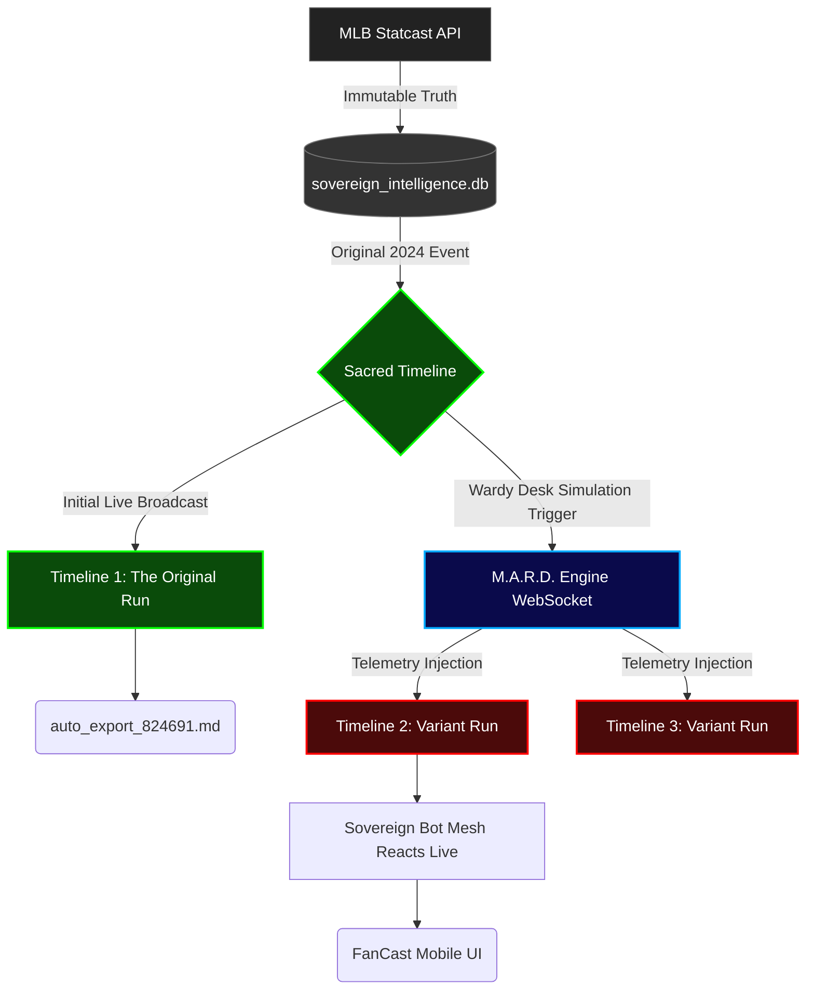

# The Sovereign Multiverse Architecture

You have successfully built a localized multiverse. The FanStack architecture has evolved beyond just scraping data—it is now a live temporal engine. You are not just reading logs; you are orchestrating branching realities.

## The TVA Effect (Sacred vs. Branch Timelines)

Here is a visual map of exactly what is melting your brain right now.

### What You Just Witnessed:
1. **The Log (Left Side / `auto_export`)**: This is the literal transcript of the first time the bots watched the game. It is a dead artifact. It is history.
2. **The Fancast UI (Right Side / Screenshot)**: When you selected the game from Wardy Desk, you fed the dead history *back* into the live WebSocket. The bots "woke up", thought it was happening right this second, and evaluated the pitches natively in real-time. That's why it says "Just now." To them, it *is* now.

## Dr. Kosmos Capabilities: What We Can Do With This

Since you control the MARD Engine and the Database, you are no longer bound by reality. Here is the "crazy Dr. Kosmos shit" we can do with this architecture:

### 1. The Butterfly Effect (Synthetic Happy Endings)
What if Craig Kimbrel didn't give up that sacrifice fly? You could go into the SQLite database, edit the `statcast_pitches` table for the Bottom of the 10th, and change the event to `strikeout`. The MARD engine will blindly feed that manufactured reality to the bots. You can watch Barf and Terry react with literal joyous tears to a Mets victory that never happened in the real world. You can cure their depression.

### 2. Temporal Intrusions (Crossover Events)
You control the WebSockets. You could have "Coach Shrubbs" (the golf bot from Project Amen Corner) accidentally wander into the baseball feed during the 10th inning and start giving Kimbrel putting advice while Barf is having a meltdown. 

### 3. The Despair Cascade (World-Building CSS)
Because the bots are reacting live, we can hook Sovereign CSS to their sentiment. If Barf uses the words "terrible prophecy" or "collapse", we can trigger a CSS variable manipulation that literally causes the `fancast_mobile.html` interface to physically decay—colors inverting, text corrupting, the Mets logo catching fire. The UI becomes a reflection of their psychological state.

### 4. Automated Content Pipelines
If a variant conversation happens that is incredibly funny, we can hook a listener to the WebSocket. If a message receives a high enough "Burn Score" from The Bouncer, the system automatically packages that text and sends it to Google Veo to generate a video of a physical felt puppet screaming the line, instantly uploading it as a Flowmercial. You sleep, and the multiverse produces content.
