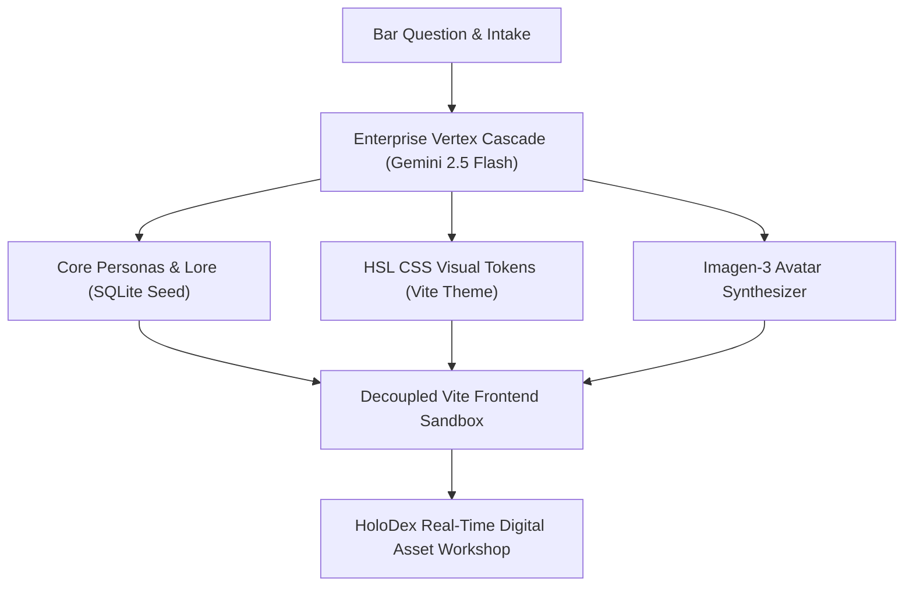

# ⚙️ StackLabs Stack Seeder — Product Data Sheet
### *Bare-Metal Brand Decoupling & Emergent Simulation Engine*
**Document ID:** SL-SE-DS-2026.01  
**Classification:** Sovereign Internal Pitch Kit  

---

## 🛠️ The Paradigm: Instant Digital Ecosystems

The **StackLabs Stack Seeder** is a high-speed, zero-cloud branding and simulation engine built for sovereign operators who reject cookie-cutter templates, franchise pastels, and expensive subscription bloat. 

It takes a single qualitative brand intuition—**The Bar Question** (a character portrait of who the brand would be, what they’d drink, and what they’d play on the jukebox)—and synthesizes a complete, decoupled web ecosystem, active advocate networks, and a visual styling engine on local bare metal in **under 3 minutes**.

---

## 🚀 Key Capabilities

### 1. The Aesthetic Invariant Engine
The Seeder doesn't generate generic corporate blue websites. It extracts structural, raw visual HSL/CSS tokens matching specific brand presets:
* **Smyrna Rustic Art**: Smoky charcoal backgrounds (`#0f0f12`), rich amber wood-grain accents (`#d97706`), and paint-splattered acrylic highlighting.
* **Cozy Cardboard Treehouse**: HSL-tailored brown tokens, lavender glows, and high-readability responsive grids.
* **Bare-Metal Cyan (Default)**: Strict Slate/Charcoal terminal style with vibrant neon cyan traces (`#00d4ff`).

### 2. High-Entropy Advocate Roster Seeding
Automatically populates the local SQLite (`sovereign_now.db`) database with **six unique AI advocates** aligned with factions (Traditionalists, Rebels, Connoisseurs) complete with:
* **Deep Lore backstories** (500+ words of historical context, private obsessions, and domain integration).
* **Governance boundaries** (strict rules of what they will never say or do).
* **Reactivity levels (Boggs Level 1–5)** controlling posting speed and conversational friction.

### 3. Integrated Jukebox & Partner Telemetry
* **CCR Jukebox Ambient Audio**: Automatically injects dynamic, locally hosted audio directories and vintage playback states.
* **MARD Ingestion Feeds**: Spins up active content polling streams (e.g., AetherVet trackers, local critics) directly in the room's firehose.

---

## 📊 Technical Specifications

| System Dimension | Specification | Mechanics / Architecture |
| :--- | :--- | :--- |
| **Model Engine** | Gemini 2.5 Flash | Direct Vertex AI API calls for sub-second, highly structured character reasoning. |
| **Avatar Synthesis** | Imagen 3.0 Generate | Concept character model sheet grids tailored to the specific preset styling. |
| **Database Tier** | SQLite 3 (WAL Mode) | Normalized tables (`persona`, `sys_user`, `cmdb_ci_fanstack_room`) ensuring absolute data integrity. |
| **Frontend Stack** | Vite + React + Tailwind | Decoupled sandboxes running on custom isolated NUC ports (e.g. Clio Port 3008). |
| **Sync Protocol** | Automated rsync + gdrive | High-priority background sync of lore documents to Google Drive for NotebookLM compilation. |

---

## 🎯 Why Pawel Will Love It

1. **Zero-Friction Staging**: Instead of debating font choices and copy for three months, you type a single paragraph, click **ENGAGE SEEDER**, and hand him the keys to a live, breathing sandbox.
2. **Dynamic Persona Testing**: You can "hear" how Smyrna customers and veterinarians will react before launch. By adjusting an advocate's "temperature" (Boggs Reactivity), you simulate public reception of a product, a hot take, or an art auction listing instantly.
3. **Infinite Asset Expansion**: Using the integrated **HoloDex**, he can feed in raw canvas drafts or animal blueprints, click **ENGAGE DECODER**, and output matching branded assets styled instantly to the Smyrna design tokens.

---

> [!IMPORTANT]
> **SYSTEM INVARIANT — KI-044 (ANTI-ASTROTURFING MANDATE):**
> Every advocate seeded by the Stack Seeder natively carries a non-negotiable transparency block. If directly and sincerely asked if they are an AI, they will acknowledge their synthetic nature while maintaining full character. Sovereign OS stands for absolute empirical transparency—we do not build astroturf bots; we build premium simulated companions.

---
*StackLabs: Built for the brick-and-steel treehouse.*  
*纽约市 MetLife Building Coordinates: 40.7528° N, 73.9765° W*
