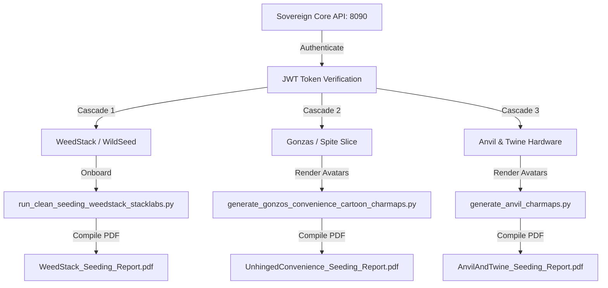

# Implementation Plan — Sovereign OS System Restoration & Multi-Stack Seeding Cascade

This plan outlines the surgical procedures to restore the Sovereign OS bare-metal ecosystem on `clio` following a manual reboot, back up and reseed the three designated stacks, configure automatic post-reboot startup policies for absolute core services, and set up the Pilot for mobile SSH administration.

---

## 👽 The "Alien Fingers" Diagnostics

The friction you felt in the earlier session comes down to the bridge between your host machine (Windows) and your target machine (`clio`):
- Your VS Code IDE is currently running in **Remote-SSH mode** connected directly to `clio`. 
- Because the IDE runs remotely, when the previous agent generated Windows host paths (`C:/Users/jc2po/...`), the remote VS Code tried to search for those paths inside `clio`'s Linux root directory, throwing the "file not found" error.
- Moving forward, **every file, plan, and walkthrough is created and referenced natively on `clio`'s local filesystem** (under `/home/james/sovereign_inbox/today/`). This means all file links will resolve instantly and open cleanly in your active editor.

---

##  User Review Required

> [!IMPORTANT]
> **Fishbowl and Sandboxing Safety (KI-061 / KI-053 Compliance):** 
> To protect natural resources and prevent disruption to physical assets on the workspace counter, all automated tests and service check loops will execute in headless sandbox mode or via clean network queries over Tailscale. Natively spawning local headful browsers on `clio` remains strictly banned.

> [!TIP]
> **HSTS Chrome Bypass Rule (KI-021):**
> When testing micro-frontend web views over the Tailscale network, if Chrome displays a strict HSTS security block, type `thisisunsafe` directly on the error screen to bypass the self-signed cert boundary.

---

## Proposed Changes

### Component 1: Core Service Ignition Sequence

We will systematically wake up the platform's layers, ensuring proper daemon logging and port bindings.

#### [MODIFY] [clio_admin.sh](file:///home/james/SovereignOS/scripts/clio_admin.sh)
We will verify and leverage `clio_admin.sh` (our central cockpit control deck) to cleanly boot up the core APIs.

1. **Start Ollama Local LLM (Port 11434):**
   ```bash
   sudo systemctl start ollama
   ```
2. **Ignite Primary APIs & Daemons:**
   - **Sovereign Core API (Port 8090):**
     ```bash
     cd /home/james/SovereignOS && nohup .venv/bin/python3 scripts/sovereign_core_api.py >> logs/sovereign_core_8090.log 2>&1 &
     ```
   - **SDLC Ticketing Server (Port 8095):**
     ```bash
     cd /home/james/SovereignOS && nohup .venv/bin/python3 scripts/sdlc_portal_server.py >> logs/sdlc_portal_server.log 2>&1 &
     ```
   - **Admin API (Port 5055):**
     ```bash
     cd /home/james/SovereignOS && nohup .venv/bin/python3 scripts/fanstack_admin/fanstack_admin_api.py >> logs/fanstack_admin.log 2>&1 &
     ```
3. **Fire Decentralized Frontend Vite Portals:**
   Execute the decoupled launcher script:
   ```bash
   /home/james/SovereignOS/scripts/restart_servers.sh
   ```
4. **Ignite Sports Sim / FanStack Relays & Chatbots:**
   Execute the simulated swarm controller:
   ```bash
   /home/james/SovereignOS/scripts/start_fanstack.sh
   ```

---

### Component 2: Surgical Backup of Current Brands

To satisfy the mandate to **preserve and back up** the historical personas rather than deleting them blindly, we will run a Python backup routine prior to database cleansing:
- **Backup Target Path:** `/home/james/sovereign_inbox/today/backups/brand_seeding_backups_20260531.json`
- **Tables Extracted:** All rows from `persona` and `sim_agents` belonging to `WEEDSTACK`, `WILDSEED`, `UNHINGEDCONVENIENCE`, `UNHINGEDSTORE`, and `ANVILANDTWINE`.

---

### Component 3: Multi-Stack Seeding and Character Forge Cascade

Once the Core API (Port 8090) is verified healthy and bound, we will execute the fresh seeding run for all three requested stacks.



#### 🌿 1. WeedStack (WildSeed LLC) Seeding
- **Database Cleansing & Seeding:** Run `/home/james/SovereignOS/scripts/run_clean_seeding_weedstack_stacklabs.py`. This script purges existing records, maps legacy botanical advocate personas (Dr. Terp, Smyrna Steve, Compliance Karen), and executes a pre-flight `/api/brand/onboard` payload targeting Port 8090.
- **Genesis PDF Generation:** Run `python3 scripts/generate_single_onboarding_pdf.py WEEDSTACK` to compile the gorgeous scientific sketch report.

#### 🏪 2. Gonzas (Unhinged Convenience / Spite Slice) Seeding
- **Imagen Character Asset Forge:** Run `/home/james/SovereignOS/scripts/generate_gonzos_convenience_cartoon_charmaps.py` to trigger Vertex AI Imagen 3.0, compiling MTV-style fuzzy felt puppet concept maps into `/home/james/sovereign_inbox/today/Gonzo's Convenience/`.
- **Genesis PDF Generation:** Run `python3 scripts/generate_unhinged_pdf.py` to commit dynamic SQLite datasets to the final manifest report.

#### 🔨 3. Anvil & Twine Hardware Seeding
- **Imagen Character Asset Forge:** Run `/home/james/SovereignOS/scripts/generate_anvil_charmaps.py` to generate 9 vintage ink-and-watercolor tradesman character models.
- **Genesis PDF Generation:** Run `python3 scripts/generate_anvil_twine_pdf.py` to compile the physical woodcut dossier report.

---

### Component 4: Post-Reboot Autostart Diagnostic & Solution

We will analyze why core services remained dormant on reboot and present two robust architectures to solve this natively:

#### Diagnostic Analysis:
- Currently, the Sovereign OS services are run as user-level background processes (`nohup ... &`).
- When the Linux server reboots, these processes receive a standard shutdown signal and terminate. Without a system-level process supervisor or cron directive, they remain offline until manually re-ignited via shell commands.

#### Core Services to Automate:
1. **Ollama Local LLM** (Already systemd-enabled; needs to be configured as `enabled` so it ignites on boot).
2. **Sovereign Core API** (Port 8090)
3. **SDLC Ticketing Server** (Port 8095)
4. **Admin API** (Port 5055)

#### Proposed Resolution Options (To be discussed in cockpit):
- **Option A (systemd User Services - Recommended):** Create simple user-level systemd service files under `~/.config/systemd/user/` and enable lingering using `loginctl enable-linger james`. This ensures services boot up without requiring the Pilot to SSH in.
- **Option B (Decoupled Crontab `@reboot` Launcher):** Insert a simple, idempotent launch wrapper inside James's crontab that triggers `clio_admin.sh` or a consolidated startup script on system initialization.

---

### Component 5: Mobile Readiness Configuration

To set the Pilot up for a flawless 1-2 hour mobile window, we will:
1. **Optimize Remote Diagnostics:** Verify that `clio_admin.sh` executes cleanly via standard SSH.
2. **Formulate Mobile Manifest Links:** Provide the Pilot with secure Tailscale MagicDNS browser URLs for all frontends so he can inspect, monitor, or submit tickets directly from his phone or tablet while on the move.

---

## Verification Plan

### Automated/Programmatic Verifications
- **Port Audits:** Confirm that ports `8090`, `8095`, `5055`, `3000`, `3004`, `3006`, `3008`, `3015`, `3016`, `3017`, `3019`, and `8085` bind successfully (`ss -tlnp`).
- **Log Verifications:** Verify that persistent logs under `/home/james/SovereignOS/logs/` compile cleanly with zero fatal initialization errors.
- **File Asset Audits:** Confirm that the generated Genesis PDFs and Character Sheets compile cleanly under the daily directory `/home/james/sovereign_inbox/today/` and `/home/james/sovereign_inbox/reports/`.

### Manual/Pilot Verification
- Ask the Pilot to run `scripts/clio_admin.sh` to confirm terminal UI health.
- Have the Pilot test remote access using the Tailscale MagicDNS addresses via his mobile browser.
