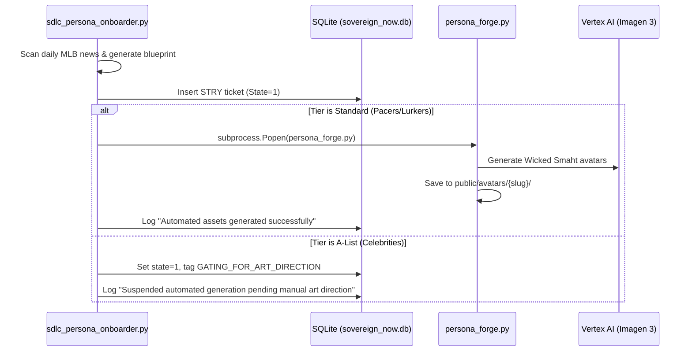

# Concept Document & Work Order: Auto-Wiring Persona Forge into Onboarding Daemon
**Ticket ID:** STRY1779560416 (Proactive Tracking Card)  
**Parent System:** Sovereign FanStack  
**Target Daemon:** `sdlc_persona_onboarder.py`  
**Automated Engine:** `scripts/persona_forge.py`  

---

## ⚡ Executive Summary
The deployment of **`persona_forge.py`** resolves a month-long backlog bottleneck by automating the generation of high-quality, multi-pose persona image maps using Vertex AI (Imagen 3.0). 

This Work Order defines the precise technical integration to **auto-wire** `persona_forge.py` directly into the daily background onboarding daemon (**`sdlc_persona_onboarder.py`**). This converts the onboarding pipeline into a completely **zero-click, lights-out autonomous operation** for standard pacers/lurkers, while enforcing a secure manual gate for A-List celebrities.

---

## 💻 Technical Design



### 1. Ingestion Daemon Modifications (`sdlc_persona_onboarder.py`)
Directly inside the daemon loop that generates daily blueprints, we wire in an automatic subprocess execution block immediately after the blueprint markdown file is written to the inbox:

```python
import subprocess
import os

def trigger_asset_generation(blueprint_path, tier="standard"):
    if tier == "standard":
        print(f"⚡ [AUTO-FLOW] Standard Tier detected. Invoking Persona Forge...")
        try:
            # Execute the forge in the background
            subprocess.Popen([
                "/home/james/SovereignOS/.venv/bin/python3",
                "/home/james/SovereignOS/scripts/persona_forge.py",
                blueprint_path
            ], stdout=subprocess.DEVNULL, stderr=subprocess.DEVNULL)
            print(f"✅ [AUTO-FLOW] Persona Forge triggered successfully.")
        except Exception as e:
            print(f"⚠️ [AUTO-FLOW ERROR] Failed to invoke Persona Forge: {e}")
    else:
        print(f"🛑 [AUTO-FLOW] A-List Tier detected. Suspending generation for manual gating.")
```

### 2. Gating and Status Updates
*   **For Standard Personas:** The daemon generates the blueprint, fires the forge subprocess, and logs `State=1` (Draft) for your final approval. Avatars are generated and staged automatically.
*   **For A-List Personas:** The daemon writes the blueprint, bypasses the subprocess, sets the ticket to `State=1` (Draft), and appends `[GATING_FOR_ART_DIRECTION]` to the short description. This holds the generation until you review and trigger it manually via `python3 scripts/persona_forge.py --style custom <path>`.

---

## 🛠️ Work Order Tasks

- [ ] **Task 1: Add Tier Classification to Blueprints**
  Update the daily generation prompts in `sdlc_persona_onboarder.py` to output a `# Style Profile` section detailing either `Tier: Standard` or `Tier: A-List` in the markdown blueprint.
- [ ] **Task 2: Inject Subprocess Trigger**
  Modify `sdlc_persona_onboarder.py` to import `subprocess` and execute the trigger loop immediately after writing the daily `.md` blueprint file.
- [ ] **Task 3: Ticket Work Note Logging**
  Update the database ticket logger to write automated audit logs in `sovereign_tickets.work_notes` indicating whether the asset forge completed successfully or was benched for art direction.
- [ ] **Task 4: Sandbox RPG Sync**
  Ensure any sandbox map characters (like Sam or Metsy) can still be generated isolated in `/rpg-scripts/sprite_forge.py` without touching FanStack production tables.

---

*"Zero manual intervention. Pure autonomous execution."*
