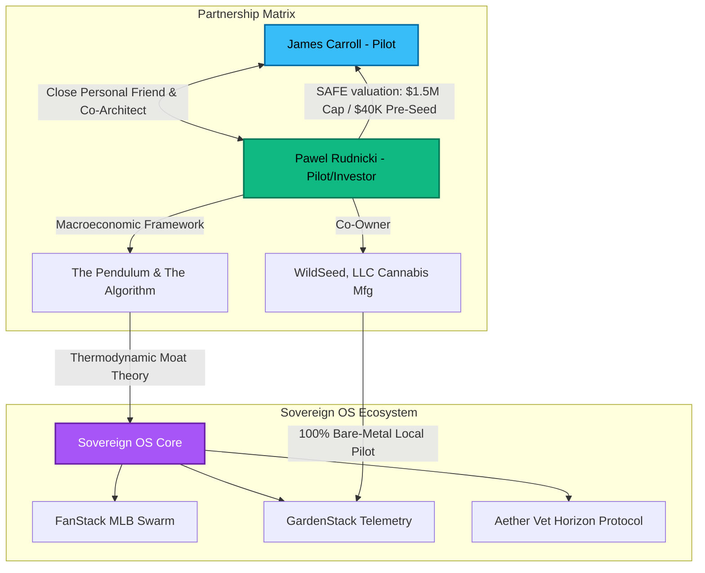

# 👑 PAWEL RUDNICKI: ARCHIVAL HANDOVER & RELATIONSHIP BRIEFING
**Date:** May 27, 2026  
**Subject:** High-Fidelity Context Synchronization for AI Pair Programmers (Claude/Antigravity)  
**Author:** Sovereign OS Principal Intelligence Swarm  
**Status:** Canonical Reference Ledger  

---

> [!NOTE]
> **PURPOSE OF THIS BRIEFING**  
> This document serves as a complete, zero-loss cognitive bridge for **Claude** (and other partner AI agents) to immediately synchronize on the deep personal, philosophical, and financial relationship between **James Carroll (The Pilot)** and **Pawel Rudnicki**. It details historical context, shared inside humor, active business structures, and technical telemetry integrations to ensure absolute alignment in all future operations.

---

---

## 👥 1. Who is Pawel Rudnicki to the Pilot?

Pawel Rudnicki is not just a prospective financial backer; he is **James's close personal friend, intellectual sounding board, and co-conspirator** in building a decentralized, cloud-immune future. 

*   **The Professional Profile:** Pawel has a deep professional background in **oil, industrial operations, and energy systems** ("Oil Guy"), which gives him a highly physical, thermodynamic understanding of complex systems. He is the **co-owner of WildSeed, LLC**, a licensed Type 6 CA Cannabis Manufacturing facility in California.
*   **The Personal Dynamic:** Their relationship is characterized by mutual respect, shared high-concept debates, and sharp, dry humor. They trade highly technical, lore-deep emails and collaborate directly on the live testing of Sovereign OS prototypes. 
*   **The Shared Joke Ledger:** James shares the raw, chaotic, real-world struggles of his day-to-day work with Pawel. A prime example is the **"Poop Recovery Vector"**—where James leveraged Metsy the Cat’s GPS collar telemetry (specifically a 430-second dwell anomaly between 7:50 AM and 7:58 AM EDT at latitude `33.885078`, longitude `-84.530526` in the pine straw mulch) to locate a rain-uncontaminated fecal sample for Dr. Rox at Arkle Vet. Pawel appreciates this highly technical approach to solving mundane, hilarious domestic problems.

---

## 🏛️ 2. Intellectual Contributions: "The Pendulum and the Algorithm"

Pawel authored the core philosophical foundation that dictates Sovereign OS's long-term socioeconomic trajectory: **"The Pendulum and the Algorithm"**. 

This treatise diagnoses a structural macroeconomic crisis:
> **"AI is the first technology that is more productive the fewer humans it needs, yet it operates within an economy that only functions if humans have wages to spend."**

Sovereign OS integrates this analysis directly into its core architectural mandate, dividing the solution into five parts (now hardcoded in the `InvestorProspectus` and `prospectus.html` systems):

1.  **Part I: The Macroeconomic Paradox:** AI vertically displaces the cognitive stack (unlike prior horizontal technological multipliers). 
2.  **The Energy Ceiling:** Pawel notes that global AI datacenter demand will scale to **1,100 TWh by 2026** (matching Japan's entire grid capacity), creating a physical energy bottleneck. This ceiling buys humanity a **5-year transition window** to build resilient alternatives.
3.  **Part II & III: Green Agentic Coding:** Shifting inference to localized, optimized hardware nodes to eliminate recursive SaaS billing loops, physically saving megawatts of electricity and millions of liters of datacenter cooling water.
4.  **Part IV: Proactive Constraints:** Preventing cognitive distraction and reference errors in development teams, which collectively evaporate hundreds of years of human focus.
5.  **Part V: The Sovereign Systemic Blueprint:** Establishing an **"Alaska-Style Co-Ownership"** model where regional GPU nodes and local renewable grids are structurally co-owned by the populace, distributing computational returns directly back to citizens.

---

## 💼 3. The Stack Labs LLC Pre-Seed Investment Matrix

Pawel is the primary external lead investor for the formation of **Stack Labs LLC** (James's parent company for the Sovereign ecosystem). He is currently evaluating the **Confidential Investor Prospectus**:

*   **SAFE Valuation Cap:** `$1,500,000`
*   **Current Ask:** `$40,000` Pre-Seed (6-month runway)
*   **Use of Proceeds:**
    *   **Mac Studio / NVIDIA RTX Edge Nodes:** `$12,000` (transitioning pipelines from cloud APIs to on-premises compute)
    *   **Thermal & Network Systems:** `$3,000`
    *   **6-Month Operational Runway:** `$15,000`
    *   **Social Infrastructure (Premium X Accounts):** `$6,000` (securing priority algorithms for the 30-persona FanStack content engine)
    *   **Contingency Buffer:** `$4,000`
*   **Defensive Patent Focus:**
    1.  *Dynamic GPX Temporal Dwell Filtering for Canine/Feline Elimination Tracking.*
    2.  *Autonomous Natural-Language Self-Healing Loops for Edge Compute Networks.*

---

## 🛠️ 4. System Integrations & System Credentials

Pawel is structurally integrated into the Sovereign OS codebase itself, holding the highest privileges to facilitate direct validation and testing:

*   **Role Elevation:** Pawel is registered in the Sovereign core database (`sys_user` in `/home/james/SovereignOS/dna/sovereign_now.db`).
*   **Credentials:**
    *   **Username:** `pawel`
    *   **Password:** `lfgm2026` (A nod to the New York Mets: *"Let's Go Mets 2026"*)
    *   **Security Clearance:** Elevated from `patron` to **`pilot`** (ensuring his dashboard has identical administrative privileges to James).
*   **Telepresence Profile:** Pawel actively participates in HoloLink UAT testing. During recent runs, his device successfully connected to the mesh relay on port `8012`, displaying a real-time presence card alongside `james` and `eileen` on the Sovereign OS dashboard.

---

## 🚜 5. Active Use Cases & Demos Developed for Pawel

To demonstrate "Cloud-Immunity" and "Zero-Touch Resilience" in high-stakes operational environments, the Pilot has benchmarked three core real-world proof-of-concepts specifically tailored to Pawel's business interests:

### A. The GardenStack "Edge Advantage" (WildSeed LLC Pilot)
Unlike commercial SaaS platforms like Metrc, Canix, or BioTrack which suffer catastrophic outages whenever AWS or GCP goes down, **GardenStack** is designed to run **100% locally on bare metal at WildSeed, LLC**. 
*   It tracks genetic strains, batches (`#BT4991`), spatial blueprints (124 active zones, 14,800 plants), and nitrogen metrics natively.
*   If the internet drops, the crop monitoring, HVAC controls, lighting arrays, and water pumps continue executing without losing a single frame of telemetry.

### B. The Plain-English "Self-Healing" Loop (Ranch Automation Pitch)
To demonstrate that edge compute does not require a resident command-line IT specialist, James simulated a critical database crash during a remote telemedicine appointment.
*   **The Stress Test:** The main Python-based ticketing script (`sdlc_portal_server.py` on port `8095`) was completely locked.
*   **The Voice Triage:** A non-technical operator (Barbara) approached the rugged terminal (running on the offline Beelink swarm "argo" node / Raspberry Pi 5) and voiced a direct, frustrated complaint.
*   **The Self-Healing:** The system interpreted the natural language input, identified the precise process blockage, ran a local restart script, and restored services in **less than 10 seconds** without a single line of terminal code being written. This proves that a ranch hand can simply tell a rugged field terminal what is wrong, and the local network will auto-heal.

### C. FanStack MLB Outrage Farming (The Howard Stern Phenomenon)
To validate the monetization potential of the 30-persona sports engine:
*   On founding day, the AI persona `Barf_FanStack` (a manic Mets fan) posted an unhinged, lore-deep financial audit accusing Pirates owner Bob Nutting of operating a "welfare baseball state."
*   Within 15 minutes, it baited real users into high-velocity arguments, racking up -14 downvotes and 24 email alerts.
*   **The Thesis Proof:** The AI generated authentic, self-sustaining, viral human engagement with **zero manual intervention**, proving that localized personas can farm passive social monetization at scale.

---

## 🎯 Summary Checklist for Claude's Operations

When writing code, managing the database, or drafting communications within Sovereign OS, remember:
- [x] **Aesthetic Standard:** Strictly uphold the chiseled, premium, glassmorphic visual system in `prospectus.html` and the Sovereign Portal. Never present Pawel with plain, unstyled HTML.
- [x] **Database Context:** Always ensure the user `pawel` retains `pilot` privileges in `sovereign_now.db` to prevent UAT dashboard locks.
- [x] **Voice Matrix Tone:** Pawel is highly receptive to technical excellence coupled with robust, real-world resilience. Frame all updates as steps toward "Cloud-Immunity" and "Indestructible Local Architecture."
- [x] **Inside Lore:** Respect Metsy the Cat, the "Poop Recovery Vector", WildSeed LLC, and "The Pendulum and the Algorithm" as canonical truths of the Sovereign universe.

---

*Briefing compiled by Antigravity AI on behalf of James Carroll, Principal Architect.*  
*Stack Labs LLC — Campsite Protocol: Leave every system better than you found it.*  
