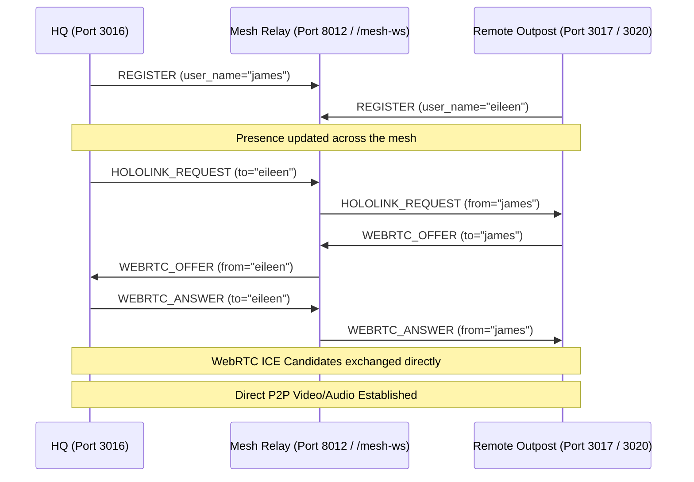

# HoloLink: Sovereign OS Peer-to-Peer WebRTC Media Service

HoloLink is the peer-to-peer (P2P) WebRTC audio and video calling service powering telepresence across the Sovereign OS Tailscale mesh network. It enables direct, secure media streams between outposts, tablets, control consoles, and headless TV nodes with zero reliance on cloud-based signaling.

---

## 1. System Architecture Overview

HoloLink consists of three primary layers:
1. **Signaling Server:** An isolated Python WebSocket relay facilitating WebRTC handshakes.
2. **Context & State Providers:** React Hooks/Context wrapping the media stream lifecycles.
3. **UI Hub & Receivers:** Endpoints and overlay controls dynamically displaying local and remote streams.



---

## 2. Component Directory Layout

*   **Signaling Server:** [`scripts/sovereign_mesh_relay.py`](file:///home/james/SovereignOS/scripts/sovereign_mesh_relay.py)
    *   Listens on port `8012` over `0.0.0.0`.
    *   Exposed externally over the Tailscale secure wildnet via `/mesh-ws`.
    *   Manages user registration, online presence/roster states, queue/waiting rooms (for `AetherVet` clinics), and routes SDP handshakes (`WEBRTC_OFFER`, `WEBRTC_ANSWER`, `WEBRTC_ICE_CANDIDATE`, `HOLOLINK_END`).
*   **Sovereign Media Context:** [`02_Sovereign_Media/src/contexts/HoloLinkContext.tsx`](file:///home/james/SovereignOS/02_Sovereign_Media/src/contexts/HoloLinkContext.tsx)
    *   Standardizes `RTCPeerConnection` configuration with Google STUN servers (`stun:stun.l.google.com:19302`).
    *   Handles local audio/video grab triggers (`navigator.mediaDevices.getUserMedia`) and triggers `ontrack` events.
*   **Media Portal Control Hub:** [`02_Sovereign_Media/src/components/HololinkHub.tsx`](file:///home/james/SovereignOS/02_Sovereign_Media/src/components/HololinkHub.tsx)
    *   Universal dialer overlay with lists of active rooms (e.g., `aether_vet`, `fanstack`, `gardenstack`) and online users.
    *   Renders incoming calls, active audio/video toggles, and handles picture-in-picture layouts.
*   **Storybook Station / Outpost Receivers:** 
    *   [`23_EileenStack/src/HololinkReceiver.tsx`](file:///home/james/SovereignOS/23_EileenStack/src/HololinkReceiver.tsx)
    *   [`18_BarbStack/src/HololinkReceiver.tsx`](file:///home/james/SovereignOS/18_BarbStack/src/HololinkReceiver.tsx)
    *   Standalone nodes designed to listen for incoming pings and boot cameras/microphones automatically to connect back to the caller.

---

## 3. WebRTC Signaling and Handshake Protocol

When initiating a telepresence session, the network operates on the following message exchange loop:

1.  **Register:** Users establish a persistent WebSocket connection to `wss://clio.taila01894.ts.net/mesh-ws` and dispatch a `REGISTER` message.
2.  **Request Call:** The caller issues a `HOLOLINK_REQUEST` specifying the target node.
3.  **Offer:** The receiver accepts, triggers `getUserMedia`, initiates `RTCPeerConnection`, and broadcasts a `WEBRTC_OFFER` with the local Session Description Protocol (SDP).
4.  **Answer:** The caller responds with a `WEBRTC_ANSWER` containing its own SDP.
5.  **ICE Candidates:** Both clients dynamically send `WEBRTC_ICE_CANDIDATE` payloads as ICE trickle establishes the shortest path.
6.  **Tear-down:** Either client sends `HOLOLINK_END` to terminate tracks and destroy the peer connection cleanly.

---

## 4. Hardware Fallback and Edge Resilience

Edge hardware often lacks full multimedia peripherals. HoloLink incorporates robust fallback chains in the receivers to prevent connection failure:

```typescript
try {
  // 1. Attempt full duplex (Audio + Video)
  stream = await navigator.mediaDevices.getUserMedia({ video: true, audio: true });
} catch (mediaErr) {
  try {
    // 2. Fall back to Video-Only (e.g., Headless Nodes without Microphone attached)
    stream = await navigator.mediaDevices.getUserMedia({ video: true, audio: false });
    setStatus('Camera initialized without microphone.');
  } catch (videoOnlyErr) {
    // 3. Fall back to Receive-Only mode (e.g., TV displays)
    setStatus('Hardware Node Camera/Mic not found. Proceeding in Receive-Only Mode.');
  }
}
```

If no local streams are captured, the transceivers are configured to explicitly receive only:
```typescript
pc.addTransceiver('video', { direction: 'recvonly' });
pc.addTransceiver('audio', { direction: 'recvonly' });
```

---

## 5. Troubleshooting & Security

> [!WARNING]
> **HSTS Self-Signed Cert Block:** Because the Tailscale mesh endpoints run secure MagicDNS over HTTPS, browsers may show a security warning warning page. Tell users to type `thisisunsafe` directly on the Chrome error page to bypass this block.

*   **Signaling Server Port:** `8012`
*   **Vite Hot-Reload Collision Guard:** Make sure to keep HMR connections on `/ws` and HoloLink traffic strictly separated on `/mesh-ws` namespace to avoid Vite dev crashes.
