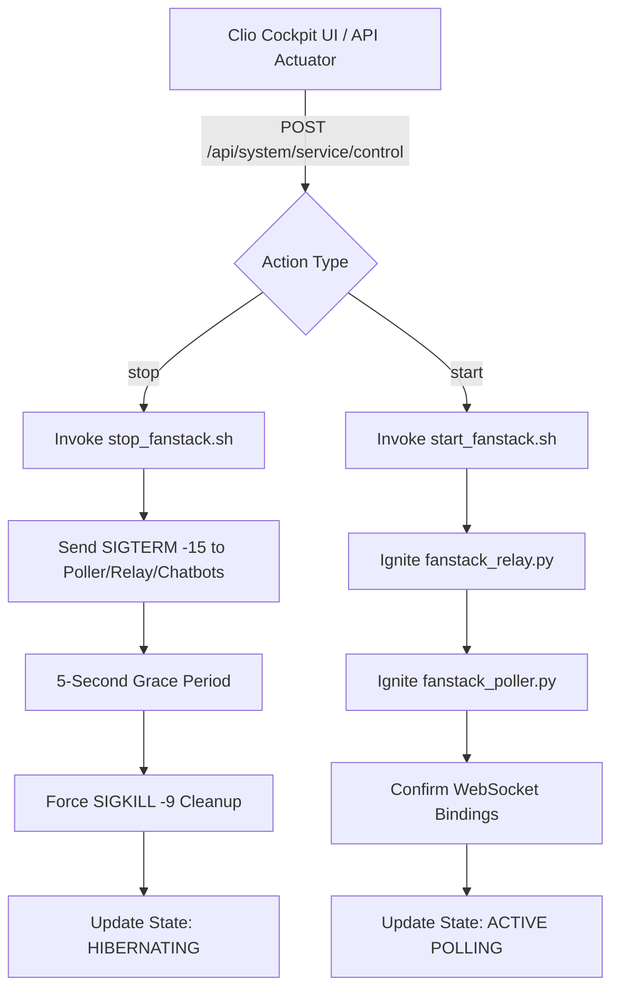

# Sovereign OS FanStack Hibernation Protocol

**Article ID:** KB0002  
**Topic:** System Administration & Resource Optimization  
**Applicability:** Sovereign OS (Raspberry Pi 5 Core)  
**Status:** Published  

---

## Executive Summary

The **FanStack Hibernation Protocol** defines the operational standards and automated procedures for surgically pausing and resuming sports telemetry collection, stream relays, and interactive advocate chatbots. 

By utilizing the **Clio Cockpit** dashboard or the underlying system controllers, the Pilot can transition the system into a low-resource "Hibernation" state. This conserves CPU cycles and RAM on the host Raspberry Pi 5 without disrupting critical core infrastructure or risking database corruption.

> [!NOTE]
> Core infrastructure—such as the **Sovereign Core API (Port 8090)**, the **Vesper Scheduler**, and the **SQLite CMDB/SDLC databases**—remains fully active during hibernation. Only non-essential telemetry collection processes are suspended.

---

## Technical Architecture & Lifecycle

The hibernation sequence is divided into two distinct operational phases: **Surgical Shutdown (Hibernation)** and **System Ignition (Resumption)**.



### 1. Surgical Shutdown Sequence (Hibernation)
When the Pilot triggers a hibernation request, the system executes the `/home/james/SovereignOS/scripts/stop_fanstack.sh` script. The sequence proceeds as follows:

1. **Graceful Term (SIGTERM)**: The script issues a `pkill -15 -f` command targeting the active python runtimes for:
   - `fanstack_poller.py` (Active sports statistics and schedule poller)
   - `fanstack_relay.py` (Telemetry WebSocket relay server on Port 8008)
   - `tmi_daemon.py` (Twitch/advocate messaging engine)
2. **Grace Period**: The system pauses for a **5-second cooldown** to allow file descriptors, active sockets, and database transactions to close cleanly.
3. **Forced Cleanup (SIGKILL)**: Any orphaned telemetry or chatbot processes still active after the cooldown are forcefully terminated via `pkill -9 -f` to guarantee free CPU and memory.

> [!WARNING]
> Never manually issue a global `killall python3` or `pkill python` command. Doing so will crash the **Sovereign Core API** and sever the Clio Cockpit dashboard connection. Always use the surgical script or the Cockpit UI controls.

### 2. System Ignition Sequence (Resumption)
When the Pilot resumes operations, the system executes the `/home/james/SovereignOS/scripts/start_fanstack.sh` script to restore the telemetry pipe:

1. **Relay Binding**: Restarts `fanstack_relay.py` and binds it to Port 8008.
2. **Poller Startup**: Restarts `fanstack_poller.py` to resume real-time schedule checks and game events.
3. **Chatbot Ignition**: Spins up advocate engines to handle chat monitoring and interactive streams.

---

## Dashboard Integration

The **Clio Cockpit** provides a premium, one-click control panel inside the **Active Service Process Matrix** column.

* **Status Indicators**:
  - **● ACTIVE POLLING**: The telemetry suite is running; system is fully active.
  - **○ HIBERNATING**: Telemetry is suspended; CPU and memory consumption are minimal.
* **Control Actuators**:
  - `Hibernate Telemetry`: Triggers the surgical stop script.
  - `Ignite Telemetry`: Triggers the system ignition script.

---

## Troubleshooting & Verification

> [!IMPORTANT]
> If the **WS Relay** status indicator in the Clio Cockpit header turns orange (DISCONNECTED) while the FanStack Telemetry Suite is in the **ACTIVE POLLING** state, check the logs in the trailing console.

### Port Verification via Terminal
To manually verify that the WebSocket relay is bound and listening:
```bash
# Check if Port 8008 is bound
ss -tulpn | grep 8008
```

### Database State Check
To verify that the database correctly reflects the service states:
```bash
sqlite3 /home/james/SovereignOS/dna/sovereign_now.db "SELECT * FROM kb_knowledge WHERE number='KB0002';"
```

> [!TIP]
> Under normal operating conditions, hibernation reduces the overall CPU load of the Raspberry Pi 5 by approximately **15-20%**, cooling core temperatures and freeing up memory for heavy compilation tasks.
