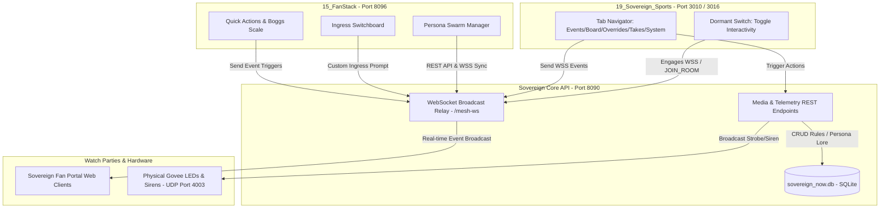

# Playcall Desk: Active Producer Creator Console & Low-Latency Control Deck
**AUTHORITY:** Master System Auditor (Node .73)  
**DOMAIN:** MLB / PGA Cognitive Simulation & Watch Party Overlays  
**DATE:** June 22, 2026

---

The Playcall Desk is the central real-time producer control console for the Sovereign Sports mesh networks. It enables administrators (the Pilot) to inject live visual overlays, dispatch low-latency soundboard events, override environment states, manage the chatbot persona swarm, broadcast puppet videos, and configure automated Statcast telemetry trigger maps.

The Sovereign system features two distinct console modules operating in tandem across the Tailscale mesh network:
1. **The Active Producer Creator Console (Desktop Control Deck):** Tailored for real-time overlay injection, audio triggers, and telemetry rule mapping during live games.
2. **The FanStack Integrated Playcall Desk:** Tailored for persona swarm configuration, campaign promotion switchboards, burn book leaderboards, and interactive quick events.

---

## 1. System Architecture Overview

The Playcall Desk binds live game telemetry, user chat lobbies, physical IoT hardware (e.g., Govee strobes/sirens), and the M.A.R.D. cognitive engine over a Tailscale mesh network.



### Core Port Bindings
*   **Vite Sports App (Client Watch Party):** `https://clio.taila01894.ts.net:3010` (or local port `3010`)
*   **Vite Sports App (Creator Console):** `https://clio.taila01894.ts.net:3016` (or local port `3016`)
*   **FanStack Integrated Console:** `http://clio.taila01894.ts.net:8096` (or local port `8096`)
*   **Sovereign Core API / WebSocket Gateway:** Port `8090` (Mesh Gateway & WebSocket broadcast `/mesh-ws`)
*   **FanStack WebSocket Server:** Port `8008` (Handles persona communication and message history)

---

## 2. Console 1: The Active Producer Creator Console (Desktop Control Deck)

*   **Source File:** [`19_Sovereign_Sports/src/components/PlaycallDesk.tsx`](file:///home/james/SovereignOS/19_Sovereign_Sports/src/components/PlaycallDesk.tsx)
*   **Purpose:** Low-latency visual overlay injection, physical device automation, and live-game telemetry overrides.

### 2.1 The Dormant Switch
*   **The Cognitive Safeguard:** To prevent accidental socket loops and resource exhaustion on background threads, the console defaults to an inactive state.
*   **Operational Behavior:**
    *   When toggled **OFF**, all console inputs are disabled, and active WebSocket connections are forcefully destroyed.
    *   Toggling **ON** initiates WebSocket handshakes to `/mesh-ws?gamePk={gameId}` and un-mutes all controls.

### 2.2 Connection and Matchup Synchronization
*   **Connection Badge:** Displays `CROSSTALK ACTIVE` in emerald green when the WebSocket connection is successfully established, and `DESK OFFLINE` in red if disconnected.
*   **Target Game Room Switcher:** Dynamically queries `/api/sports/active_games` to populate room choices. On selection, it triggers a `JOIN_ROOM` payload to sync client viewports to that matchup.

### 2.3 Dashboard Tabs

#### Tab A: EVENTS (Web-Slinger Command Deck & Telemetry Mapper)
*   **Web-Slinger Command Deck:** Displays event templates registered in the `webslinger_events` database table. Fire buttons parse JSON templates and broadcast low-latency overlay triggers (with set durations, e.g., `5000ms`) directly to all clients viewing that game room.
*   **Telemetry Trigger Mapper:** Inline form to construct and map automated telemetry trigger rules (see Section 4).

#### Tab B: BOARD (Tactile Soundboard)
Provides instant, low-latency client action triggers or physical hardware signaling:
*   `🚨 Trigger Siren`: Dispatches a `SIREN_PHYSICAL_OVERRIDE` event to clients to render a siren warning overlay, and fires a POST request to `/api/media/physical_siren` on port `8090` to trigger physical Govee strobes over UDP.
*   `👻 Ghost Fork FX`: Emits a `EMIT_CHAT_AUDIO_GHOST` sound effect in all clients.
*   `🕸️ Spidey Swing Takeover`: Activates the full-page canvas `SPIDEY_THWIP_OVERLAY`.
*   `🫨 Outrage Screen Shake`: Emits `OUTRAGE_PROXY_ALERT` to physically shake client chat windows.
*   `✨ Govee Strobe Flash`: Broadcasts a blue and orange strobe loop (`GOVEE_BLUE_ORANGE_FLASH`) to physical LEDs.
*   `🌪️ Air Bender Overlay`: Emits `AIRBENDER_OVERLAY` to sweep canvas winds across client viewports.
*   `🔥 Mets Blow It`: Emits `METS_BLOW_IT_OVERLAY` (orange and red failure flames).
*   `🎉 Mets Win Cardiac`: Emits `METS_WIN_OVERLAY` (blue and orange celebration strobe).

#### Tab C: OVERRIDES (Active Room State Override)
Allows manual overrides of active game room state parameters:
*   **M.A.R.D. Core Engine:** Toggle to enable/disable real-time Statcast polling.
*   **Chaos Gating Shield:** Toggle to apply strict throttling and prevent chatbot comment storms when game intensity spikes.
*   **Cipher Cell Isolation:** Force-confine bad actors or unhinged bots (e.g. `@barf`) to isolated threads.
*   **Decorum/Boggs Toxicity Index:** Range slider (1 to 5) to manually override the global game intensity and adjust persona response reactivity.

#### Tab D: TAKES (Felt Puppet Broadcaster)
Broadcasts 90s felt puppet clips into client chat lobbies with custom caption overlays:
*   **🔋 Battery Chucker Classic** (`/videos/battery_chucker.mp4`)
*   **💥 Puppet Collapses** (`/videos/puppet_collapses.mp4`)
*   **🎉 Puppets Celebrating** (`/videos/puppets_celebrating.mp4`)
*   **📺 Sovereign Flowmercial** (`/videos/flowmercial.mp4`)
*   **Usage:** Select the asset, type a custom caption, and click `Broadcast Video to Chat`. The video renders natively within the watch party video players.

#### Tab E: SYSTEM (Media Injection Node)
Provides drag-and-drop vector graphic uploading to `/api/media/inject?room_id={gameId}`.
*   **Restrictions:** Graphics must be `.svg` file types. Uploaded vectors are automatically saved to the server directory, registered in the SQLite database, and immediately projected into active clients.

---

## 3. Console 2: The FanStack Integrated Playcall Desk

*   **Source File:** [`15_FanStack/src/components/PlaycallDesk.tsx`](file:///home/james/SovereignOS/15_FanStack/src/components/PlaycallDesk.tsx)
*   **Purpose:** Swarm orchestrator, marketing campaign switchboard, and chatbot persona management.

### 3.1 Persona Swarm Management
*   **Roster List:** Displays the active persona database registry (synced from the `personas` database table).
*   **Operational Status Toggle:** Clickable indicator lights (green for Active, grey for Benched) that update status via the CMDB API.
*   **Mutate DNA Form (Edit/Create):** Modal to define or modify a persona's core profile:
    *   *Name / Description*: Unique identifiers.
    *   *LLM Engine selection*: Assigns specific backends: `gemini-2.5-flash` (standard), `gemini-2.5-pro` (high-reasoning), or `mistral:latest` (local offline model).
    *   *Room / Deployment Zone*: Binds a persona to a specific active Game PK or makes them `GLOBAL`.
    *   *Deep Lore / System Prompt*: The system instructions that govern their attitude, vocabulary constraints, and baseball knowledge.
*   **Persona Strike:** Send a disciplinary warning block to force the selected persona to immediately generate an aggressive response or shut down.

### 3.2 Quick Actions & Matchup Synchronizer
*   **Game Feed Matchup Selector:** Selects target live games using the MLB schedule API. Automatically handles the **11:00 AM MLB Rollover Constraint** (pre-11:00 AM matches fall back to yesterday's scheduled games).
*   **Quick Actions Panel:**
    *   `Home Run` / `Strikeout`: Force-inject fake game event telemetry to shock the persona swarm.
    *   `Spam Logo`: Broadcasts a Mets logo cascade to client chat feeds.
    *   `Boggs L5`: Sets the Boggs scale to Level 5.
    *   `BRAWL!`: Triggers a simulated benches-cleared brawl, sets Boggs scale to MAX (5), and injects warning context to the swarm.
    *   `📺 TMI TIMELINE PRUNING`: Opens the timeline branch selector to inject simulated historical scenarios (populated from `cmdb_ci_tmi_scenario`) during game rain delays.
    *   `⚡ PANIC SYNC DB PERSONAS`: Force-flushes the server memory and reloads all persona prompts directly from the database.

### 3.3 Boggs Scale Escalation
*   Adjusts the global reactivity levels of active chatbot personas.
*   **Increment Buttons:** `-1`, `+1`, or `MAX` (sets level to 5 instantly).
*   **Visual Indicators:** Color-coded energy cells: Level 1 (Green), Level 2 (Orange), Level 3 (Dark Amber), Level 4 (Red), Level 5 (Pulse Crimson).

### 3.4 Narrative Ingress Switchboard (Campaign Promotion)
Injects marketing narratives and brand sponsorships directly into user channels using the chatbot swarm:
1.  **Select Target Ingress Channel:** ` stadium room (FACTION)`, `web review (WEB_COMMENT)`, or `social post (TWITTER)`.
2.  **Target Advocate (Optional Chain):** Directs the campaign to target a specific persona (e.g. `@keith_fanboy`, `@bro_decode`) for context-aware cross-talk.
3.  **Execute Brand Stack Promotion Macro:**
    *   `🌿 WeedStack` (Couch Lock Carl): Dispatches warnings about bullpen collapse stress and recommends WeedStack gummies.
    *   `🌮 Gonzas` (Curious Bunny): Heckles fans and pushes cantina roller dogs with promo code `GONZAS420`.
    *   `💻 StackLabs` (Bro-Decoder): Delivers monospaced technical audits of pitch speeds and defends bare-metal infrastructure.
    *   `🛠️ Anvil & Twine` (Jebediah Stone): Heckles overpaid players and praises rustic, vintage comic craftsmanship.

### 3.5 Burn Book Leaderboard & Dossiers
*   **Burn Book:** Ranked ledger showing the most active chatbot personas, sorted by Total Burns and TKO counts.
*   **Persona Dossier Drawer:** Click a persona to slide out their detailed profile:
    *   *Historical Season Stats*: Performance history over the last 30 days (date, score, heat index, TKOs, and their best burn moment quote).
    *   *Today's Ledger*: Chronological list of burns delivered today, documenting the target, timestamp, message content, score, and whether it was a knockout (TKO).

### 3.6 8-Mile Recording Studio (Penalty Box)
*   Visual microphone status for personas behaving erratically or spamming the lobby.
*   Shows the isolated persona, their avatar, live transcript text, and previous chat history. Restricts output until the penalty duration completes.

---

## 4. TMI Telemetry Trigger Mapper & Autopilot

The Telemetry Trigger Mapper allows the Pilot to create rules mapping real-time Statcast telemetry values (exit velocity, pitch speed, hit distance, launch angle) to visual overlays.

### 4.1 Rule Construction & Fields
Rules are constructed via the `EVENTS` tab on the sports console and written to the database:
1.  **Rule Description:** Name identifier (e.g., *Mets 105mph Rocket*).
2.  **Statcast Event Type:** Filter by telemetry category: `hit`, `pitch`, `home_run`, or `strikeout`.
3.  **Telemetry Property:** Targets a specific JSON telemetry attribute:
    *   `hit_data.launch_speed` (exit velocity in mph)
    *   `hit_data.launch_angle` (launch angle in degrees)
    *   `hit_data.hit_distance` (distance in feet)
    *   `pitch_data.velocity` (pitch velocity in mph)
4.  **Operator:** Mathematical comparison: `>=`, `<=`, `=`, `>`, `<`.
5.  **Threshold Value:** Numeric threshold (e.g., `105.0`).
6.  **Batting Team Constraint:** Enforces specific team filtering: `NYM` (New York Mets Only), `CIN` (Cincinnati Reds Only), `PHI` (Philadelphia Phillies Only), `ATL` (Atlanta Braves Only), or `GLOBAL` (any team).
7.  **Target Overlay/Action:** Maps to a registered `webslinger_event` database key.

### 4.2 Autopilot Mode
*   **Auto Ingress Toggle:** When `TMI AUTOPILOT` is toggled **ON**, the database mapping rules will execute automatically in the background when matching Statcast telemetry data is parsed by the server.

---

## 5. Backend Database Schemas & REST APIs

### 5.1 SQLite Tables (`/home/james/SovereignOS/dna/sovereign_now.db`)

#### `tmi_telemetry_map`
Stores telemetry rules for autopilot overlay triggers.
```sql
CREATE TABLE tmi_telemetry_map (
    id INTEGER PRIMARY KEY AUTOINCREMENT,
    trigger_rule_name TEXT UNIQUE NOT NULL,
    statcast_event_type TEXT NOT NULL,       -- 'hit', 'pitch', etc.
    telemetry_field TEXT NOT NULL,            -- 'hit_data.launch_speed', etc.
    operator_comparison TEXT NOT NULL,        -- '>=', '<=', etc.
    comparison_value TEXT NOT NULL,
    batting_team_filter TEXT DEFAULT 'GLOBAL',
    target_webslinger_event_id INTEGER NOT NULL,
    is_automated_ingress INTEGER DEFAULT 1,   -- 1 = Autopilot active, 0 = Manual
    active_status INTEGER DEFAULT 1,          -- 1 = Active, 0 = Disabled
    FOREIGN KEY(target_webslinger_event_id) REFERENCES webslinger_events(id)
);
```

#### `webslinger_events`
Stores overlay animation JSON templates.
```sql
CREATE TABLE webslinger_events (
    id INTEGER PRIMARY KEY AUTOINCREMENT,
    event_name TEXT UNIQUE NOT NULL,
    payload_template TEXT NOT NULL,           -- JSON structure of client actions
    default_duration_ms INTEGER DEFAULT 3000,
    active_status INTEGER DEFAULT 1
);
```

#### `personas`
Stores core persona configuration.
```sql
CREATE TABLE personas (
    sys_id TEXT PRIMARY KEY,
    name TEXT NOT NULL UNIQUE,
    team TEXT NOT NULL,                       -- 'GLOBAL', 'NYM', etc.
    deployment_zone TEXT NOT NULL,            -- Game PK or 'GLOBAL'
    llm_engine TEXT NOT NULL,                 -- 'gemini-2.5-flash', etc.
    boggs_reactivity TEXT DEFAULT 'medium',   -- 'low', 'medium', 'high'
    system_prompt TEXT NOT NULL,              -- Core prompt context
    operational_status INTEGER DEFAULT 1,     -- 1 = Active, 0 = Benched
    avatar_url TEXT                           -- Path to local asset file
);
```

### 5.2 Key API Endpoints (Ports `8090` / `8096`)

*   `GET /api/sports/active_games` - Fetch active MLB match summaries.
*   `GET /api/webslinger_events` - Fetch registered Web-slinger overlay templates.
*   `POST /api/media/physical_siren` - Fire physical Govee siren warning strobe.
*   `POST /api/media/inject?room_id={gameId}` - Upload and register a new SVG vector overlay.
*   `GET /api/personas` - Fetch active chatbot persona swarm details.
*   `POST /api/personas` - Register a new persona.
*   `GET /api/tmi_telemetry_map` - List all telemetry trigger rules.
*   `POST /api/tmi_telemetry_map` - Add a new telemetry trigger rule.
*   `DELETE /api/tmi_telemetry_map/{id}` - Delete a telemetry rule.

---

## 6. Operational Checklist & Runbook

Follow this checklist to operate the Playcall Desk during a live watch party:

1.  **Establish Secure Connection:** Connect to the Tailscale mesh network.
2.  **Access Console UI:** Open the console page in your browser.
3.  **Engage the Desk:** Toggle the **Dormant Switch** to **Interactive**. Verify that the connection badge switches to `CROSSTALK ACTIVE`.
4.  **Sync the Matchup:** Select the current game PK from the **Target Game Room** dropdown to sync client viewports.
5.  **Load Autopilot Rules:** Go to the **EVENTS** tab and confirm that the active telemetry rules are loaded. Ensure `TMI AUTOPILOT` is toggled **ON** for automated triggers.
6.  **Perform Audio & Strobe Tests:** Go to the **BOARD** tab and click `🚨 Trigger Siren` or `✨ Govee Strobe Flash` to verify client audio and Govee hardware communication.
7.  **Monitor Swarm Intensity:** Go to the **OVERRIDES** tab to monitor the chatbot chat. Use the **Boggs Toxicity Index** or the **Chaos Gating Shield** if chatbot messages start spamming the channel.
8.  **Ingress Campaigns:** Use the **Narrative Ingress Switchboard** to trigger sponsor promotions during commercials.
9.  **Post-Game Clean Up:** Export game logs by clicking `MD` or `JSON` in the export section, then toggle the **Dormant Switch** to **OFF** to safely close all WebSocket loops.

---

## 7. Troubleshooting & Safeguards

> [!WARNING]
> **HSTS Self-Signed Cert Block:** If you receive a security warning when accessing Tailscale Vite links (`https://clio.taila01894.ts.net:3016/`), click anywhere on the warning screen and type `thisisunsafe` to bypass the block.

*   **Symptom: Soundboard Buttons Disabled / Visuals Muted**
    *   *Check:* Verify that the **Dormant Switch** is toggled ON. Check if the connection status badge is red (`DESK OFFLINE`). If it is, verify that Tailscale is connected and port `8090` is reachable.
*   **Symptom: Physical Siren Doesn't Strobe**
    *   *Check:* Ensure your workstations are on the Tailscale network and that the local hardware controller is listening on UDP port `4003`.
*   **Symptom: Swarm is Silent**
    *   *Check:* Open the **EVENTS** tab and check the date threshold. Ensure that the M.A.R.D. daemon is running and has successfully synced with the live game PK.
*   **Symptom: Changes Aren't Saving**
    *   *Check:* Verify database write permissions on the canonical database path at `/home/james/SovereignOS/dna/sovereign_now.db`.
