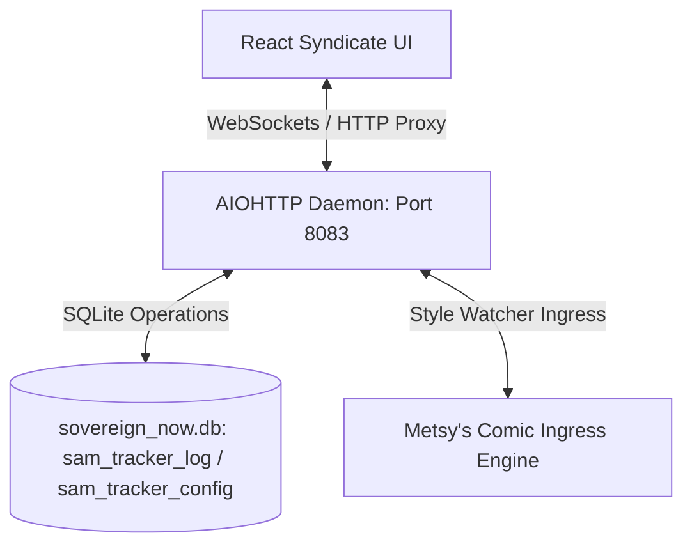

# REQ_0702: CATNIP WARS SYNDICATE FRONTEND REPURPOSING SPEC
**Version**: 1.0.0  
**Status**: APPROVED / REGISTERED  
**Owner**: AI Architecture & SDLC Governance  

---

## 🌳 I. EXECUTIVE SUMMARY & AESTHETIC DIRECTIVES

This document defines the requirements for repurposing the legacy **SamTracker** pet log utility into the **Catnip Wars Syndicate Frontend**. 

The portal transitions from a simple domestic cat activity log into a backyard-defense tactical terminal. All visual components must strictly adhere to the **Cozy 90s Cardboard Treehouse** aesthetic:
- **Palette**: Twilight purples, cardboard browns, pastel greens, and sunset ambers.
- **Motifs**: Corrugated cardboard panel boundaries, silver duct-tape corner bindings, crayon-styled guidelines, and glowing firefly jars for active status indication.
- **Controls**: Wooden dials/buttons, handwritten scribbled text, and classic cartoon styling.

---

## 🏛️ II. ARCHITECTURAL FLOW

The restructured frontend communicates via WebSockets and HTTP to the decoupled Python daemon (`sam_tracker_server.py`) which manages state persistence inside the SQLite database (`sovereign_now.db`).

---

## 🛠️ III. CORE FUNCTIONAL SPECIFICATIONS

### 1. Syndicate Command Dashboard (Main App Window)
- **Cozy Cardboard Grid**: Replace modern UI containers with cardboard panels. Use double-layer borders with crayon lines to simulate cardboard boxes.
- **Interactive Wooden Buttons**: Wooden button styling for custom tactical actions.
- **Mason Jar Indicators**: Ambient glowing mason jars representing active communication links or tactical status.

### 2. Tactical Log (Ledger)
- **Incident & Sighting Reports**: Render recent events using hand-drawn crayon/marker guidelines.
- **Multi-Panel Comic Strip Viewer**: Preserve support for rendering Metsy's stylized daily adventures as a comic strip sequence.
- **Incident Logging Input**: Create a custom duct-tape input field to post new incident descriptions with optional image attachments.

### 3. Dynamic Syndicate Stats
- Refactor the simple domestic stats panel to represent Catnip Wars variables:
  - **Tuna Snacks** -> **Kibble Ammo Inventory** (Standard/Stolen indicator)
  - **Daily Naps** -> **Fortification Integrity** (e.g. 94%)
  - **Adventures** -> **Active Feline Agents** (e.g. Buster, Metsy, Sam)

### 4. Strategic Coordination Feed
- Anchor a secondary scrolling panel showing messages from backyard faction operators (e.g. `@doc_wheeler`, `@buster_brawler`, `@barb_founder`).

---

## 🧪 IV. VERIFICATION & UAT PROTOCOL

1. **Build & Hot-Reload Integrity**: Run Vite development server on port `3004` and ensure zero TypeScript compilation issues.
2. **WebSocket Integration**: Ensure live state updates (stats, logs) propagate to the client inside the dashboard container.
3. **Visual Audit**: Verify the corrugated borders, crayon logs, and mason jars align with the generated design mockup:
   - 
