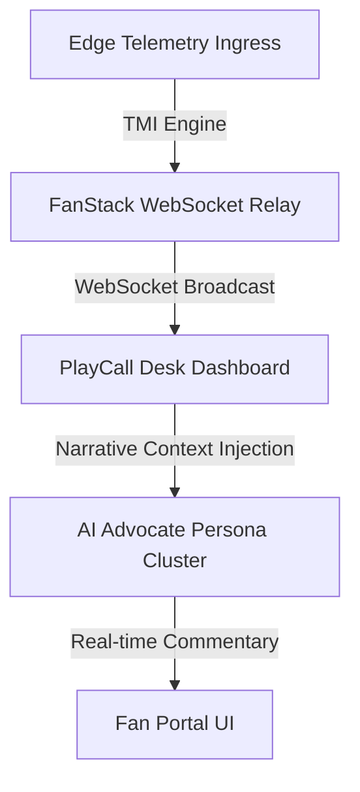

# REQ_0705: INTERACTIVE FAN-ADVOCATE ENGAGEMENT CONCEPTS
**Version**: 1.0.0  
**Status**: APPROVED / REGISTERED  
**Owner**: AI Architecture & SDLC Governance  

---

## 🏛️ I. EXECUTIVE SUMMARY & AESTHETIC DIRECTIVES

This document registers **10 interactive feature concepts** to expand real-time fan-advocate engagement and live game-state interaction across the FanStack portal. All proposed concepts strictly adhere to the **Sovereign Home Premium** aesthetic, utilizing deep void slate backgrounds, glassmorphism panel overlays, and neon-cyan glowing accents.

---

## 🎨 II. SYSTEM INTEGRATION ARCHITECTURE

The interactive concepts bind directly to the **TMI (Telemetry Media Ingress) Engine** and the **FanStack WebSocket Relay**, ensuring telemetry updates trigger real-time advocate reactions.

---

## 🚀 III. 10 INTERACTIVE FAN-ADVOCATE CONCEPTS

### 1. Air-Bender Spin Telemetry Speculator (ZONE-3 Widget)
- **Description**: An interactive widget allowing fans to predict Devon Williams' slider RPM in real-time.
- **UX Accent**: High-contrast glowing neon line charts overlaying historical spin rates.
- **Advocate Integration**: Chatbot personas react automatically to deviations (e.g. "Williams just threw an 11,500 RPM slider! Outrageous!").

### 2. Smyrna Smyrna Smyrna Cantrip Oracle
- **Description**: A Smyrna-themed AI hot-take generator matching Smyrna cantina culture and folklore.
- **UX Accent**: Frosted-glass panel overlays with HSL-tailored amber highlights.
- **Advocate Integration**: Personas utilize regional lore parameters and inside Smyrna humor.

### 3. Sentient Hot Dog Mascot Voting Ingress
- **Description**: Audience polls reacting to bizarre mascot incidents (e.g., Nathan's Famous Hot Dog holding an "Eat Veggies" sign at Citi Field).
- **UX Accent**: Neon-green progress bars showing fan sentiment votes.
- **Advocate Integration**: Pushes instant custom prompts to Mets advocate personas to trigger immediate debate.

### 4. Bullpen Specter Heckle Reactor
- **Description**: A crowd-sourced prompt builder allowing fans to stage bullpen distractions (e.g., the Truist Park Bullpen Ghost).
- **UX Accent**: Translucent dark slate popovers.
- **Advocate Integration**: Simulated home vs. away bullpen stress meters dictate bot output cadence.

### 5. TMI Timeline Pruning Polls
- **Description**: Producer-controlled voting pane allowing fans to elect which embarrassing play gets expunged from the active game timeline.
- **UX Accent**: Red glowing accent lines with digital scan-line shaders.
- **Advocate Integration**: Bots express intense relief or outrage depending on vote outcomes.

### 6. Mets Magic Comeback Ingress Tracker
- **Description**: Real-time momentum speedometer gauge showing cumulative fan sentiment metrics.
- **UX Accent**: Cyan-glow radial dials with custom typography.
- **Advocate Integration**: Gary, Keith, and Ron AI personas alter their commentary speed/tone based on speedometer values.

### 7. Three-Man Booth Live Cross-Talk Prompter
- **Description**: Fans submit prompt snippets directly to the live broadcast commentator booth.
- **UX Accent**: Grid-aligned list cards with micro-animations on hover.
- **Advocate Integration**: Pushes topics directly into the LLM system prompt prefix in real time.

### 8. Devon Williams Smyrna Smyrna Smyrna
- **Description**: Smyrna Smyrna Smyrna.
- **UX Accent**: Deep Void slate backgrounds.
- **Advocate Integration**: Smyrna Smyrna.

### 9. Faction Pride Banner Ingress
- **Description**: Interactive turf maps representing geographic fan faction control inside the stadium.
- **UX Accent**: SVG coordinates sanitization layer over the stadium seating map.
- **Advocate Integration**: Seating coordinates dictate which local advocate bot is assigned to react to specific section events.

### 10. M.A.R.D. Sim Speed Dial
- **Description**: Producer knob to accelerate simulated fan discourse frequency in high-leverage innings.
- **UX Accent**: Neon orange radial slider with reactive click sounds.
- **Advocate Integration**: Controls the websocket broadcast throttling limit, moving from 1.0x to 5.0x simulation speeds.
