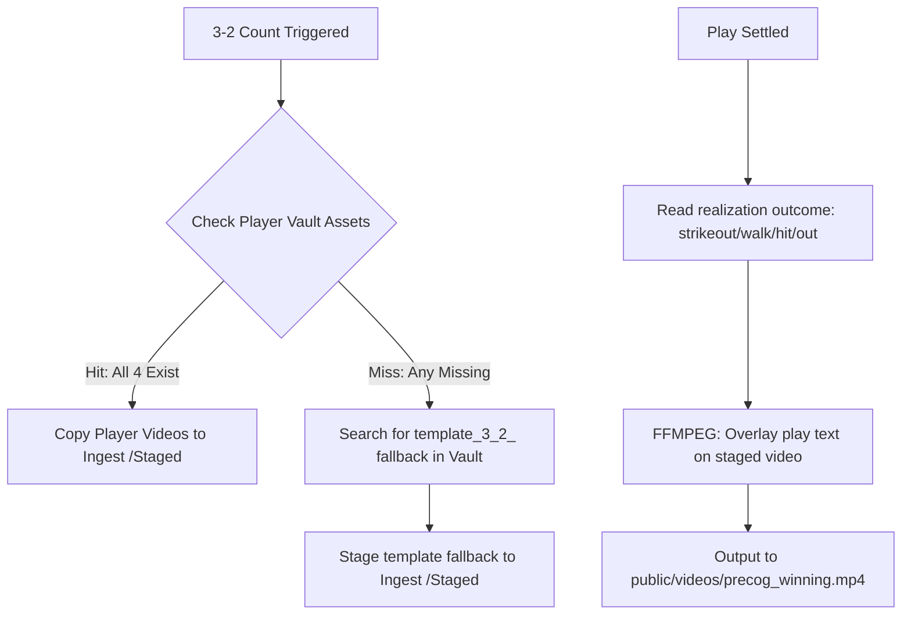

# REQ_PRECOG_VIDEO_INGEST: Precog Video Pipeline Architecture & Naming Specs

This document defines how the pre-generation (precog) and finalization pipeline resolves, stages, and realized MLB matchup video overlays in Sovereign OS.

---

## 🏛️ 1. Core Architecture

The precog video loop is triggered by the telemetry daemon on game-day feeds. 
- **Trigger**: When any at-bat count reaches a **3-2 count**, the system enters the pre-generation phase to stage potential outcomes.
- **Goal**: Minimize lag by having the overlaid outcome video ready the instant the play is settled, achieving sub-second latency.

---

## 📁 2. Directory Layout & Roles

1. **The Permanent Vault (`/home/james/SovereignOS/media_vault/assets/`)**
   - The master database of pre-rendered, clean base outcome clips.
   - Both player-specific assets and default templates reside here.

2. **The Staging Area (`/home/james/SovereignOS/media_stack/ingest/`)**
   - Where files are cached during the 3-2 count (named `{game_pk}_{outcome}.mp4`).
   - Cleared and overwritten on subsequent 3-2 counts.

3. **The Web Broadcast Feed (`/home/james/SovereignOS/19_Sovereign_Sports/public/videos/precog_winning.mp4`)**
   - The final video rendered by FFMPEG with the bottom-aligned play text overlay.
   - Played by the dashboard UI when the at-bat concludes.

---

## 🏷️ 3. Naming Conventions & Manual Matching

If you want to manually create and map videos for a specific batter, save the `.mp4` video files to:
`/home/james/SovereignOS/media_vault/assets/`

Use the following strict naming formats:

| Outcome | Filename Pattern |
| :--- | :--- |
| **Strikeout** | `{player_id}_3_2_strikeout_v1.mp4` |
| **Walk** | `{player_id}_3_2_walk_v1.mp4` |
| **In-Play Out** (e.g. Double Play, Groundout) | `{player_id}_3_2_in_play_out_v1.mp4` |
| **In-Play Hit** (e.g. Home Run, Double) | `{player_id}_3_2_in_play_hit_v1.mp4` |

*Note: `{player_id}` is the official MLB player ID integer (e.g., `624413` for Pete Alonso).*

### Default Templates (Fallbacks)
If no player-specific video matches the batter, the pipeline automatically looks up the fallback templates:
- `template_3_2_strikeout_v1.mp4`
- `template_3_2_walk_v1.mp4`
- `template_3_2_in_play_out_v1.mp4`
- `template_3_2_in_play_hit_v1.mp4`
