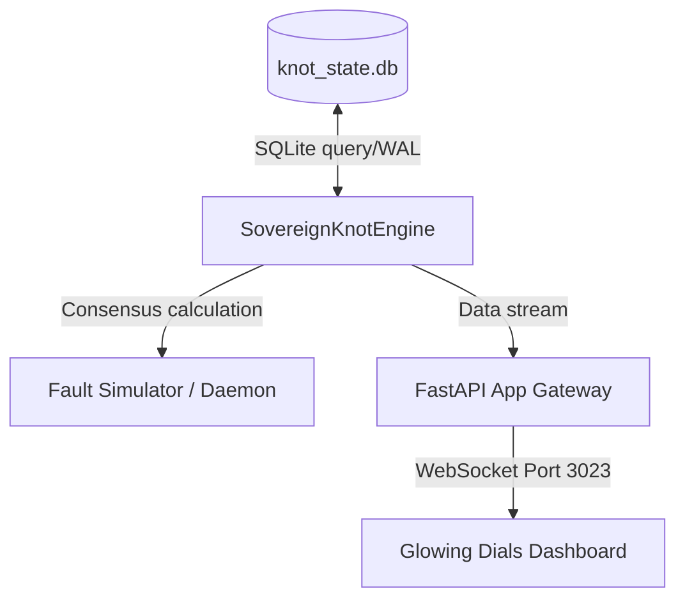

# REQ_WO_KNOT_MASTER: DECOUPLED SOVEREIGN KNOT CORE SHOWCASE SPECIFICATION
**Version**: 1.0.0  
**Status**: APPROVED  
**Owner**: James Carroll, Founder & Lead Systems Architect, StackLabs LLC  
**Date**: July 9, 2026

---

## 🏛️ I. EXECUTIVE SUMMARY & AESTHETIC DIRECTIVES

This document specifies the technical and mathematical requirements for the **Decoupled Sovereign Knot Core Showcase**. The showcase illustrates a decentralized consensus gateway built around a scalar S-Score that monitors core system variables in real time.

All user interfaces, console outputs, and dashboards associated with this module must strictly adhere to the **Sovereign Home Premium** styling guidelines:
- **Background**: Deep Void black/slate (`#0b0d13`).
- **Foreground/Accents**: Neon-cyan glow (`#00b4d8` / cyan-500) and frosted-glass panels (`backdrop-filter: blur()`).
- **Typography**: Clean high-contrast sans-serif font face (e.g. Inter).

---

## 🎨 II. MATHEMATICAL CONSENSUS MODEL

The core engine computes a continuous consensus S-Score representing system integrity.

### 1. Variables and Inputs
The system monitors five (5) distinct parameters from the local `knot_state.db` SQLite database:
1. **A** (Active Core Network State): Nominal state check.
2. **PW** (Power Purity): Measured voltage level.
3. **T** (Temporal Sync): Chronological sync.
4. **C** (Relational CMDB Constraints): System alignment mapping.
5. **PI** (Omega Gate): Pilot sign-off bypass.

### 2. Strict Evaluation Thresholds
Each variable is mapped to a binary status ($0.0$ or $1.0$) based on strict logic:
* **Active State Status ($A_{status}$)**:
  $$A_{status} = \begin{cases} 1.0 & \text{if } A \ge 1.0 \\ 0.0 & \text{otherwise} \end{cases}$$
* **Power Purity Status ($PW_{status}$)**:
  $$PW_{status} = \begin{cases} 1.0 & \text{if } 5.05 \le PW \le 5.15 \\ 0.0 & \text{otherwise} \end{cases}$$ *(Strict 5.1V power constraint)*
* **Temporal Sync Status ($T_{status}$)**:
  $$T_{status} = \begin{cases} 1.0 & \text{if } T \ge 1.0 \\ 0.0 & \text{otherwise} \end{cases}$$
* **Relational CMDB Status ($C_{status}$)**:
  $$C_{status} = \begin{cases} 1.0 & \text{if } C \ge 1.0 \\ 0.0 & \text{otherwise} \end{cases}$$
* **Omega Gate Status ($PI_{status}$)**:
  $$PI_{status} = \begin{cases} 1.0 & \text{if } PI \ge 1.0 \\ 0.0 & \text{otherwise} \end{cases}$$

### 3. S-Score Calculation
The final scalar consensus $S$ is calculated as follows:
$$S = (A_{status} \cdot PW_{status} \cdot T_{status} \cdot C_{status}) \cdot PI_{status}$$

### 4. Zero-Collapse Containment Rule
* **Nominal Containment ($S == 1.0000$)**: A SHA-256 state hash is generated and written to `audit_breadcrumb` every cycle. Downstream database transactions are permitted.
* **State Fracture ($S < 1.0000$)**: If $S$ drops below $1.0$, the system must instantly call `execute_quarantine_suspension()`, flash `[TOPOLOGICAL COLLAPSE - POWER DEGRADATION]` (or appropriate error) to the console, register a "State Fracture" alert log, and throw an exception blocking all downstream transactions.

---

## 🌐 III. SYSTEM ARCHITECTURE



### 1. Database Schema (`knot_state.db`)
Configured in WAL mode to allow asynchronous reads/writes without lock contention:
```sql
CREATE TABLE IF NOT EXISTS sys_variable (
    variable_key TEXT PRIMARY KEY,
    status_value REAL NOT NULL,
    last_verified_timestamp TEXT NOT NULL
);

CREATE TABLE IF NOT EXISTS audit_breadcrumb (
    id INTEGER PRIMARY KEY AUTOINCREMENT,
    state_hash TEXT NOT NULL,
    s_score REAL NOT NULL,
    details TEXT NOT NULL,
    timestamp TEXT NOT NULL
);
```

### 2. API Endpoints
* **WebSocket `/ws/consensus`**: Streams JSON payloads every 500ms containing current values and S-Score:
  ```json
  {
    "A": 1.0,
    "PW": 5.1,
    "T": 1.0,
    "C": 1.0,
    "PI": 1.0,
    "S": 1.0,
    "status": "NOMINAL"
  }
  ```
* **POST `/api/simulate_fracture`**: Drop `PW` status to `4.7` in the database.
* **POST `/api/simulate_recovery`**: Restore `PW` status to `5.1` in the database.
* **GET `/`**: Serves the single-page HTML client dashboard.

### 3. Port Allocation
To avoid conflict with the Clio Cockpit Dashboard running on Port `3022`, the Showcase App Gateway will serve on Port **3023**.
