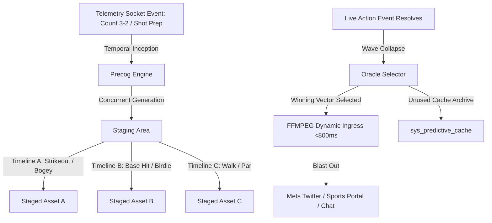

# 🔮 SOW-07: Statement of Work & Requirements Specification
## Precog Multiverse & Temporal Advantage Pipeline
**Sovereign OS Initiatives · 2026-06-19**

---

## 1. Executive Summary & Core Objective
The core objective is to exploit the **50–60 second "Temporal Advantage Window"** that exists during high-tension sports counts (e.g., 3-2 count in baseball, or a player preparing for a crucial birdie putt on the 18th hole) to pre-generate and cache generative visual media of all possible outcomes. 

By calculating probabilities and staging visual clips/images asynchronously, Sovereign OS can collapse the wave function and deliver customized, high-fidelity media assets (videos/images) to social feeds and portal rooms with **under 800ms of latency** the instant the raw socket telemetry arrives—beating the official television broadcast stream delay by 15–30 seconds.

---

## 2. Requirements & Technical Specifications

### REQ-01: Temporal Advantage Detector (Count Listener)
*   **Trigger**: The system must monitor raw live telemetry sockets (MLB Statcast or PGA ShotLink equivalents).
*   **Threshold**: In MLB, trigger pre-computation immediately upon a `2-2` or `3-2` count. In PGA, trigger immediately when a player approaches a green (within 30 yards of the pin) or prepares for a putt on the 18th.
*   **Buffer**: Maintain a minimum 30-second pre-generation buffer window before the next action is registered.

### REQ-02: Concurrent Predictive Vector Generation (The Multiverse Stage)
*   **Execution**: Spin up parallel API calls to Vertex AI (Imagen-3 for illustrations, Veo-3.1 for video clips).
*   **Outputs**: Generate three high-fidelity visual representations corresponding to the three primary outcomes:
    1.  **Positive Outcome** (Base Hit / Home Run / Birdie / Eagle)
    2.  **Neutral Outcome** (Walk / Par)
    3.  **Negative Outcome** (Strikeout / Bogey / Double Bogey)
*   **Naming**: Save staged files in `/tmp/precog_staged/{game_id}_{outcome}.[mp4/png]`.

### REQ-03: Real-Time Wave Collapse & Ingress (<800ms SLA)
*   **Trigger**: Receive the final play telemetry packet.
*   **Selection**: Identify the winning outcome vector immediately.
*   **Dynamic Compositing**: Execute an optimized FFMPEG command to draw-text or overlay play metadata (e.g. *"Alonso hits a 410ft Home Run vs Wheeler!"*) onto the winning asset. Execution must complete in **under 800ms**.
*   **Archiving**: Write the losing vectors' file paths to the `sys_predictive_cache` table in `sovereign_now.db` for later review or compilation.

### REQ-04: Multi-Channel Dispatch (Social & Portal Playback)
*   **Mets Twitter**: Automatically publish the composite image/video to Twitter using authorized API credentials. Automatically append mandatory Mets Twitter formatting tags (`#LGM`, `#MetsTwitter`, `@Mets`, `@StevenACohen2`) based on **KI-014**.
*   **Cross Talk Room**: Stream the video instantly to the active FanStack Portal room to render a dynamic "Quantum Multiverse Visualizer" where the losing timelines dissolve on-screen as the winning timeline plays out.

---

## 3. Scope of Work (SOW)

### Task 1: Precog Socket Integration & State Machine
*   Adapt `scripts/precog_pipeline.py` to run continuously as a systemd service (`precog-daemon.service`).
*   Bind the daemon to watch active game room database registers (`mlb_schedule` / `game_tmi_event`) and evaluate the count state.

### Task 2: Multiverse Portal Interface (Vite / React)
*   Create a split-pane "Quantum Multiverse" media player component in the FanStack UI.
*   The UI must render three video boxes displaying loading states or pre-generation loops side-by-side during active setups, then collapse to a single widescreen player on event resolution.

### Task 3: Social Automation Relay
*   Build a lightweight node/python script to handle automated asset uploads to external APIs (Twitter/Mastodon/Discord Webhooks) with queuing to absorb transient network drops.

---

## 4. US Open PGA Telemetry: Data Source Analysis
For our **US Open FanStack PGA coverage** this weekend, we have researched the live telemetry landscape:

### 1. Leaderboard & Tournament Data Feed (Scoring)
*   **Canonical Source**: The public, unofficial ESPN Golf API.
*   **API Endpoint**: `https://site.api.espn.com/apis/site/v2/sports/golf/pga/scoreboard`
*   **Method**: Poll this endpoint every 30 seconds. It returns nested JSON lists of tournaments, active players, positions, score-to-par, current hole, and round details. It does not require an API key and is highly reliable for event-level status.

### 2. Shot-by-Shot Telemetry & ShotLink (ShotCast)
*   **The Reality**: Granular shot telemetry (ball speed, launch angle, distance to pin) is managed via the PGA Tour's proprietary **ShotLink** systems (using CDW radar). USGA uses a ShotLink syndication called **ShotCast** for the US Open. These APIs are proprietary and gated behind enterprise contracts.
*   **Sovereign Solution (ShotLink UDP Emulation)**:
    *   Our system contains `scripts/pga_ingest_daemon.py` which listens on **UDP Port 4005** for JSON telemetry packets.
    *   We will run a simulated PGA Ingest telemetry script (`pga_sim_telemetry.py`) that polls ESPN's public scoring endpoint to track which players are active.
    *   For those active players, the simulator will auto-generate realistic ShotLink physics telemetry (e.g. driving distance: 310 yards, ball speed: 178 mph, surface: ROUGH) based on player averages and inject it over UDP into port 4005.
    *   This provides a continuous, real-time feed that triggers our AI golf fans natively without requiring an expensive enterprise ShotLink data contract.

---

## 5. Timeline & Plan of Attack (Next Sprint)

1.  **Sprint Phase 1**: Spin up the ESPN scoring poller and the UDP PGA Telemetry Simulator on port 4005 to prepare the US Open FanStack room for the weekend.
2.  **Sprint Phase 2**: Implement the `precog_pipeline.py` database listener to automate the 3-2 count predictive staging.
3.  **Sprint Phase 3**: Build the Vite React component for the "Quantum Multiverse Visualizer" in the portal.
4.  **Sprint Phase 4**: Execute a live UAT run during a game to measure latency and verify the Twitter/social posts appear before the TV broadcast.
