# 🏟️ SOW-08: Statement of Work & Design Document
## Unified Match Center UI & Telemetry Pipeline
**Sovereign OS Initiatives · 2026-06-20**

---

## 1. Executive Summary & Core Objective
The objective of this initiative is to redesign and optimize the live viewer interfaces (`VideoPlayer.tsx` and `FootyMatchCenter.tsx`) in **Sovereign Sports** (`19_Sovereign_Sports`), consolidating them into a unified, high-performance dark-mode **Match Center UI**. 

This interface will stream live broadcasts while rendering real-time telemetry (physics overlays, play logs, momentum charts, and interactive 2D canvases) dynamically populated by a database-driven pipeline. The UI borrows design patterns from industry leaders like **FotMob** (clean grid alignment and xG shot mapping), **Sofascore** (interactive lineup toggles and momentum tracking), and **PGA Tourcast** (3D ball flight vectors and green grids).

---

## 2. Architecture & Data Flow
The telemetry pipeline digests scoring, coordinates, and physical metrics from public scoreboards and UDP sensor streams, caches them in the canonical SQLite database, and distributes them via FastAPI WebSockets to the React frontend.

```mermaid
graph TD
    subgraph Ingress Layer
        A[ESPN Scoreboard API] -->|REST Poller| C[Sovereign Stream Relay]
        B[ShotLink UDP Emulation: Port 4005] -->|Socket Listener| C
    end

    subgraph Storage & Relay Layer
        C -->|SQL Write| D[(sovereign_now.db)]
        C -->|Push Event| E[FastAPI WebSocket Router]
    end

    subgraph Client Layer
        E -->|Websocket Mesh Stream| F[React Match Center UI]
        D -->|REST Hydration /api/sports| F
        F -->|WebRTC Offer| G[Sovereign Core API: Port 8090]
        G -->|WebRTC Audio Link| F
    end
    
    style D fill:#1e1e2e,stroke:#3b82f6,stroke-width:2px;
    style F fill:#0f172a,stroke:#00ffcc,stroke-width:2px;
```



---

## 3. Database Schema Specifications
All live game metadata and telemetry reside in the canonical `/home/james/SovereignOS/dna/sovereign_now.db` database. The active schemas governing the sports stacks are specified below:

### 3.1 MLB Play Logs (`game_play`)
Records individual pitches, velocities, and bat-to-ball telemetry for active baseball games:
```sql
CREATE TABLE game_play (
    id TEXT PRIMARY KEY,
    game_pk TEXT NOT NULL,
    play_id TEXT,
    inning INTEGER,
    half TEXT,                  -- 'top' or 'bottom'
    event_type TEXT,            -- 'strikeout', 'single', 'home_run', etc.
    batter TEXT,
    pitcher TEXT,
    pitch_speed REAL,           -- Release velocity in mph
    pitch_type TEXT,            -- 'four-seam', 'slider', 'curveball', etc.
    description TEXT,           -- Playcall narrative
    score_away INTEGER,
    score_home INTEGER,
    outs INTEGER,
    raw_json TEXT,              -- Full unparsed payload backup
    recorded_at TEXT DEFAULT (datetime('now')),
    sys_created_on TIMESTAMP,
    sys_updated_on TIMESTAMP
);
```

### 3.2 PGA Shot-by-Shot Telemetry (`pga_tournament_telemetry`)
Stores detailed physics measurements for golfer strokes on the fairway and green:
```sql
CREATE TABLE pga_tournament_telemetry (
    shot_id INTEGER PRIMARY KEY AUTOINCREMENT,
    player_id INTEGER NOT NULL,
    hole_number INTEGER NOT NULL,
    shot_number INTEGER NOT NULL,
    ball_speed_mph REAL,
    launch_angle_deg REAL,
    spin_rate_rpm REAL,
    distance_to_pin_yds REAL,
    surface_type TEXT,          -- 'TEE', 'FAIRWAY', 'ROUGH', 'SAND', 'GREEN'
    logged_at TIMESTAMP DEFAULT CURRENT_TIMESTAMP
);
```

### 3.3 PGA Leaderboards (`pga_active_leaderboard`)
Tracks tournament positioning, current holes, and aggregate score-to-par:
```sql
CREATE TABLE pga_active_leaderboard (
    player_id INTEGER PRIMARY KEY,
    player_name TEXT NOT NULL,
    current_position INTEGER,
    score_to_par INTEGER DEFAULT 0,
    current_hole INTEGER DEFAULT 18,
    status TEXT DEFAULT 'ACTIVE', -- 'ACTIVE', 'FINISHED', 'CUT'
    updated_at TIMESTAMP DEFAULT CURRENT_TIMESTAMP
);
```

### 3.4 Soccer Match Events (`soccer_incident_ingress`)
Logs football pitch events, timing, and leverage metrics to calculate game momentum:
```sql
CREATE TABLE soccer_incident_ingress (
    incident_id VARCHAR(36) PRIMARY KEY,
    match_id INT NOT NULL,
    match_minute VARCHAR(10) NOT NULL,
    incident_type VARCHAR(50) NOT NULL, -- 'GOAL', 'YELLOW_CARD', 'RED_CARD', 'FOUL'
    leverage_delta DECIMAL(4,2) NOT NULL, -- Impact of play on match outcome
    data_payload TEXT NOT NULL          -- Event details (scorer, assistant, team)
);
```

---

## 4. Front-End User Interface Design
The revised interface uses a **65/35 dual-column grid** enclosed in a glassmorphic frame, shifting background accents depending on the teams playing:

```
+-------------------------------------------------------------------+
|  [<-]  USA 2 - 1 ENG       74' | xG: 1.82 - 1.15       [Decibels] |
+------------------------------------+------------------------------+
|                                    |                              |
|           VIDEO STREAM             |     ADVOCATE SWARM MATRIX    |
|       (Broadcast / Feed)           |   @proper_pinter  (Orange)   |
|                                    |   @expected_tears (Blue)     |
|                                    |                              |
| +--------------------------------+ | +--------------------------+ |
| |       2D TACTICAL PITCH        | | |   TERRACE CHAT BALCONY   | |
| |   (Live coordinates / heatmaps) | | |                          | |
| |                                | | |  [proper_pinter]:        | |
| |                                | | |  "VAR is killing the     | |
| |                                | | |   soul of the terrace!"  | |
| +--------------------------------+ | |                          | |
|                                    | |  [Pilot]:                | |
|  MOMENTUM SPARKLINE (Leverage)     | |  "Who is ref today?"     | |
|  ================~~~~~~~~~~~~~~~  | |                          | |
|                                    | |                          | |
|  STATCAST / OPTA TICKER            | |  [Mic] Input Chat...     | |
+------------------------------------+------------------------------+
```

### 4.1 MLB Match Center Redesign
*   **Opta Pitch Ticker**: A scrolling data-dense bar at the bottom showing speed, pitch selection, and exit velocities.
*   **2D Diamond Canvas**: Interactive canvas displaying base-runner positions (glowing node icons on 1st, 2nd, 3rd) and a graphic pitch-zone grid mapping previous pitches of the current at-bat.
*   **Dynamic Play log**: Vertical list showing the outcome of each at-bat (e.g. *Strikeout*, *Groundout*, *Home Run*), updating via websockets.

### 4.2 FootyStack (Soccer) Match Center Redesign
*   **xG Shot Mapping**: Plotting shots on the 2D canvas. Clicking a shot point opens a tooltip containing details on distance, shot type, and xG value.
*   **Momentum Wave Graph**: A dynamic SVG path illustrating team pressure waves.
*   **Tactical Heatmap**: Displays Touch Map coordinates of the active advocate persona selected from the **Swarm Panel**.

### 4.3 Golf Match Center Redesign
*   **GPS Hole Vector Graphic**: Renders a vertical representation of the active hole, placing nodes for the selected player's shots (Tee shot -> Fairway -> Green) with hover info cards.
*   **Green Grids**: Displays green contour arrows and slope breaks when the ball is on the putting surface.
*   **Active Leaderboard Sidebar**: Slides open from the side, updating player position and total score in real-time.

---

## 5. Scope of Work & Verification Plan

### 5.1 Deliverables & Tasks
1.  **Task 1 (UI Refactoring)**: Merge common player interface logic from `VideoPlayer.tsx` and `FootyMatchCenter.tsx` into a reusable telemetry core.
2.  **Task 2 (Canvas Development)**: Build the interactive 2D canvas drawing utility supporting custom sports maps (Baseball Diamond, Soccer Pitch, Golf Fairway).
3.  **Task 3 (Telemetry Socket Bindings)**: Connect the WebSocket listener in the frontend to dispatch actions to update the canvas coordinate matrices instantly.
4.  **Task 4 (HoloLink Call Optimization)**: Refine audio stream delay controls inside the WebRTC connection state to maintain sub-200ms calling lag.

### 5.2 Verification Plan
*   **Playwright Telemetry Simulation**: Execute telemetry packet injections over WebSocket rooms to verify correct canvas positioning.
*   **Schema Consistency Audit**: Validate database write integrity under parallel simulated matches.
