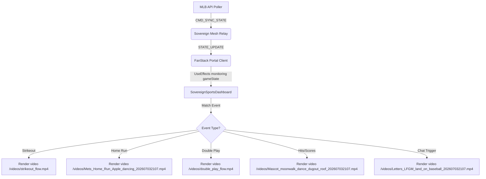

# SOW 13: CROSSTALK LOUNGE PANEL B EVENT-DRIVEN NEON OVERLAYS
**VERTICAL:** Sovereign Sports Watch Party & FanStack Telemetry
**STATUS:** Approved & Implemented (Integrated with user-designed Flow animations)

## 1. EXECUTIVE SUMMARY
To achieve an "SNY-worthy" broadcast standard for the Sovereign Sports Watch Party (Port 3010), the Crosstalk Lounge requires high-fidelity, visual feedback animations. When crucial game events happen (such as strikeouts, home runs, or full counts), the dashboard must instantly trigger high-energy, eye-catching overlays over the main telemetry field.

This document serves as the formal specification for the event-driven Panel B (Zone 4) overlay system, mapping telemetry triggers, specifying asset generation prompts, and cataloging the active media files.

---

## 2. ASSET GENERATION PROMPTS & MEDIA CATALOG

To ensure aesthetic consistency ("Sovereign Home Premium" theme: dark void backgrounds, glowing neon blue/orange/green accents), all graphics must be created using precise prompting.

### 2.1. Strikeout Celebration
*   **Trigger**: `gameState.event_type === 'strikeout'` or `gameState.status_msg` containing strikeout descriptions.
*   **Current Asset**: `/videos/strikeout_flow.mp4` (high-fidelity looping animation created in Flow).
*   **Prompt for Generation**:
    > "A retro neon baseball strikeout celebration graphic with a glowing neon letter 'K' in Mets colors (blue and orange), style of an arcade display, dark void background, high-contrast, premium, 8k."
*   **Behavior**: Displayed inside a neon-cyan container with a zoom-in animation for exactly 6.0 seconds.

### 2.2. Home Run Celebration
*   **Trigger**: `gameState.event_type === 'home_run'` or `gameState.status_msg` containing homer descriptions.
*   **Current Asset**: `/videos/Mets_Home_Run_Apple_dancing_202607032107.mp4` (glowing dancing Home Run Apple).
*   **Prompt for Generation**:
    > "A stunning neon Mets home run celebration graphic with a glowing home run apple and firework trails in Mets blue and orange, arcade display, dark void background, high-contrast, premium, 8k."
*   **Behavior**: Displayed inside a neon-orange pulsing container with a spinning zoom animation for exactly 8.0 seconds.

### 2.3. Double Play Celebration
*   **Trigger**: `gameState.status_msg` containing "double play" or "grounds into a double".
*   **Current Asset**: `/videos/double_play_flow.mp4` (looping neon baseball double play animation).
*   **Prompt for Generation**:
    > "A retro neon baseball double play graphic with glowing blue and orange double play text, arcade glow, dark background, 8k."
*   **Behavior**: Displayed inside a neon-cyan container with a zoom-in animation for exactly 6.0 seconds.

### 2.4. Mascot Celebration
*   **Trigger**: Hits, walks, or runs scored (e.g., status message contains "singles", "doubles", "triples", "scores", or "walks").
*   **Current Asset**: `/videos/Mascot_moonwalk_dance_dugout_roof_202607032107.mp4` (Mets mascot moonwalking).
*   **Prompt for Generation**:
    > "A retro neon graphic of a baseball mascot moonwalk dancing on a dugout roof with glowing green outlines, high contrast arcade aesthetic, 8k."
*   **Behavior**: Displayed inside a neon-green container for exactly 6.0 seconds.

### 2.5. LFGM (Lets Go Mets) Chat Overlay
*   **Trigger**: Chat message text containing "lfgm" or "lets go mets".
*   **Current Asset**: `/videos/Letters_LFGM_land_on_baseball_202607032107.mp4` (LFGM letters landing on baseball).
*   **Prompt for Generation**:
    > "A glowing neon letter logo LFGM landing on a glowing baseball with trailing orange sparks, dark background, premium arcade style, 8k."
*   **Behavior**: Displayed inside a pulsing blue-orange container for exactly 5.0 seconds.

### 2.6. Full Count Heartbeat Warning
*   **Trigger**: `gameState.balls === 3 && gameState.strikes === 2` (Full Count).
*   **Current Asset**: `/images/fullcount_neon.png` (3-2 scoreboard with heartbeat monitor EKG lines).
*   **Prompt for Generation**:
    > "A premium neon baseball scoreboard graphic indicating a 3-2 count (full count warning) with a glowing heartbeat monitor line and alert text. High-contrast, dark void background, Mets themed blue and orange accents, arcade glow, 8k."
*   **Behavior**: Persistent display for the duration of the 3-2 count inside a high-intensity red borders container with a heartbeat pulse scaling effect.

---

## 3. TECHNICAL ARCHITECTURE

### 3.1. Inline Keyframe Injector
To keep CSS scoping clean and avoid styling leakage, custom animations are injected into the dashboard's styles:
- `neonPulseStrikeout`: Alternate glow scaling between `#00FFCC` and `#00F0FF`.
- `neonPulseHomerun`: Pulse orange shadow between `#FD5A1E` and `#EF4444`.
- `neonPulseDoublePlay`: Alternate blue-cyan glow shadow.
- `neonPulseMascot`: Pulse green shadow.
- `neonPulseLfgm`: Alternate orange and blue glow shadow.
- `heartbeatFlash`: Rapid double-pulse scaling to mimic a heartbeat warning beep.

---

## 4. VERIFICATION AND QUALITY ASSURANCE
*   **Asset Path Integrity**: Verify all files exist in `/home/james/SovereignOS/19_Sovereign_Sports/public/`.
*   **Performance Audit**: Ensure overlays use CSS GPU-accelerated properties (`transform`, `opacity`) to guarantee 60fps render loops, matching live broadcast feeds.
*   **Timeout Safety**: Validate that local react timers correctly clear themselves on component unmount to prevent resource leaks.
