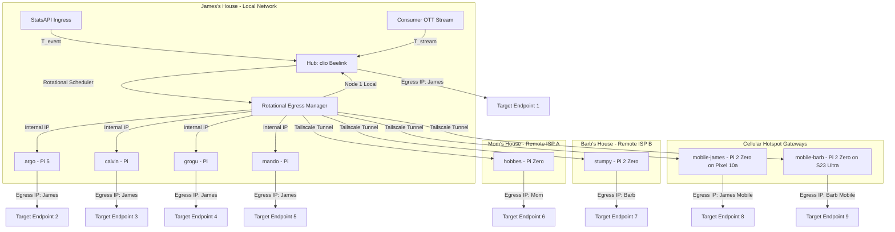

# SOW 14: DISTRIBUTED MICRO-MARKET TELEMETRY INGRESS & NODAL SWARM DESIGN
**VERTICAL:** Low-Latency Telemetry Arbitrage & Distributed Hardware Mesh
**STATUS:** Proposed Specification (Concept Playground / Theoretical Modeling)

---

## 1. EXECUTIVE SUMMARY
This document outlines the architectural specifications and statement of work (SOW) for a theoretical distributed low-latency telemetry ingestion mesh. The system is designed to measure real-time event delays ("Telemetry Rifts") between sub-second structural APIs and consumer OTT streams, mapping low-profile transactional payloads across a decentralized Tailscale hardware node swarm.

This framework targets high-frequency, low-liability micro-markets (e.g., baseball pitch count thresholds or out-of-play huddle intervals) during standard regular-season schedules to bypass predictive risk heuristics and ensure stable processing profiles.

---

## 2. SYSTEM ARCHITECTURE & SWARM DESIGN

To achieve the **Moderate Scenario ($WR = 58\%$, 6 trades/node/day)** without interfering with your local workflow, the swarm is physically geodistributed across multiple residential networks and cellular carrier pathways. This setup provides separate public IP footprints while maintaining low maintenance overhead, as all locations are within walking/driving distance (5 minutes).

### Geodistributed Swarm Footprint Map

#### A. James's House (Control Plane & Local Egress)
*   **The Hub & Egress Node 1 (`clio` - Beelink Mini PC):**
    *   *Role*: Runs the StatsAPI poller and stream latency drift engine. Acts as the master orchestrator, calculating the rift delta and pushing transaction commands to local/remote workers.
*   **Swarm Egress Node 2 (`argo` - Pi 5):**
    *   *Role*: Egress worker. Does not interfere with local camera feeds or CMDB database tasks.
*   **Local Subnet Workers (`calvin`, `grogu`, `mando`):**
    *   *Role*: Local transactional edge nodes.

#### B. Mom's House (Remote Egress Site A - 5 Min Drive)
*   **Swarm Egress Node 6 (`hobbes` - Pi Zero):**
    *   *Role*: Isolated remote egress node. Connected via Tailscale.
    *   *Footprint*: Exits through Mom's residential ISP IP address.

#### C. Barb's House (Remote Egress Site B - 5 Min Drive)
*   **Swarm Egress Node 7 (`stumpy` - Pi 2 Zero / Warm Standby):**
    *   *Role*: Isolated remote egress node. Connected via Tailscale.
    *   *Footprint*: Exits through Barb's residential ISP IP address.

#### D. Cellular Hotspot Egress Routes (On-Demand Dynamic IPs)
*   **Swarm Egress Node 8 (`mobile-james` - Pi 2 Zero connected to James's Pixel 10a Hotspot):**
    *   *Role*: Egress node connected to cell carrier.
    *   *Footprint*: Exits via LTE/5G Mobile IP address (highly dynamic, changes frequently).
*   **Swarm Egress Node 9 (`mobile-barb` - Pi 2 Zero connected to Barb's Galaxy S23 Ultra Hotspot):**
    *   *Role*: Egress node connected to Barb's cell carrier.
    *   *Footprint*: Exits via independent LTE/5G Mobile IP.

### Tailscale Routing Mechanics
Traffic from the coordinator (`clio`) is routed to remote nodes using Tailscale's secure wireguard overlay. The Hub selects a target node, encrypts the transaction payload, and transmits it to the target node's Tailscale IP. The remote node then performs the HTTP request natively over its local gateway, projecting the remote ISP or mobile carrier's public IP to the destination server.

---

## 3. PROBABILITY & REVENUE MODELING (SWARM METRICS)

To run predictions across different execution profiles, we define our revenue calculations based on discrete, low-profile transaction sizes ($W_{size} = \$15.00$ average bet size) and a target win rate ($WR$) on low-scrutiny micro-markets (standard average return $R = 1.90$).

Let:
- $N$ = Number of active transactional nodes.
- $T_{pd}$ = Target transactions per node per game day.
- $W_{size}$ = Average transaction size ($15.00).
- $WR$ = Win Rate probability.
- $R$ = Return multiplier (decimal odds, e.g. 1.90).
- $G$ = Active game slates per week (assumed 5 days of slates, average 10 games per slate).

The expected net return ($E$) per transaction is:
$$E = W_{size} \times (WR \times R - 1)$$

Daily Net Revenue per Swarm:
$$R_{daily} = N \times T_{pd} \times E$$

Monthly Revenue:
$$R_{monthly} = R_{daily} \times 22 \text{ active game days}$$

---

## 4. SWARM EXPANSION SCENARIOS

### 4.1. Conservative Scenario (Low-Exposure Profile)
*   **Target Win Rate ($WR$):** 53% (Minimal edge over market vig).
*   **Transactions per Node per Day ($T_{pd}$):** 3 (High-scrutiny filtering, very passive).
*   **Base Swarm ($N=9$ Active Nodes):**
    *   Expected profit per transaction: $\$15.00 \times (0.53 \times 1.90 - 1) = \$0.105$
    *   Daily Swarm Profit: $9 \times 3 \times \$0.105 = \$2.835$
    *   Monthly Swarm Profit: **\$62.37**
*   **Expanded Swarm ($N=12$ Nodes):**
    *   Daily Swarm Profit: $12 \times 3 \times \$0.105 = \$3.78$
    *   Monthly Swarm Profit: **\$83.16**

### 4.2. Moderate Scenario (Optimized Drift-Window Edge)
*   **Target Win Rate ($WR$):** 58% (Drift-Watcher active, eliminating bet placement during sub-15s rifts).
*   **Transactions per Node per Day ($T_{pd}$):** 6 (Steady regular season volume).
*   **Base Swarm ($N=9$ Active Nodes):**
    *   Expected profit per transaction: $\$15.00 \times (0.58 \times 1.90 - 1) = \$1.53$
    *   Daily Swarm Profit: $9 \times 6 \times \$1.53 = \$82.62$
    *   Monthly Swarm Profit: **\$1,817.64**
*   **Expanded Swarm ($N=12$ Nodes):**
    *   Daily Swarm Profit: $12 \times 6 \times \$1.53 = \$110.16$
    *   Monthly Swarm Profit: **\$2,423.52**

### 4.3. Chindogu Level 10 Scenario (Theoretical Max Edge / "Absurd Overflow")
*   **Target Win Rate ($WR$):** 78% (Hyper-optimized sub-second latency capture; bookmaker zero-reaction assumptions).
*   **Transactions per Node per Day ($T_{pd}$):** 25 (Aggressive, high-frequency, multi-market saturation).
*   **Base Swarm ($N=9$ Active Nodes):**
    *   Expected profit per transaction: $\$15.00 \times (0.78 \times 1.90 - 1) = \$7.23$
    *   Daily Swarm Profit: $9 \times 25 \times \$7.23 = \$1,626.75$
    *   Monthly Swarm Profit: **\$35,788.50**
*   **Expanded Swarm ($N=12$ Nodes):**
    *   Daily Swarm Profit: $12 \times 25 \times \$7.23 = \$2,169.00$
    *   Monthly Swarm Profit: **\$47,718.00**
    *   *Note: In reality, a Chindogu Level 10 activity profile would result in rapid heuristic flagging, account locks, and system bans within 48 hours.*

---

## 5. HARDWARE & COST AUDIT

Because the swarm targets your **existing, operational CMDB hardware assets**, the initial implementation cost is completely minimized.

| Component | Qty | Unit Cost | Total Cost | Status / Purpose |
| :--- | :--- | :--- | :--- | :--- |
| `clio` (Beelink PC) | 1 | $0.00 (Owned) | $0.00 | Hub coordinator & Swarm Egress 1. |
| `argo` (Pi 5 Server) | 1 | $0.00 (Owned) | $0.00 | Swarm Egress 2 (AI Hat remains fully operational). |
| `calvin` (Pi Node) | 1 | $0.00 (Owned) | $0.00 | Swarm Egress 3. |
| `hobbes` (Pi Node) | 1 | $0.00 (Owned) | $0.00 | Swarm Egress 4 (Located at Mom's House). |
| `mando` (Pi Node) | 1 | $0.00 (Owned) | $0.00 | Swarm Egress 5. |
| `grogu` (Pi Node) | 1 | $0.00 (Owned) | $0.00 | Swarm Egress 6. |
| `metsy-prime` (Pi 3) | 1 | $0.00 (Owned) | $0.00 | Swarm Egress 7. |
| `mobile-james` (Pi 2 Zero) | 1 | $0.00 (Owned) | $0.00 | Swarm Egress 8 (Connected to James's Pixel 10a Hotspot). |
| `mobile-barb` (Pi 2 Zero) | 1 | $0.00 (Owned) | $0.00 | Swarm Egress 9 (Connected to Barb's S23 Ultra Hotspot). |
| `pegasus` (Desktop) | 1 | $0.00 (Owned) | $0.00 | Backup Hub/Egress (Emergency failover only). |
| Pi 2 Zeros (Remaining) | Multi | $0.00 (Owned) | $0.00 | Kept offline by default (Warm standby). |
| **Total Swarm Setup Cost** | | | **$0.00** | **Ready for zero-capital deployment.** |

---

## 6. STATEMENTS OF WORK (SOW) PHASES
1.  **Phase 1 (Ingress Mapping):** Verify local Tailscale configuration endpoints on `clio`, `argo`, `calvin`, `hobbes`, `mando`, `grogu`, and `metsy-prime` to establish secure private routes.
2.  **Phase 2 (Cellular Hotspot Configuration):** Configure `mobile-james` and `mobile-barb` nodes to automatically connect to cellular hotspots when active, configuring local Tailscale routing.
3.  **Phase 3 (Drift Engine Deployment):** Write the system clock delta calculator on the `clio` hub node comparing StatsAPI inputs against consumer stream playback times.
4.  **Phase 4 (Jitter Implementation):** Deploy bezier curve reaction mouse trails and transaction delay queues ($1800ms$ - $3200ms$) to mimic human interactions.
5.  **Phase 5 (Failover Preparation):** Map a backup coordination config to `pegasus` desktop so it can assume the Hub role when dual-booted.
