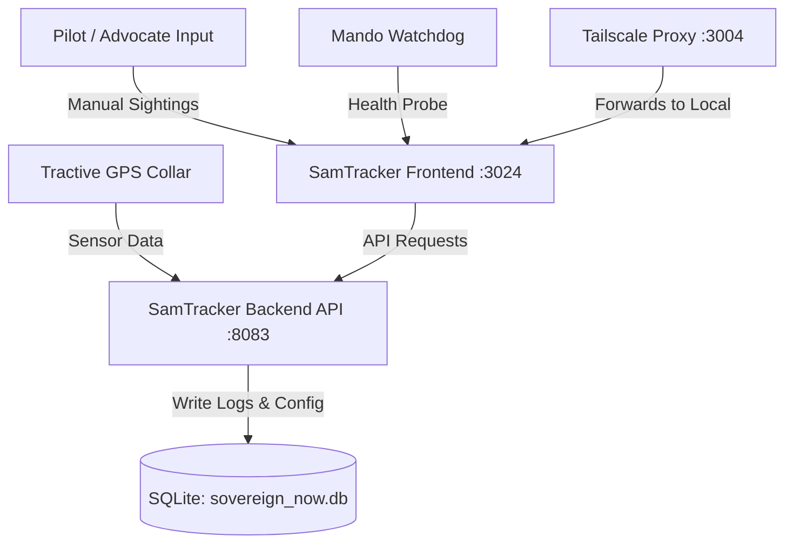
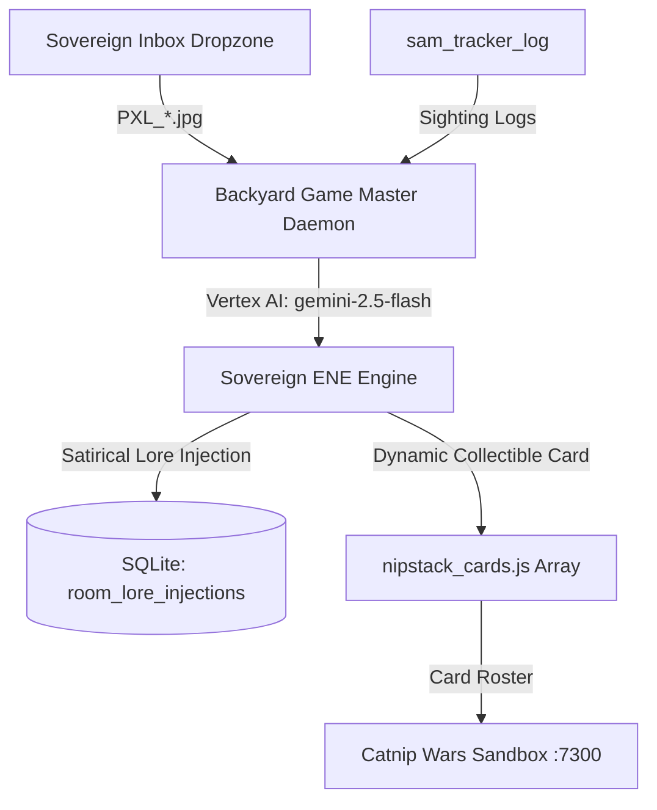
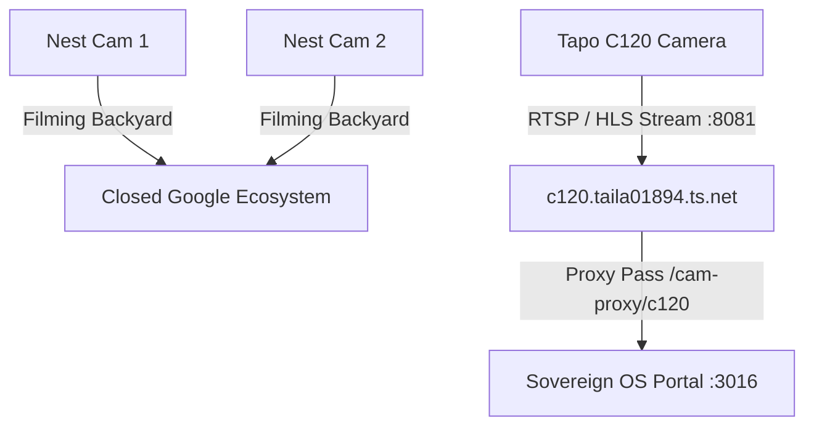

# Sovereign OS — Mesh Architecture & Stack Reference Manual
**Document Version:** 1.0  
**Scope:** SamTracker, Catnip Wars, and Camera Mesh  

---

## 1. System Node Topology
The Sovereign OS mesh consists of several local and Tailscale-networked nodes communicating via secure MagicDNS hostname endpoints.

| Node Hostname | IP Address | Class / Role | Primary Functions / Responsibilities |
| :--- | :--- | :--- | :--- |
| **`clio`** | `100.73.155.70` | Workstation | Host node for systems core, database, APIs, and SamTracker/FanStack frontends. |
| **`calvin`** | `100.77.60.67` | Host Node | Persistent backup loops, database replication, and GardenStack camera streaming. |
| **`argo`** | `100.123.68.9` | Entertainment Kiosk | Runs Chromium for TV kiosk dashboard and local `argo-vision-cam` (Hailo AI). |
| **`metsy-prime`**| `100.73.155.xx` | Smyrna Heights Sentinel | Hardware-level UAT Pi monitoring station and backyard sensor node. |

---

## 2. SamTracker Website & Stack
SamTracker is the primary tracking application used to record, trace, and commentate on the movements of Six Dinner Sam.



### 2.1 Software Components & Port Layout
*   **SamTracker Frontend (Port `3024` local / Port `3004` external):**
    *   **Tech Stack:** Vite / React / TypeScript.
    *   **Port Mapping:** Configured in `vite.config.ts` to listen on port `3024`. Tailscale proxies the external port `3004` to this local port (`https://clio.taila01894.ts.net:3004` -> `http://127.0.0.1:3024`).
*   **SamTracker Backend (Port `8083`):**
    *   **Tech Stack:** FastAPI / Python.
    *   **Endpoint:** Serves REST endpoints for fetching and posting sightings, status updates, and telemetry logs.
*   **Startup Daemons:**
    *   Surgically started/killed by `restart_sam_tracker.sh` and tracked in `mando_watchdog.py`.

### 2.2 Database Schemas (`sovereign_now.db`)
*   **`sam_tracker_config`**: Stores the global, high-level status of Sam.
    ```sql
    CREATE TABLE sam_tracker_config (
        id INTEGER PRIMARY KEY AUTOINCREMENT,
        note TEXT,
        status TEXT,
        operational_status INTEGER,
        active INTEGER,
        updated_by TEXT,
        avatar_img TEXT,
        short_description TEXT,
        sys_created_on TIMESTAMP,
        sys_updated_on TIMESTAMP
    );
    ```
*   **`sam_tracker_log`**: Records all real-time coordinate logs, proximity events, and camera sightings.
    ```sql
    CREATE TABLE sam_tracker_log (
        id INTEGER PRIMARY KEY AUTOINCREMENT,
        timestamp TIMESTAMP DEFAULT CURRENT_TIMESTAMP,
        message TEXT,  -- Contains metadata marker (e.g. "||| IMG:sam_1778937930.jpg")
        type TEXT      -- e.g. "TELEMETRY", "SIGHTING"
    );
    ```

---

## 3. Catnip Wars Sandbox Stack
Catnip Wars is an emergent Gwent-style collectible card minigame played on the Smyrna Heights World Ledger.



### 3.1 Software Components
*   **Catnip Wars Sandbox (Port `7300`):**
    *   **Tech Stack:** Vite / React / Tailwind (custom).
    *   **Location:** `/home/james/SovereignOS-sandbox/catnip-wars`
    *   **Function:** Hosts the interactive 16-bit card grid interface representing Smyrna Heights.
*   **Backyard Game Master Daemon (`backyard_game_master.py`):**
    *   Runs persistently in the background.
    *   Monitors `/home/james/sovereign_inbox` for image drops (`PXL_*.jpg`) and the `sam_tracker_log` table for `SIGHTING` entries.
    *   Invokes Gemini (`gemini-2.5-flash`) via the Sovereign Emergent Narrative Engine (ENE) to transcribe events into lore and automatically append new card objects directly into `/home/james/SovereignOS-sandbox/catnip-wars/src/components/NipStack/nipstack_cards.js`.

### 3.2 Collectible Card Database Structure
Cards are declared as objects inside `NIPSTACK_CARDS` array in `nipstack_cards.js`:
*   **Card Types:** `HERO` (immune to weather/specials), `UNIT` (standard power-bearing cards), `WEATHER` (caps row power), `SPECIAL` (weather clearing/effects).
*   **Strategic Rows:** `PORCH`, `WIRE`, `TRASH_CAN`, `WEATHER`, `SPECIAL`.
*   **Abilities:**
    *   *Tight Bond* (Power doubles for duplicates in a row, e.g. *Sam the Orange*).
    *   *Medic* (Resurrects cards from discard pile, e.g. *The Gross Kid*).
    *   *Spy* (Placed on opponent board, draws 2 cards, e.g. *Sky-Rats Logistics*).
    *   *Smuggle* (Immune to weather, purr-suades unit defection, e.g. *Premium 'Nip Dealer*).
*   **Rarity Tiers:** `common`, `rare`, `epic`, `hero`, `special`.

---

## 4. Mesh Camera Infrastructure
Real-time environmental monitoring is captured by a multi-device local and Tailscale camera mesh.



### 4.1 Device Specifications
1.  **Tapo C120 Outdoor Camera:**
    *   **Role:** Primary capture device for backyard wildlife and feline patrols (crucial for feeding the ENE).
    *   **Tailnet Host:** `c120.taila01894.ts.net` (responds to ping telemetry).
    *   **Local Stream Server:** Port `8081`.
    *   **Sovereign Portal Proxy:** Integrated via a Vite rewrite configuration:
        `'/cam-proxy/c120' -> target: 'http://c120.taila01894.ts.net:8081'`
    *   *Known Issue:* The node is online, but the local camera streaming daemon on port `8081` is currently dead or refusing connections, displaying "Awaiting Signal" in the Smyrna Sentinel UI.
2.  **Google Nest Outdoor Cameras (Qty: 2):**
    *   **Role:** General backyard surveillance.
    *   **Status:** Actively filming the backyard. However, due to closed Nest API restrictions, they are not currently linked into automated stream grabs or telemetry decoders.
