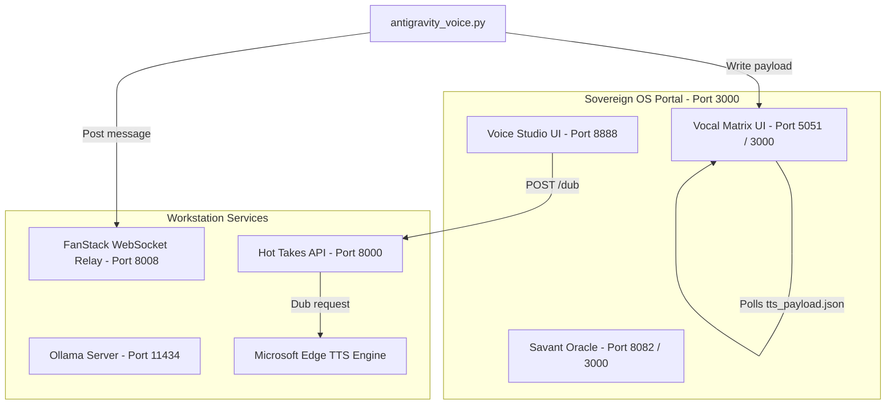

# 🛠️ Sovereign OS: Power Tools & Voice Studio Architecture Guide

## 📋 1. Subsystem & Port Mapping Catalog
These tools are dynamically provisioned within individual tenant stacks to manage chat discourse, media generation, video synthesis, telepresence, and token costs.



### 🔍 Tenant Services Mappings (`sys_module`)
The configuration database tracks primary routes, ports, and classifications for tenant-accessible modules:

| Subsystem Name | Module Class | Primary Route / Port | Category | Description |
| :--- | :--- | :--- | :--- | :--- |
| **Scruffy's Tavern** | `scruffys` | Room: `scruffys` / Port `3002` | Live Chat & Engagement | WebSocket-relayed chat lobbies and advocate conversations. |
| **The Skew (Live)** | `the_skew` | Room: `the_skew` / Port `8001` | Live Chat & Engagement | Live debate show stage with audio feeds and hot topics. |
| **Hot Takes** | `hot_takes` | Room: `hot_takes` / Port `8000` | Live Chat & Engagement | High-intensity advocate rants tracking and ratings. |
| **Comet Messaging** | `comet_messenger` | Room: `comet` / Port `8015` | Live Chat & Engagement | Sputnik Comet-90: Secure real-time family communications, emergency alerts. |
| **The HoloLink** | `hololink` | Room: `hololink` / Port `8012` | Live Chat & Engagement | Peer-to-peer WebRTC video calling and telepresence service. |
| **Sovereign HoloDex** | `holodex` | Room: `holodex` / Port `3008` | Video & Media Processing | Cinematic video synthesis, interactive canvas, and frame-sequencing. |
| **Sovereign Watch Party** | `rom_gallery` | Room: `rom_gallery` / Port `3004` | Video & Media Processing | Synchronized video player controls for historical records. |
| **Sovereign Cinema** | `cinema` | Room: `cinema` / Port `3008` | Video & Media Processing | Media-casting power tool that lets users cast video straight to TV nodes. |
| **Stream Sniper** | `stream_sniper` | Room: `stream_sniper` / Port `5056` | Video & Media Processing | Surveillance, acquisition, and logging of live feeds. |
| **Daily Roll Call** | `roll_call` | Room: `roll_call` / Port `8000` | Management & Cost Control | Morning routine checks and dependency validations. |
| **Token Ledger** | `token_ledger` | Room: `token_ledger` / Port `7300` | Management & Cost Control | API burn metrics, prompt cost logs, and budget bounds. |

---

## 🎙️ 2. Voice Studio Architecture & Dubbing Pipeline

Voice Studio is provisioned as an interactive video/audio dubbing workbench and API endpoint. It allows content creators to merge text-to-speech voiceovers directly into generated video clips (such as those from highlight pollers or raw gameplay).

### A. Core Service Config & API Routes
The backend service resides in `scripts/hot_takes_service.py`, while `scripts/voice_studio_uat.py` runs a standalone FastAPI-driven UAT workbench on Port `8888`.

```
🎙️ Standalone UAT Server URL: https://clio.taila01894.ts.net:8888
🎙️ Production Dub Endpoint:   POST https://clio.taila01894.ts.net:8000/api/hot_take/dub
```

#### Voice Presets Matrix (`PERSONA_VOICES`)
Persona voices are locked into Microsoft Edge TTS Neural voice profiles:

| Persona ID | Voice Engine Model | Rate Speed | Pitch Offset | Accent/Role |
| :--- | :--- | :--- | :--- | :--- |
| **`barf`** | `en-US-ChristopherNeural` | `+15%` | `-5Hz` | Deep & Authoritative (Underpants Bandito) |
| **`dot`** | `en-US-AriaNeural` | `+5%` | `+0Hz` | Sharp & Direct |
| **`barbara`** | `en-US-JennyNeural` | `+5%` | `+0Hz` | Confident & Clear |
| **`cuban`** | `en-US-GuyNeural` | `+10%` | `-3Hz` | Gritty Sports Radio (Mark Cuban clone) |
| **`default`** | `en-US-GuyNeural` | `+10%` | `+0Hz` | Standard Sports Announcer |

### B. Dual Ingestion Flow
1. **Live Tweet Mode (Plain Script Input)**: If no video file is uploaded to the `/dub` endpoint, it records the hot take directly into the `hot_takes` SQLite database table mapped under `'scruffys_tavern'` room ID.
2. **Video Dubbing Mode (Video File + Script)**: 
   - Downloads/accepts the uploaded `.mp4` video.
   - Generates the raw `.mp3` voiceover using the `edge-tts` python package.
   - Dynamically scales and merges the audio to match the video.

### C. Audio Speed Scaling & Merge Logic
To prevent cutting off speech or leaving dead silence, Voice Studio calculates the duration ratio between the synthesised speech and the video track, applying a cascading speed-scaling algorithm:

```python
def _adjust_and_merge(video_path: str, audio_path: str, output_path: str):
    video_dur = _get_duration(video_path)
    audio_dur = _get_duration(audio_path)
    ratio = audio_dur / video_dur

    # Cascading atempo filters because ffmpeg restricts single-filter limits to [0.5, 2.0]
    filters = []
    r = ratio
    while r > 2.0:
        filters.append("atempo=2.0")
        r /= 2.0
    while r < 0.5:
        filters.append("atempo=0.5")
        r *= 2.0
    filters.append(f"atempo={r:.4f}")

    with tempfile.NamedTemporaryFile(suffix=".mp3", delete=False) as adj_f:
        adj_audio = adj_f.name

    # Step 1: Scale TTS audio duration
    subprocess.run(
        ["ffmpeg", "-y", "-i", audio_path, "-filter:a", ",".join(filters), adj_audio],
        check=True, capture_output=True
    )
    # Step 2: Overlay scaled audio track and truncate excess using -shortest
    subprocess.run([
        "ffmpeg", "-y",
        "-i", video_path, "-i", adj_audio,
        "-c:v", "copy", "-c:a", "aac",
        "-map", "0:v:0", "-map", "1:a:0", "-shortest",
        output_path
    ], check=True, capture_output=True)
    os.unlink(adj_audio)
```

---

## 🗣️ 3. Vocal Matrix & CypherCell Integration
The Vocal Matrix is the real-time speech synthesis proxy for client browser nodes. It allows agents running in background terminals or CLI scripts to immediately speak text through the human operator's browser session.

### A. The Ingress Pipeline (`antigravity_voice.py`)
When a script triggers vocal matrix speech, it invokes `scripts/antigravity_voice.py`:
1. **WebSocket Broadcast**: Connects to the local relay at `ws://127.0.0.1:8008` (proxied to port 8000) and broadcasts a JSON payload:
   ```json
   {
       "type": "CHAT_MESSAGE",
       "is_penalty_box": false,
       "user": "Antigravity",
       "text": "Hello World",
       "channel": "vocal_matrix"
   }
   ```
2. **Payload Writing**: Writes a localized `tts_payload.json` token containing an ingestion ID (unix timestamp) and text. To maintain multi-stack sync, the file is duplicated across development and production directories:
   - `/home/james/SovereignOS/01_Sovereign_Portal/public/tts-proxy/tts_payload.json`
   - `/home/james/SovereignOS/04_Sovereign_Core/tts_payload.json`

### B. Browser Client Architecture (`tts_commlink.html`)
The frontend client interface runs at `http://clio.taila01894.ts.net:3000/tts_commlink.html`.

#### 1. Audio Activation (User Consent Bypass)
Browsers ban automatic speech synthesis unless unlocked by user interaction. The interface features a **"Initialize Stream"** button, which runs a tiny synthesis utterance immediately:
```javascript
function initAudio() {
    isInitialized = true;
    window.speechSynthesis.speak(new SpeechSynthesisUtterance("Vocal matrix initialized."));
}
```

#### 2. Polling Loop & Cache Evasion
The client polls `tts_payload.json` every `2000`ms. To prevent the browser from caching previous responses, it appends a dynamic timestamp parameter:
```javascript
async function checkPayload() {
    if (!isInitialized) return;
    const response = await fetch('tts_payload.json?t=' + new Date().getTime());
    if (response.ok) {
        const data = await response.json();
        if (data.id !== lastPayloadId && data.id !== null) {
            lastPayloadId = data.id;
            // Speak text via browser Web Speech API
            const msg = new SpeechSynthesisUtterance(data.text);
            window.speechSynthesis.speak(msg);
        }
    }
}
```

#### 3. Theme Overrides Matrix (`?theme=...`)
The client dynamically binds custom colors and typefaces at boot depending on the query parameter:
* `sovereign-home`: Outlines default glassmorphism styling.
* `stacklabs`: Deep dark terminal mode styled in `JetBrains Mono` and cyan hues.
* `espn`: Clean light theme with bold red outlines.
* `pixel` / `linux`: Retro high-contrast green screen styling.
* `steamboat`: Paper-parchment background styled in `Playfair Display` serif fonts.

---

## ⚙️ 4. Global Platform Utilities
Global daemons monitor and govern low-level system states:
* **ITSM Incident Tracker (`sdlc_portal_server.py`)**: Runs on port `8095` to manage state updates and attachments for active work tasks.
* **Ollama Governor (`ollama_governor.py`)**: Monitors ports and shuts down Ollama systemd services if live game feeds start playing to free up workstation compute resources.
* **Voice Heal (`mando_watchdog.py`)**: Continuously verifies that loopback audio interfaces, relays, and USB microphones are online, auto-repairing configs if dropouts occur.
