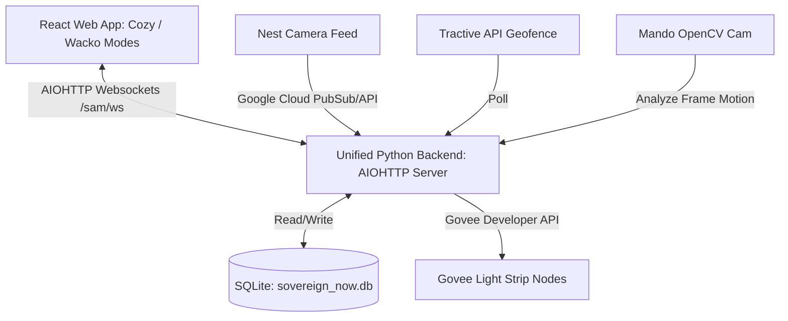

# Retrospective: Sovereign EON 0 — Sam Tracker (The Biological Oracle)

## Introduction
The Sam Tracker was built in early 2026 (EON 0) to monitor Sam, a cat on the mend, and integrate visual surveillance with smart-home automation. It represented the first decoupled micro-frontend and unified automation backend of Sovereign OS, laying the foundation for modern FanStack abstractions.

## Architecture Diagram

## Key Technical Components

### 1. Frontend Design (React + Vite)
- **Cozy Mode:** Cozy watercolor field-journal aesthetics, pale beige grid backgrounds, and a calming status message board for Sam's recoveries.
- **Wacko Mode:** Radioactive neon-orange interface triggered by specific keywords ("felony", "break", "steal", "attack", "b&e"). Displays flashing alerts, "REPORT CRIME" panic buttons, and evidence cards.
- **Environment Badging:** Dynamic environment badge detecting if host contains `dev`, `uat`, or fallback to `prod`.
- **Heavy Media Handling:** Supported base64 photo capture/upload directly via WebSockets, and asynchronous chunk-based heavy video files with background processing.

### 2. Unified Backend (Python AIOHTTP)
- **Server Port:** `8083` (AIOHTTP Server).
- **WebSocket Protocol:** `/sam/ws` handled live JSON states, broadcast configuration updates (`CMD_UPDATE_CONFIG`), and broadcast alarm states.
- **FFmpeg Integration:** Asynchronous subprocess transcoding (`ffmpeg`) to shrink raw uploaded media files and convert them to standard web-ready H.264 formats while updating the SQLite status.
- **Database Schema (`sovereign_now.db`):**
  - `sam_tracker_config`: Stores current notes, status texts, daily naps, adventure counts, and tuna snacks.
  - `sam_tracker_log`: Stores historical sight log timestamps, event descriptions, and media paths.

### 3. IoT & Smart Home Integrations
- **Govee Developer API:** Authenticated via `.env` keys. Triggers room-wide physical light changes: flashing Mets Orange for standard cat events and Mets Blue for local interaction warnings (e.g. if Metsy is home).
- **Nest Integration:** Custom ingestion loops for camera alerts flashing the physical room whenever a target pet was detected.
- **Tractive Geofencing:** Pulled tractive API to monitor public coordinate boundaries. Triggered automatic status changes to Level 6 whenever the pet breached the geofence to prevent physical danger.
- **OpenCV Motion Checking:** Checked frame diff scores on security cameras, dynamically raising the "Chindogu Level" to 9 if active movement was detected.
- **Weather API Integration:** Smynra weather check (`wttr.in/Smyrna+30080?format=j1`) to notify the pilot of unexpected rain or storm conditions.
