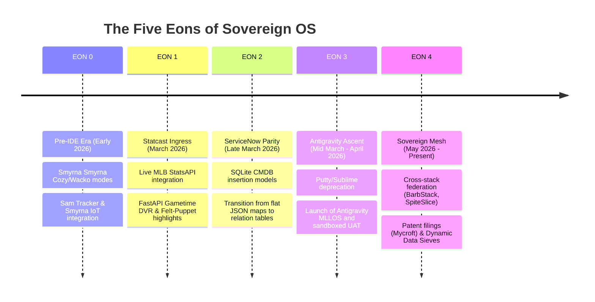

# Sovereign OS Saga: Historical Documentation Blueprint

This document outlines the roadmap for compiling the complete history of Sovereign OS, tracing the system's evolution from its low-fidelity pre-IDE origins (EON 0) to the multi-agent, autonomous MLLOS framework of today (EON 4).

---

## 🗺️ The Sovereign Timeline Abstraction

---

## 🏛️ Chronological Chapters & Documentation Scope

### Chapter 1: EON 0 — The Biological Oracle (Pre-IDE)
* **Status:** Drafted ([sam_tracker_eon0_retrospective.md](file:///home/james/SovereignOS/dna/history/sam_tracker_eon0_retrospective.md))
* **Core Narrative:** The physical Smyrna ecosystem. Monitoring Sam's recovery with Nest cameras and Tractive geofences, running Smyrna weather sweeps, and routing state events to Govee lighting arrays (Mets Orange/Blue alerts). 
* **Toolchain:** Putty, WinSCP, Sublime Text, SQLite, custom Python AIOHTTP daemon.

### Chapter 2: EON 1 — The Statcast Ingress & Sensory Feedback Loop
* **Status:** Drafted ([fan_stack_eon1_retrospective.md](file:///home/james/SovereignOS/dna/history/fan_stack_eon1_retrospective.md))
* **Core Narrative:** Leveraging the MLB StatsAPI. Bridging physical action with digital events. The development of `fanstack_background_poller.py` with atomic JSON caching, the Savant SQLite query engine, the DVR pitch-playback simulator, and unhinged sensory triggers (Boggs Level 4 extra-innings alarms).

### Chapter 3: EON 2 — The Great Decoupling & ServiceNow Parity
* **Status:** *Planned*
* **Core Narrative:** The transition from amateur single-script file-dropping pipelines to enterprise ITSM abstractions. Standardizing `sovereign_now.db` with ServiceNow-style schema parity (`sys_user`, `sys_module`, `cmdb_ci_appl`). Eliminating flat files like `avatarMap.json` in favor of dynamic persona tables.

### Chapter 4: EON 3 — The Antigravity Ascent
* **Status:** *Planned*
* **Core Narrative:** The migration of the developer workstation. The transition from Sublime/Putty SSH tunnels to the multi-agent Antigravity IDE platform. The installation on **March 15, 2026**, the initialization of implicit telemetry, and the first recorded agent dialogue logs on **April 1, 2026**.
* **Key Artifacts:** Pre-flight checks, SDLC resolution flows, the Eileen Remote Testing Mandate, and absolute protection of local Clio hardware bounds.

### Chapter 5: EON 4 — The Sovereign Mesh & Patent-Level Integration
* **Status:** *Planned*
* **Core Narrative:** The federation of stack nodes. Decoupling the frontends across Spite Slice, Gonzas Cantina, AetherVet, and BarbStack. Utilizing the Mycroft IP Gem to compile provisional patent applications (PPA), and building the Cosmic Sieve FastAPI email triage desk to buffer incoming context volumes.

---

## 📋 Action Plan: Document Assembly

1. **Chapter 3 (EON 2) Composition:** Draft the ServiceNow Parity retro, detailing how the relational tables decoupled the frontends from backend file dependencies.
2. **Chapter 4 (EON 3) Composition:** Draft the Antigravity Ascent retro, focusing on the cultural and speed shift of moving all software orchestration through structural markdown files.
3. **Chapter 5 (EON 4) Composition:** Draft the Sovereign Mesh retro, capturing the patent filing timeline and cross-stack infrastructure stabilization.
4. **The Sovereign Master Ledger:** Compile these retrospective files into a single, cohesive publication or wiki index page.
