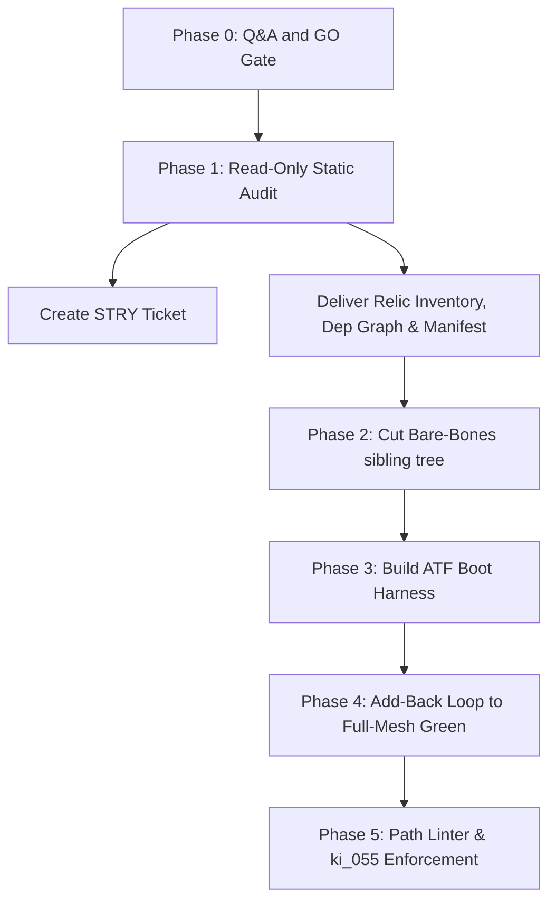

# Implementation Plan: Bare-Bones SovereignOS Rebuild & ATF Bootstrap (v2)

This plan details the implementation of a provably-minimal, RAM-resident sibling tree of **SovereignOS** with a robust automated test framework (ATF) boot harness and native path linter, eliminating legacy relics and establishing a strict single-canonical-home structure.

> [!IMPORTANT]
> **No metal is touched until the Pilot explicitly answers the Phase 0 Q&A and issues a `GO`.**
> "Touching metal" includes writing files, copying, moving, booting processes, or editing/inserting tickets into `sovereign_now.db`. The sibling tree is copy-only; the live tree remains 100% read-only.

## Phase 0 Q&A Gate (Requires Pilot Feedback)

The following 10 questions are open decisions that dictate the canonical paths and boot behaviors. Please review and answer:

*   **Q1: Media Canonical Home**: Confirm `/home/james/SovereignOS/media_vault/` as the single canonical media folder. (If approved, `/home/james/SovereignOS/dna/media/` and `/home/james/SovereignOS/dna/media_OLD_BACKUP/` will be classified as relics).
*   **Q2: DB Strategy for the ATF Boot**: Should the bare-bones ATF boot loop run on:
    *   (a) A read-only copy of the live `sovereign_now.db`.
    *   (b) A schema-only fresh SQLite database.
    *   (c) A fixture-seeded SQLite database.
*   **Q3: Logs Directory**: Is `logs/` the exclusive live log directory? Is `logs_archive/` completely frozen (read-only) or actively written? (Phase 1 will dynamically discover the writer of the `fanstack_chat_uat.log` file).
*   **Q4: Exports Directory**: What single absolute directory path is canonical for `notebook_lm_exports/`?
*   **Q5: External Dependencies**: Must the bare-bones boot verify connections to external services like Ollama (port `11434`) and the Tailscale mesh, or should the ATF evaluate the internal node mesh in isolation first?
*   **Q6: Process Supervision**: How are daemons and decoupled frontends currently managed and launched on clio (e.g., `systemd`, `pm2`, bash scripts, or `tmux`)? The ATF will be built to integrate with the active supervisor.
*   **Q7: Virtual Environments (venv)**: Should the sibling bare-bones tree reference a single unified `.venv` (e.g. `/home/james/SovereignOS/.venv/bin/python3`) or maintain per-service environment boundaries?
*   **Q8: Non-Destructive Sibling Setup**: Confirm the live `/home/james/SovereignOS/` directory remains 100% untouched, and the bare-bones tree is constructed in a clean sibling directory (e.g., `/home/james/SovereignOS_bare/`).
*   **Q9: Rename Scope**: Do we freeze all codebase strings/filenames this pass to contain the blast radius (paths-only, deferring FanCast → Skew renames to a dedicated follow-up ticket), or should we perform rename replacements in the same swing? *(Highly recommend option A: Freeze code changes to contain blast radius).*
*   **Q10: Relic-List Approval**: Confirm the Pilot will personally review and sign off on the full relic inventory produced in Phase 1 before any directories or files are physically excluded from the bare-bones workspace.

---

## Proposed Technical Workflow

### Phase 1: Static Audit & Inventory (Read-Only)
Once the `GO` is received, we will:
1.  Initialize the SDLC ticket (`STRY`) in the database.
2.  Generate a comprehensive AST-based `dependency_graph_<TICKET>.md` mapping imports (including `hot_takes_service.py`), subprocess boundaries, and network port targets.
3.  Perform a full filesystem scan to produce a `relic_inventory_<TICKET>.md` with `du -sh` receipts of the 283 GB space and locate the active writer of the legacy FanCast log.
4.  Resolve the port `3009` discrepancy (Hot Takes serving vs SDLC Portal manifest registration).

### Phase 2: Sibling Tree Generation (Copy-Only)
Construct the `/home/james/SovereignOS_bare/` tree. 
*   **Asset Protocol (DR-4)**: Strike all dynamic symlinks. Frontends will pull assets from the centralized FastAPI static files mount natively via clean URLs. Out-of-bound paths in React source code are fixed in-place.
*   Exclude confirmed relics: `fanstack_relay.py` and `scruffys_bar_server.py`.

### Phase 3: ATF Harness Construction
Create a standalone `atf_bootstrap_<TICKET>` checking four signals per system:
1.  **Process Up**: Node is active in the supervisor.
2.  **Ports Answering**: Socket listeners are bound and replying.
3.  **DB Schema Present**: SQLite tables verified via `sqlite_master`.
4.  **Smoke Response**: Active endpoint responses (e.g. `POST /api/hot_take` returning a valid AI-generated rant).

### Phase 4: Minimality Proof Add-Back Loop
Iteratively run the ATF, inspect the crash logs, add exactly what was missing, and record each addition in the minimality ledger to establish a proven RAM-resident footprint.

### Phase 5: Codification & Guardianship
*   **Path Linter**: Add a python script targeting the workspace to flag any non-manifest hardcoded path literals.
*   **`ki_055_canonical_path_law.md`**: Draft the persistent instruction banning future hardcoded configuration pollution.

---

## Verification Plan

### Automated Tests
*   Run the compiled `atf_bootstrap_<TICKET>` harness verifying all success set services:
    *   *Backends*: `sovereign_core_api`, `sdlc_portal_server`, Stream Relay, WS Hub, `the_skew_relay`, `fanstack_chatbots`, `fanstack_admin_api`, `fanstack_background_poller`, `statcast_sentinel`, `mando_watchdog`, `ollama_governor`, `dvr_controller_v2`, `stream_sniper_daemon`.
    *   *Frontends*: Portal (3000), Cinema (3008), SDLC (3009), Sports (3010), Bistro (3015), Wildseed (3016).
*   Run `path_lint_<TICKET>` to verify zero non-compliant paths exist.

### Manual Verification
*   Confirm browser-level secure TLS handshake on the sibling bare-bones endpoints under Tailscale MagicDNS.
*   Review sibling folder disk size to confirm the minimal memory footprint goal.
