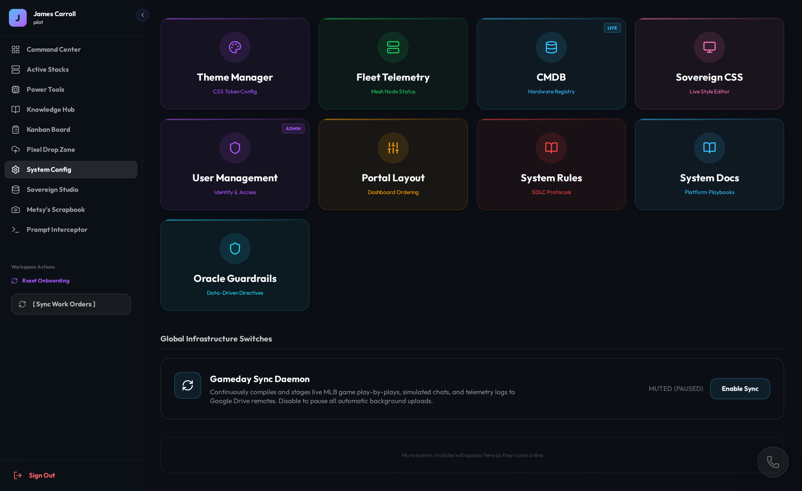
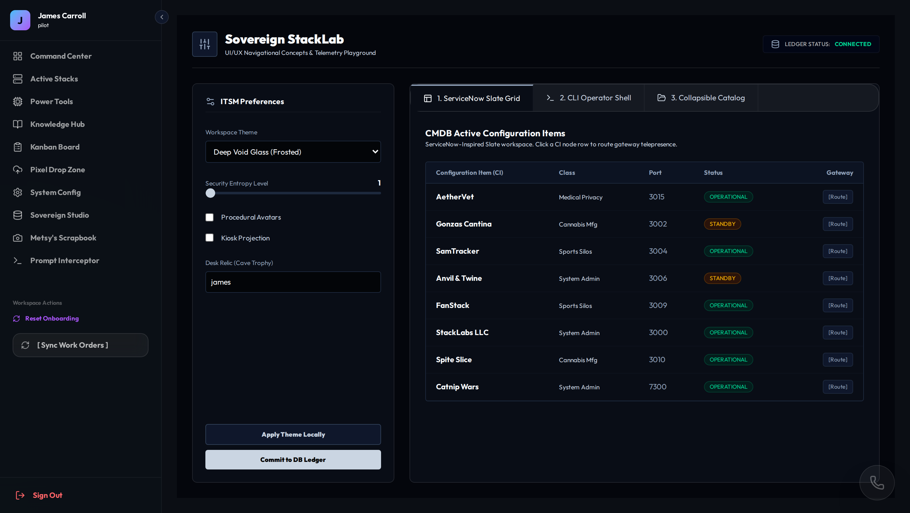
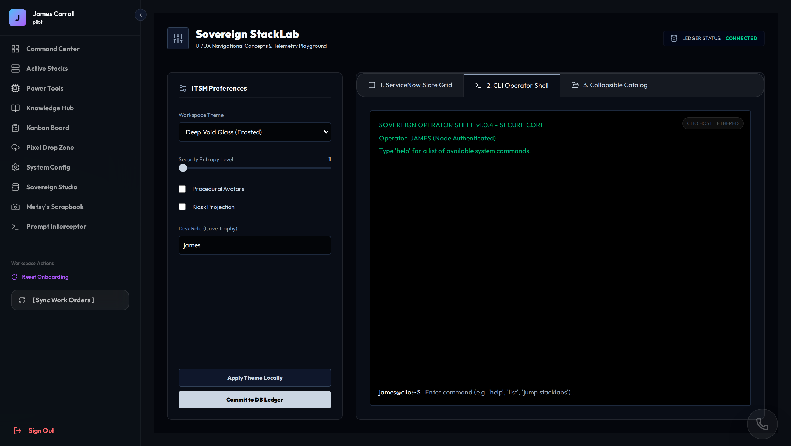
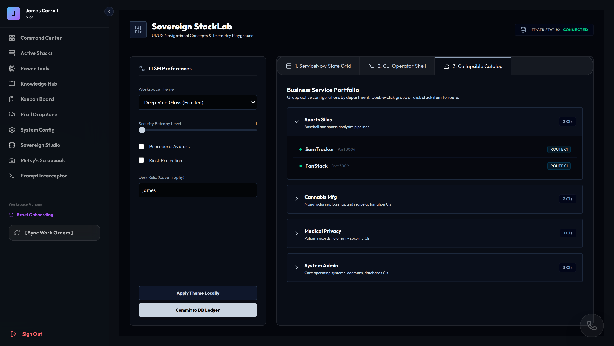
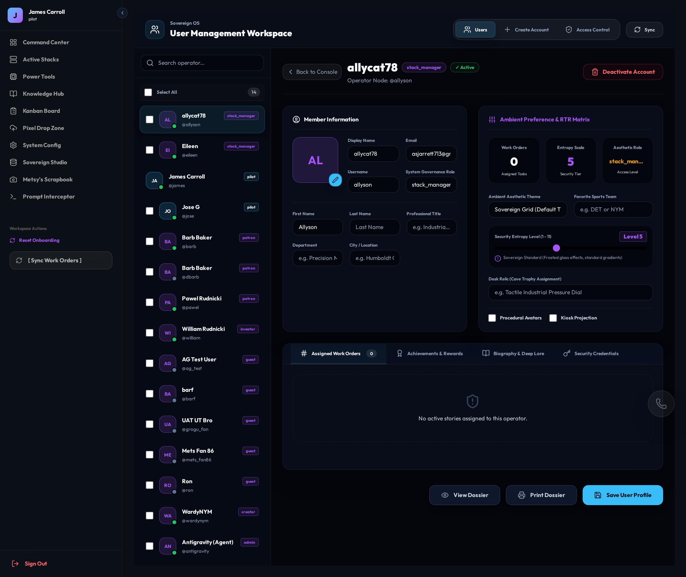
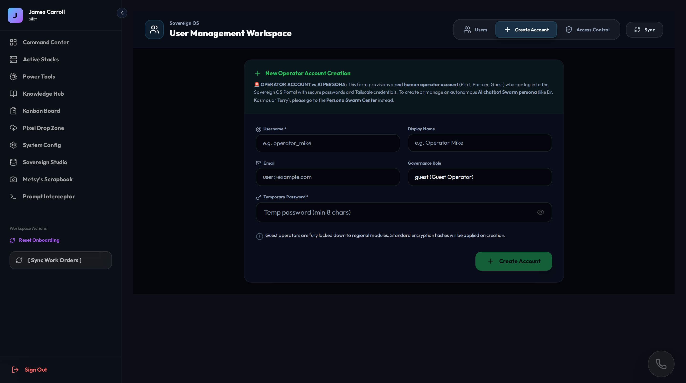
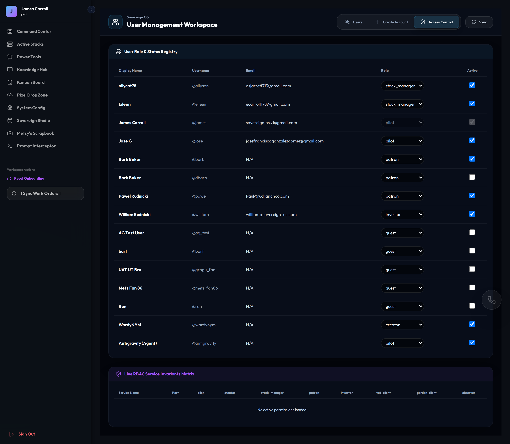

# Sovereign OS — Sample Visual Playbook Index
**Generated:** Programmatic Playwright Crawler Audit Sweep (Sample Run)
**Node Host:** Clio (`100.73.155.70`)

---

## 🎨 Visual Component Catalog (Sample System Config Hub)

### Card ID: `Portal_SystemConfig_Hub`
* **Status:** `OK`
* **Ecosystem Port:** `3016`
* **Target Route:** `/?room=system_config`
* **HTML Selector:** `.sovereign-shell-container`
* **React Source Component:** [SystemConfigHub.tsx](file:///home/james/SovereignOS/01_Sovereign_Portal/src/components/SystemConfigHub.tsx)
* **Description:** Main System Config Hub view containing utility and stack cards

---

### Card ID: `Portal_ThemeManager_Slate`
* **Status:** `ERROR`
* **Ecosystem Port:** `3016`
* **Target Route:** `/?room=theme_manager`
* **HTML Selector:** `.sovereign-shell-container`
* **React Source Component:** [SovereignThemeLab.tsx](file:///home/james/SovereignOS/01_Sovereign_Portal/src/components/SovereignThemeLab.tsx)
* **Description:** Theme Manager - ServiceNow Slate Grid tab

---

### Card ID: `Portal_ThemeManager_CLI`
* **Status:** `ERROR`
* **Ecosystem Port:** `3016`
* **Target Route:** `/?room=theme_manager`
* **HTML Selector:** `.sovereign-shell-container`
* **React Source Component:** [SovereignThemeLab.tsx](file:///home/james/SovereignOS/01_Sovereign_Portal/src/components/SovereignThemeLab.tsx)
* **Description:** Theme Manager - CLI Operator Shell tab

---

### Card ID: `Portal_ThemeManager_Portfolio`
* **Status:** `ERROR`
* **Ecosystem Port:** `3016`
* **Target Route:** `/?room=theme_manager`
* **HTML Selector:** `.sovereign-shell-container`
* **React Source Component:** [SovereignThemeLab.tsx](file:///home/james/SovereignOS/01_Sovereign_Portal/src/components/SovereignThemeLab.tsx)
* **Description:** Theme Manager - Collapsible Catalog tab

---

### Card ID: `Portal_UserManagement_Users`
* **Status:** `ERROR`
* **Ecosystem Port:** `3016`
* **Target Route:** `/?room=user_management`
* **HTML Selector:** `.sovereign-shell-container`
* **React Source Component:** [UserManagementConsole.tsx](file:///home/james/SovereignOS/01_Sovereign_Portal/src/components/UserManagementConsole.tsx)
* **Description:** User Management - Operators List tab

---

### Card ID: `Portal_UserManagement_NewUser`
* **Status:** `ERROR`
* **Ecosystem Port:** `3016`
* **Target Route:** `/?room=user_management`
* **HTML Selector:** `.sovereign-shell-container`
* **React Source Component:** [UserManagementConsole.tsx](file:///home/james/SovereignOS/01_Sovereign_Portal/src/components/UserManagementConsole.tsx)
* **Description:** User Management - Create Account tab

---

### Card ID: `Portal_UserManagement_RBAC`
* **Status:** `ERROR`
* **Ecosystem Port:** `3016`
* **Target Route:** `/?room=user_management`
* **HTML Selector:** `.sovereign-shell-container`
* **React Source Component:** [UserManagementConsole.tsx](file:///home/james/SovereignOS/01_Sovereign_Portal/src/components/UserManagementConsole.tsx)
* **Description:** User Management - Access Control tab

---

