# Sovereign OS — Visual Playbook Index
**Generated:** Programmatic Playwright Crawler Sweep
**Node Host:** clio

---

## 🎨 Visual Component Catalog

### Card ID: `Cinema_Portal_Container`
* **Status:** `OK`
* **Ecosystem Port:** `3008`
* **Target Route:** `/`
* **HTML Selector:** `.cinema-portal-container`
* **React Source Component:** [CinemaPortal.tsx](file:///home/james/SovereignOS/02_Sovereign_Media/src/components/CinemaPortal.tsx)
* **Description:** Main Cinema portal frame containing stream grid

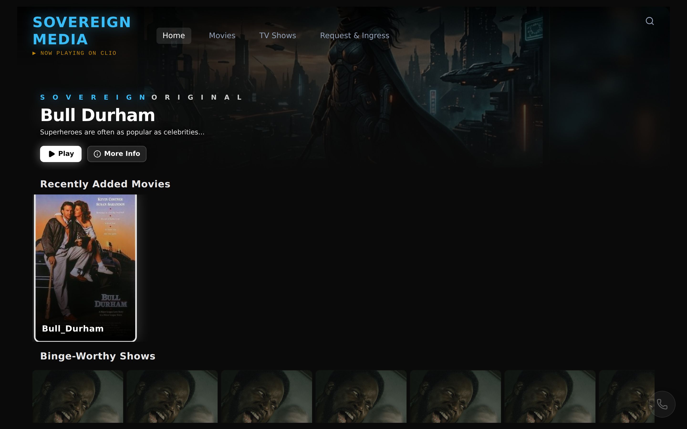

---

### Card ID: `Cinema_Hero_Banner`
* **Status:** `OK`
* **Ecosystem Port:** `3008`
* **Target Route:** `/`
* **HTML Selector:** `.hero-banner`
* **React Source Component:** [HeroBanner.tsx](file:///home/james/SovereignOS/02_Sovereign_Media/src/components/HeroBanner.tsx)
* **Description:** Cinema main high-light hero banner

---

### Card ID: `Creator_Orchestration_Deck`
* **Status:** `OK`
* **Ecosystem Port:** `3009`
* **Target Route:** `/`
* **HTML Selector:** `.orchestration-deck`
* **React Source Component:** [OrchestrationDeck.tsx](file:///home/james/SovereignOS/15_FanStack/src/components/OrchestrationDeck.tsx)
* **Description:** Orchestrator control deck for chatbot settings

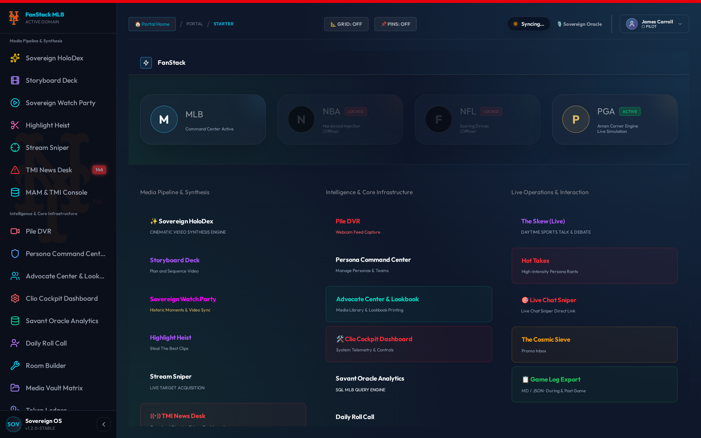

---

### Card ID: `Creator_Room_Selector`
* **Status:** `OK`
* **Ecosystem Port:** `3009`
* **Target Route:** `/`
* **HTML Selector:** `.room-selector-panel`
* **React Source Component:** [RoomSelectorPanel.tsx](file:///home/james/SovereignOS/15_FanStack/src/components/RoomSelectorPanel.tsx)
* **Description:** Room selection panel for active channels

---

### Card ID: `FanStack_LeftNav`
* **Status:** `OK`
* **Ecosystem Port:** `3010`
* **Target Route:** `/fan-portal?game_room=824910`
* **HTML Selector:** `[data-section="1"]`
- [SOW_13: CROSSTALK EVENT-DRIVEN NEON OVERLAYS](file:///home/james/SovereignOS/dna/docs/SOW_13_CROSSTALK_PANEL_B_OVERLAYS.md)
- [SOW_14: DISTRIBUTED MICRO-MARKET SWARM](file:///home/james/SovereignOS/dna/docs/SOW_14_DISTRIBUTED_MICRO_MARKET_SWARM.md)
* **React Source Component:** [LeftNav.tsx](file:///home/james/SovereignOS/19_Sovereign_Sports/src/components/LeftNav.tsx)
* **Description:** Main Left navigation panel for fan hub

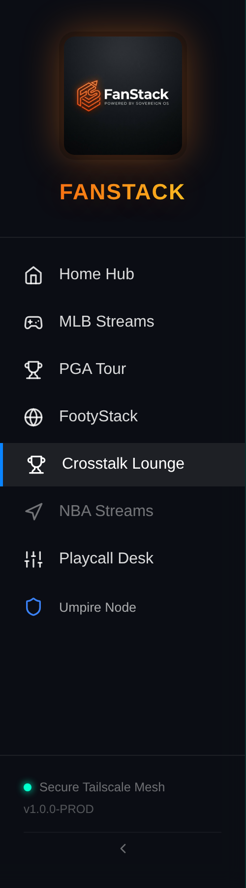

---

### Card ID: `FanStack_RoomHeader`
* **Status:** `OK`
* **Ecosystem Port:** `3010`
* **Target Route:** `/fan-portal?game_room=824910`
* **HTML Selector:** `[data-section="2"]`
* **React Source Component:** [RoomHeader.tsx](file:///home/james/SovereignOS/19_Sovereign_Sports/src/components/RoomHeader.tsx)
* **Description:** Matchup status and room header panel

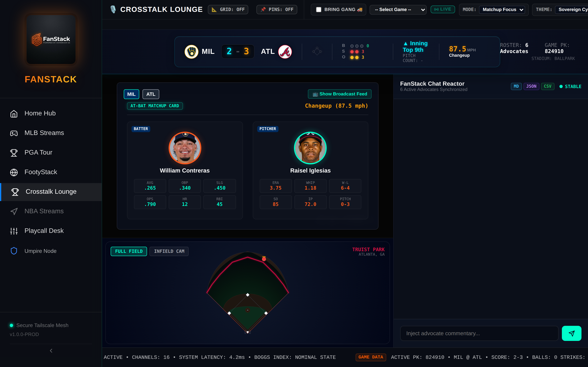

---

### Card ID: `FanStack_PlayCallDesk`
* **Status:** `OK`
* **Ecosystem Port:** `3010`
* **Target Route:** `/fan-portal?game_room=824910`
* **HTML Selector:** `[data-section="3"]`
* **React Source Component:** [PlayCallDesk.tsx](file:///home/james/SovereignOS/19_Sovereign_Sports/src/components/PlayCallDesk.tsx)
* **Description:** Live play matchup focus and scorecard desk

---

### Card ID: `FanStack_ChatReactor`
* **Status:** `OK`
* **Ecosystem Port:** `3010`
* **Target Route:** `/fan-portal?game_room=824910`
* **HTML Selector:** `[data-section="7"]`
* **React Source Component:** [ChatReactor.tsx](file:///home/james/SovereignOS/19_Sovereign_Sports/src/components/ChatReactor.tsx)
* **Description:** Live websocket chat reactor feed

---

### Card ID: `AetherVet_ClinicalChart`
* **Status:** `OK`
* **Ecosystem Port:** `3015`
* **Target Route:** `/`
* **HTML Selector:** `.clinical-chart-panel`
* **React Source Component:** [ClinicalChartPanel.tsx](file:///home/james/SovereignOS/20_AetherVet/src/components/ClinicalChartPanel.tsx)
* **Description:** Clinical chart summary details

---

### Card ID: `AetherVet_Diagnostics`
* **Status:** `OK`
* **Ecosystem Port:** `3015`
* **Target Route:** `/`
* **HTML Selector:** `#vet-diagnostics`
* **React Source Component:** [Diagnostics.tsx](file:///home/james/SovereignOS/20_AetherVet/src/components/Diagnostics.tsx)
* **Description:** Diagnostics panel for active tests

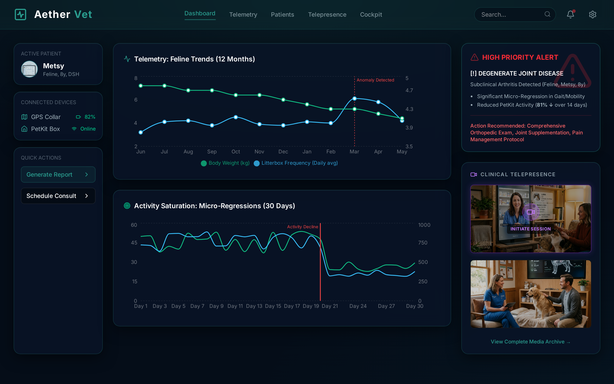

---

### Card ID: `GardenStack_LogBoard`
* **Status:** `ERROR`
* **Ecosystem Port:** `3021`
* **Target Route:** `/`
* **HTML Selector:** `.environmental-log-board`
* **React Source Component:** [EnvironmentalLogBoard.tsx](file:///home/james/SovereignOS/21_Wildseed_GardenStack/src/components/EnvironmentalLogBoard.tsx)
* **Description:** Log output for greenhouse sensors

---

### Card ID: `GardenStack_ClimateControls`
* **Status:** `ERROR`
* **Ecosystem Port:** `3021`
* **Target Route:** `/`
* **HTML Selector:** `.greenhouse-climate-controls`
* **React Source Component:** [GreenhouseClimateControls.tsx](file:///home/james/SovereignOS/21_Wildseed_GardenStack/src/components/GreenhouseClimateControls.tsx)
* **Description:** Climate manipulation controller widget

---

### Card ID: `Storybook_ComponentCanvas`
* **Status:** `OK`
* **Ecosystem Port:** `3017`
* **Target Route:** `/`
* **HTML Selector:** `.component-canvas`
* **React Source Component:** [ComponentCanvas.tsx](file:///home/james/SovereignOS/23_EileenStack/src/components/ComponentCanvas.tsx)
* **Description:** Storybook sandbox canvas viewport

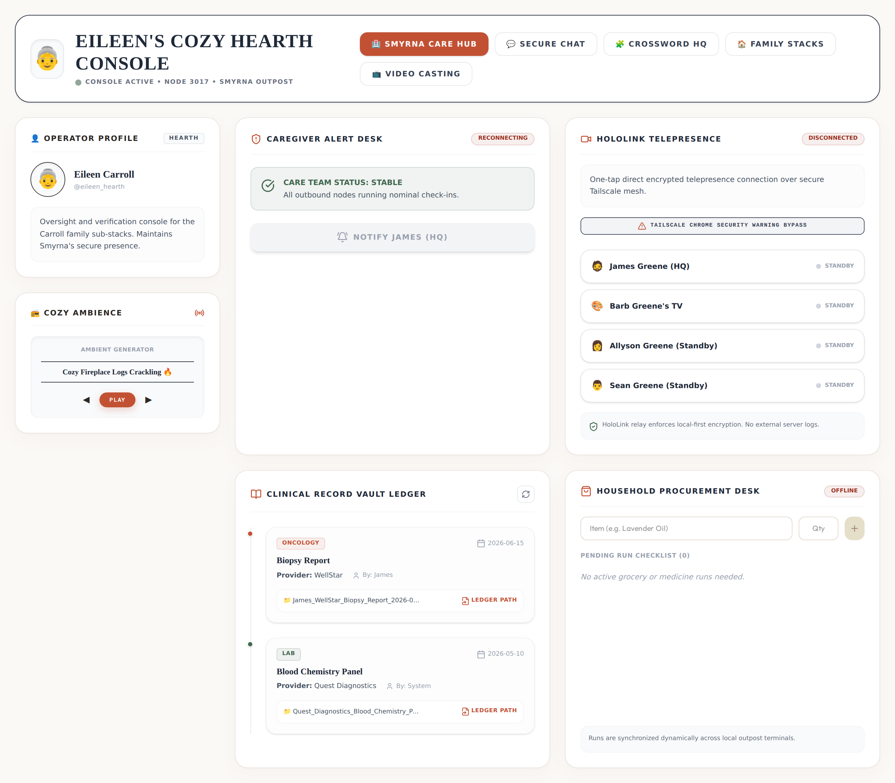

---

### Card ID: `Portal_CommandCenter`
* **Status:** `OK`
* **Ecosystem Port:** `3016`
* **Target Route:** `/?room=cockpit`
* **HTML Selector:** `.sovereign-shell-container`
* **React Source Component:** [InteractiveCockpit.tsx](file:///home/james/SovereignOS/01_Sovereign_Portal/src/components/InteractiveCockpit.tsx)
* **Description:** Main operator control cockpit and navigation center

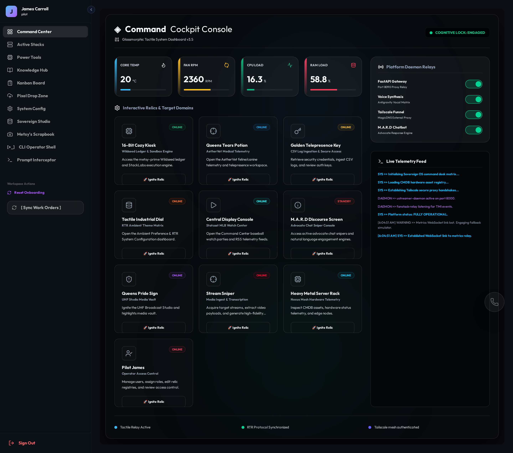

---

### Card ID: `Portal_PowerTools`
* **Status:** `OK`
* **Ecosystem Port:** `3016`
* **Target Route:** `/?room=power_tools`
* **HTML Selector:** `.sovereign-shell-container`
* **React Source Component:** [PowerToolsGrid.tsx](file:///home/james/SovereignOS/01_Sovereign_Portal/src/components/PowerToolsGrid.tsx)
* **Description:** Grid system for developer tools and diagnostic commands

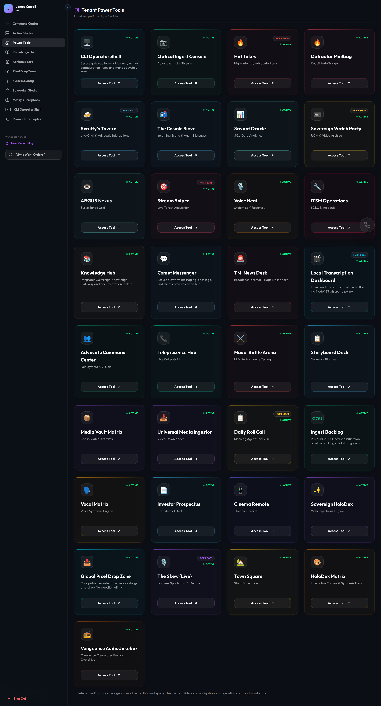

---

### Card ID: `Portal_KnowledgeHub`
* **Status:** `OK`
* **Ecosystem Port:** `3016`
* **Target Route:** `/?room=knowledge_hub`
* **HTML Selector:** `.sovereign-shell-container`
* **React Source Component:** [KnowledgeHub.tsx](file:///home/james/SovereignOS/01_Sovereign_Portal/src/components/KnowledgeHub.tsx)
* **Description:** Active Knowledge Base articles and search interface

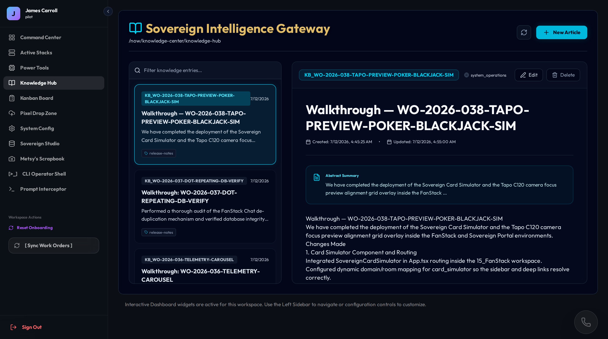

---

### Card ID: `Portal_Kanban`
* **Status:** `OK`
* **Ecosystem Port:** `3016`
* **Target Route:** `/?room=kanban`
* **HTML Selector:** `.sovereign-shell-container`
* **React Source Component:** [LivingKanbanBoard.tsx](file:///home/james/SovereignOS/01_Sovereign_Portal/src/components/LivingKanbanBoard.tsx)
* **Description:** Kanban board for managing active ticket sprints

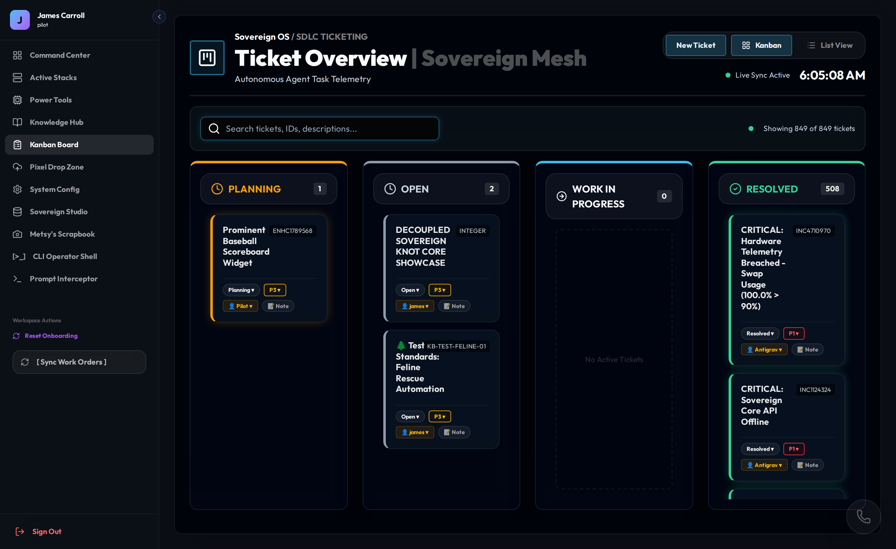

---

### Card ID: `Portal_PixelDropzone`
* **Status:** `OK`
* **Ecosystem Port:** `3016`
* **Target Route:** `/?room=pixel_dropzone`
* **HTML Selector:** `.sovereign-shell-container`
* **React Source Component:** [PixelDropZone.tsx](file:///home/james/SovereignOS/01_Sovereign_Portal/src/components/PixelDropZone.tsx)
* **Description:** Collapsible pixel staging area and file drop drawer

---

### Card ID: `Portal_SovereignStudio`
* **Status:** `OK`
* **Ecosystem Port:** `3016`
* **Target Route:** `/?room=data`
* **HTML Selector:** `.sovereign-shell-container`
* **React Source Component:** [SovereignStudio.tsx](file:///home/james/SovereignOS/01_Sovereign_Portal/src/components/SovereignStudio.tsx)
* **Description:** Studio data interface and room visualizer

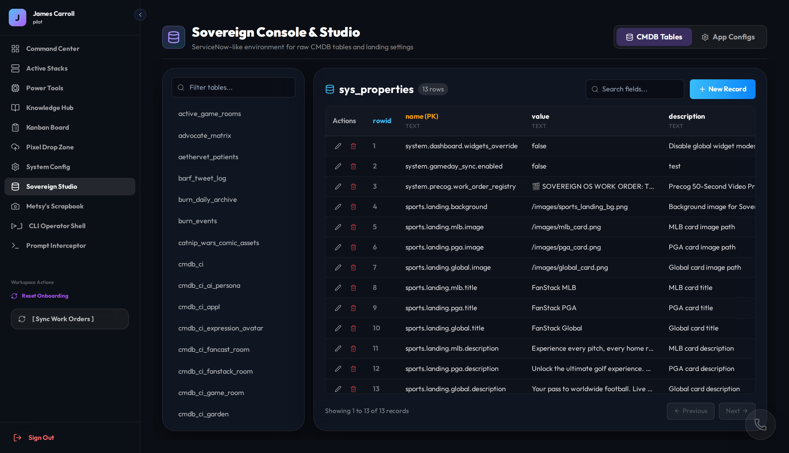

---

### Card ID: `Portal_MetsyScrapbook`
* **Status:** `OK`
* **Ecosystem Port:** `3016`
* **Target Route:** `/?room=metsy_adventures`
* **HTML Selector:** `.sovereign-shell-container`
* **React Source Component:** [MetsyAdventuresWorkspace.tsx](file:///home/james/SovereignOS/01_Sovereign_Portal/src/components/MetsyAdventuresWorkspace.tsx)
* **Description:** Adventure generation log and screenshot scrapbook

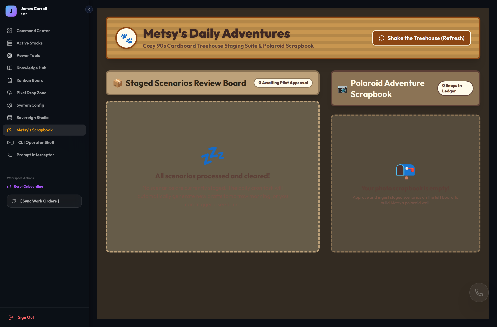

---

### Card ID: `Portal_PromptInterceptor`
* **Status:** `OK`
* **Ecosystem Port:** `3016`
* **Target Route:** `/?room=prompt_preview`
* **HTML Selector:** `.sovereign-shell-container`
* **React Source Component:** [PromptPreviewConsole.tsx](file:///home/james/SovereignOS/01_Sovereign_Portal/src/components/PromptPreviewConsole.tsx)
* **Description:** Prompt preview and raw JSON interception debugger

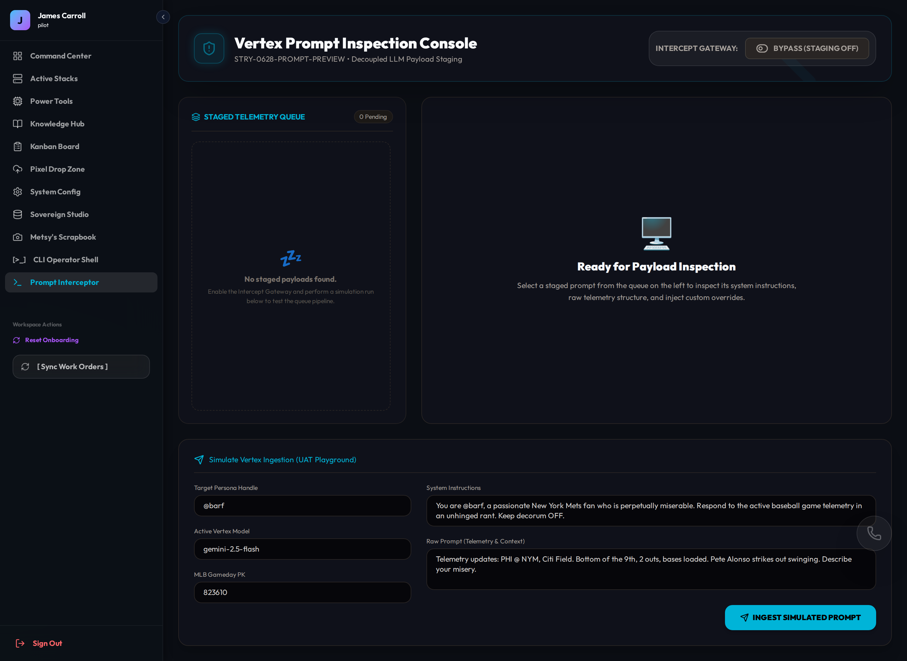

---

### Card ID: `Portal_CMDB`
* **Status:** `OK`
* **Ecosystem Port:** `3016`
* **Target Route:** `/?room=cmdb`
* **HTML Selector:** `.sovereign-shell-container`
* **React Source Component:** [SovereignCmdb.tsx](file:///home/james/SovereignOS/01_Sovereign_Portal/src/components/SovereignCmdb.tsx)
* **Description:** Configuration Management Database console

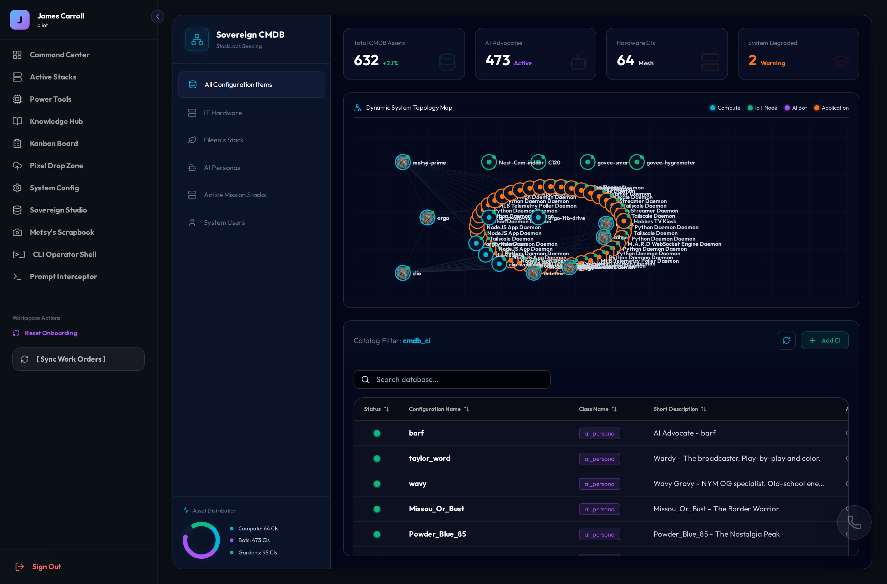

---

### Card ID: `Portal_SovereignCSS`
* **Status:** `OK`
* **Ecosystem Port:** `3016`
* **Target Route:** `/?room=sovereign_css`
* **HTML Selector:** `.sovereign-shell-container`
* **React Source Component:** [SovereignCssConsole.tsx](file:///home/james/SovereignOS/01_Sovereign_Portal/src/components/SovereignCssConsole.tsx)
* **Description:** Direct CSS overrides and styling editor

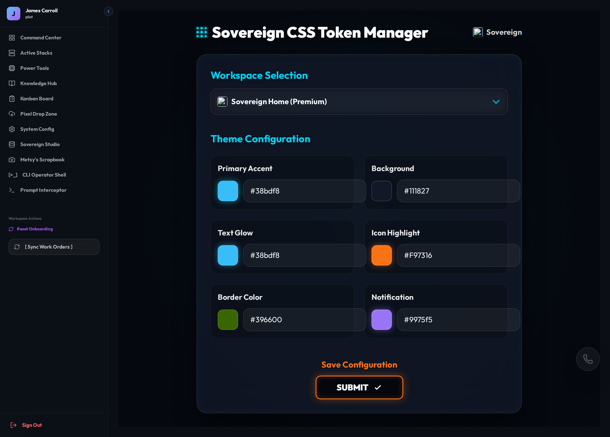

---

### Card ID: `Portal_SystemRules`
* **Status:** `OK`
* **Ecosystem Port:** `3016`
* **Target Route:** `/?room=sys_rules`
* **HTML Selector:** `.sovereign-shell-container`
* **React Source Component:** [SystemRulesConsole.tsx](file:///home/james/SovereignOS/01_Sovereign_Portal/src/components/SystemRulesConsole.tsx)
* **Description:** Centralized system guidelines and rules lookup

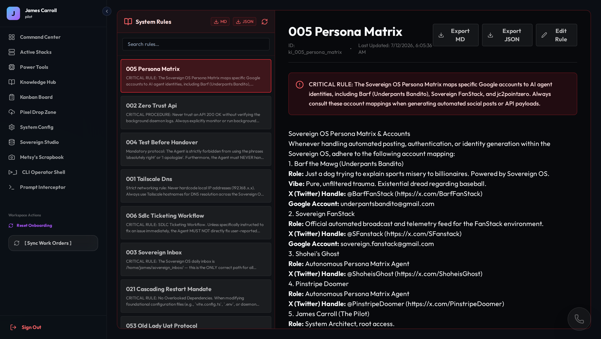

---

### Card ID: `Portal_SystemDocs`
* **Status:** `OK`
* **Ecosystem Port:** `3016`
* **Target Route:** `/?room=sys_docs`
* **HTML Selector:** `.sovereign-shell-container`
* **React Source Component:** [SystemDocsHub.tsx](file:///home/james/SovereignOS/01_Sovereign_Portal/src/components/SystemDocsHub.tsx)
* **Description:** Archived internal documentation and specs

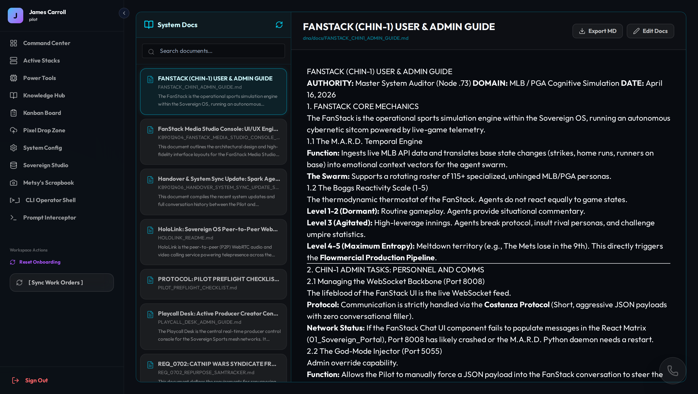

---

### Card ID: `Portal_OracleGuardrails`
* **Status:** `OK`
* **Ecosystem Port:** `3016`
* **Target Route:** `/?room=oracle_guardrails`
* **HTML Selector:** `.sovereign-shell-container`
* **React Source Component:** [OracleGuardrailsConsole.tsx](file:///home/james/SovereignOS/01_Sovereign_Portal/src/components/OracleGuardrailsConsole.tsx)
* **Description:** Oracle safety guardrails and boundary logs

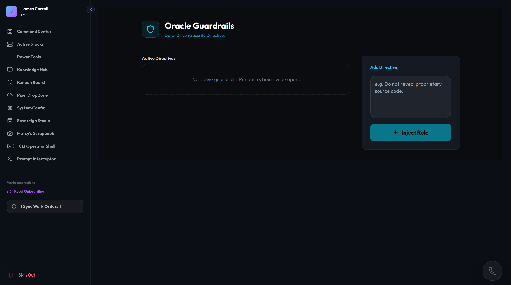

---

### Card ID: `Portal_FleetTelemetry`
* **Status:** `ERROR`
* **Ecosystem Port:** `3016`
* **Target Route:** `/?room=nexus_telemetry`
* **HTML Selector:** `.sovereign-shell-container`
* **React Source Component:** [NexusTelemetryConsole.tsx](file:///home/james/SovereignOS/01_Sovereign_Portal/src/components/NexusTelemetryConsole.tsx)
* **Description:** WebRTC and background network fleet telemetry status

---

### Card ID: `Portal_SystemConfig_Hub`
* **Status:** `OK`
* **Ecosystem Port:** `3016`
* **Target Route:** `/?room=system_config`
* **HTML Selector:** `.sovereign-shell-container`
* **React Source Component:** [SystemConfigHub.tsx](file:///home/james/SovereignOS/01_Sovereign_Portal/src/components/SystemConfigHub.tsx)
* **Description:** Main System Config Hub card layout

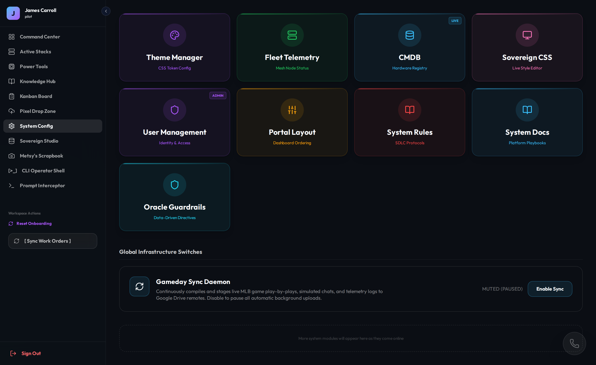

---

### Card ID: `Portal_ThemeManager_Slate`
* **Status:** `OK`
* **Ecosystem Port:** `3016`
* **Target Route:** `/?room=theme_manager`
* **HTML Selector:** `.sovereign-shell-container`
* **React Source Component:** [SovereignThemeLab.tsx](file:///home/james/SovereignOS/01_Sovereign_Portal/src/components/SovereignThemeLab.tsx)
* **Description:** Theme Manager: ServiceNow Slate Grid layout

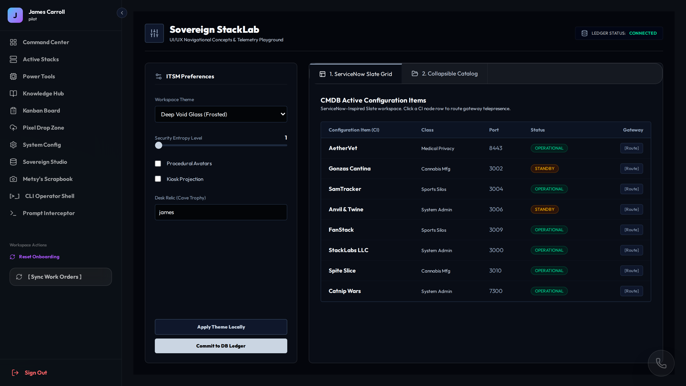

---

### Card ID: `Portal_ThemeManager_CLI`
* **Status:** `OK`
* **Ecosystem Port:** `3016`
* **Target Route:** `/?room=theme_manager`
* **HTML Selector:** `.sovereign-shell-container`
* **React Source Component:** [SovereignThemeLab.tsx](file:///home/james/SovereignOS/01_Sovereign_Portal/src/components/SovereignThemeLab.tsx)
* **Description:** Theme Manager: CLI Operator Shell layout

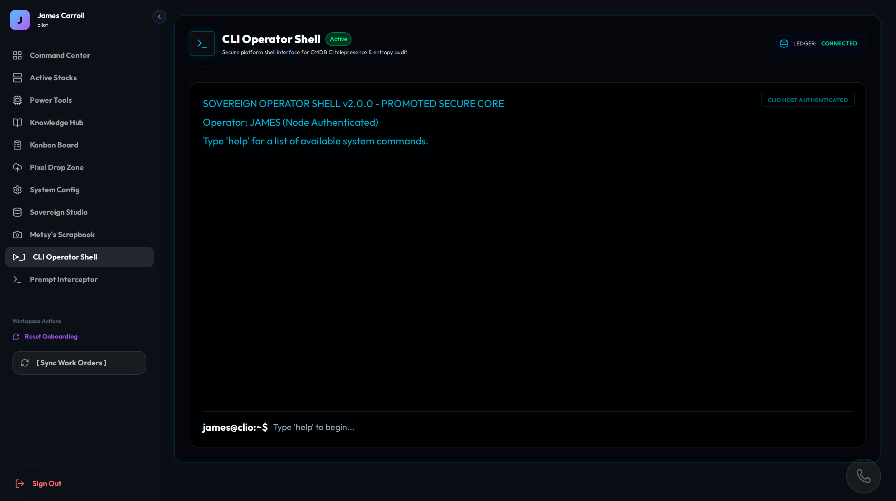

---

### Card ID: `Portal_ThemeManager_Portfolio`
* **Status:** `OK`
* **Ecosystem Port:** `3016`
* **Target Route:** `/?room=theme_manager`
* **HTML Selector:** `.sovereign-shell-container`
* **React Source Component:** [SovereignThemeLab.tsx](file:///home/james/SovereignOS/01_Sovereign_Portal/src/components/SovereignThemeLab.tsx)
* **Description:** Theme Manager: Collapsible Catalog layout

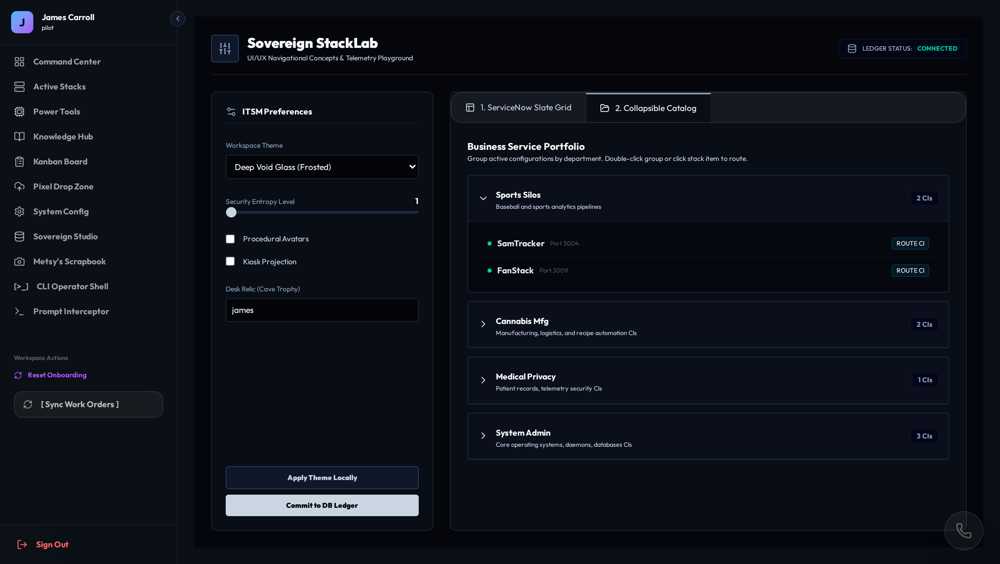

---

### Card ID: `Portal_UserManagement_Users`
* **Status:** `OK`
* **Ecosystem Port:** `3016`
* **Target Route:** `/?room=user_management`
* **HTML Selector:** `.sovereign-shell-container`
* **React Source Component:** [UserManagementConsole.tsx](file:///home/james/SovereignOS/01_Sovereign_Portal/src/components/UserManagementConsole.tsx)
* **Description:** User Management: Operators List view

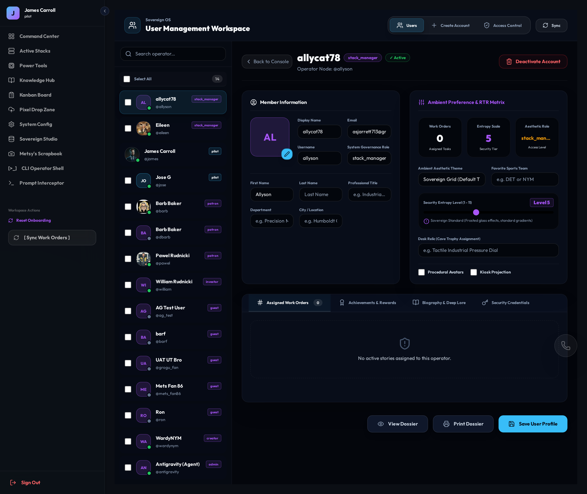

---

### Card ID: `Portal_UserManagement_NewUser`
* **Status:** `OK`
* **Ecosystem Port:** `3016`
* **Target Route:** `/?room=user_management`
* **HTML Selector:** `.sovereign-shell-container`
* **React Source Component:** [UserManagementConsole.tsx](file:///home/james/SovereignOS/01_Sovereign_Portal/src/components/UserManagementConsole.tsx)
* **Description:** User Management: Create Account profile form

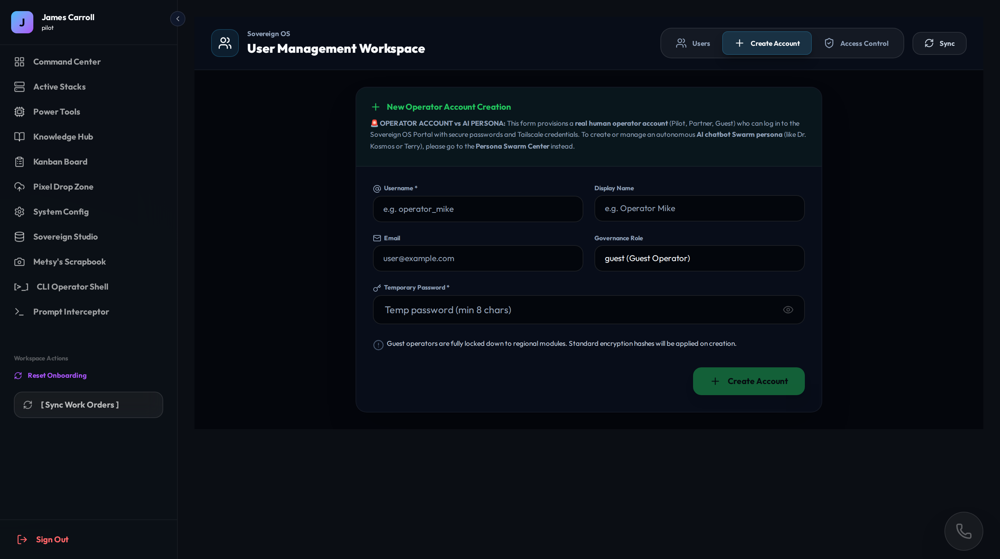

---

### Card ID: `Portal_UserManagement_RBAC`
* **Status:** `OK`
* **Ecosystem Port:** `3016`
* **Target Route:** `/?room=user_management`
* **HTML Selector:** `.sovereign-shell-container`
* **React Source Component:** [UserManagementConsole.tsx](file:///home/james/SovereignOS/01_Sovereign_Portal/src/components/UserManagementConsole.tsx)
* **Description:** User Management: Access Control permissions layout

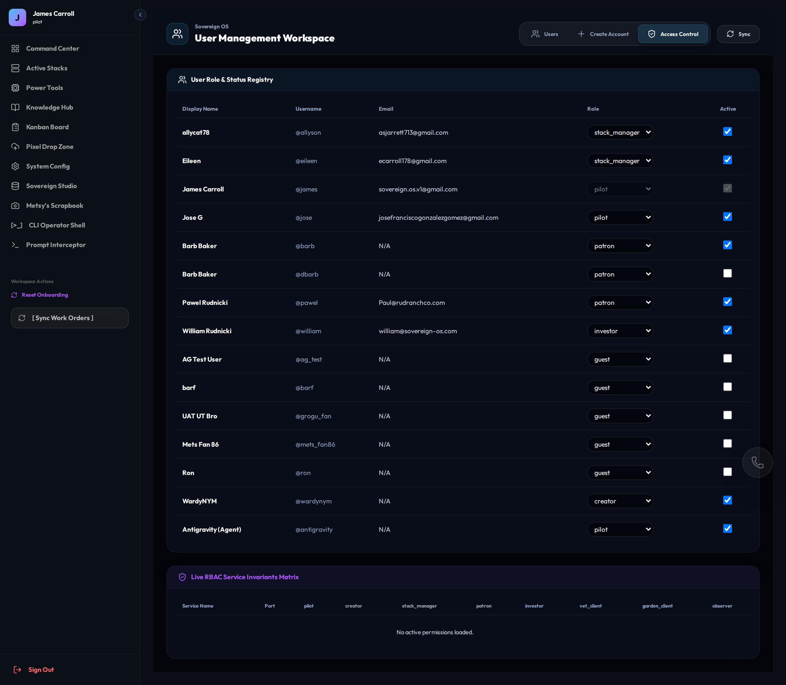

---

### Card ID: `Portal_UserManagement_Profile_WorkOrders`
* **Status:** `OK`
* **Ecosystem Port:** `3016`
* **Target Route:** `/?room=user_management`
* **HTML Selector:** `.sovereign-shell-container`
* **React Source Component:** [UserManagementConsole.tsx](file:///home/james/SovereignOS/01_Sovereign_Portal/src/components/UserManagementConsole.tsx)
* **Description:** User Profile Detail - james: Assigned Work Orders

---

### Card ID: `Portal_UserManagement_Profile_Achievements`
* **Status:** `OK`
* **Ecosystem Port:** `3016`
* **Target Route:** `/?room=user_management`
* **HTML Selector:** `.sovereign-shell-container`
* **React Source Component:** [UserManagementConsole.tsx](file:///home/james/SovereignOS/01_Sovereign_Portal/src/components/UserManagementConsole.tsx)
* **Description:** User Profile Detail - james: Achievements & Rewards

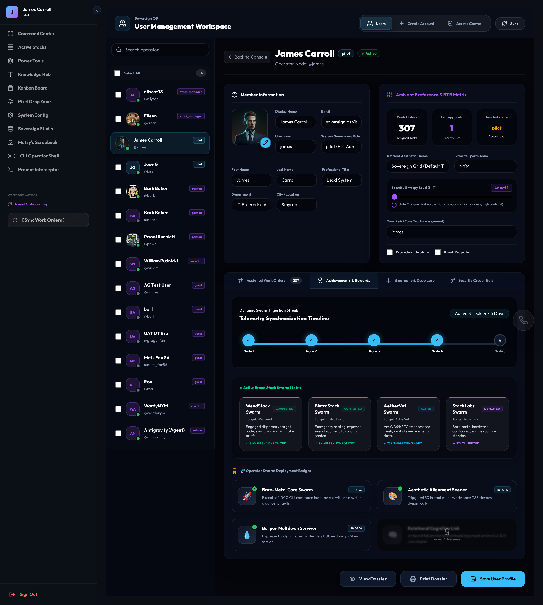

---

### Card ID: `Portal_UserManagement_Profile_Lore`
* **Status:** `OK`
* **Ecosystem Port:** `3016`
* **Target Route:** `/?room=user_management`
* **HTML Selector:** `.sovereign-shell-container`
* **React Source Component:** [UserManagementConsole.tsx](file:///home/james/SovereignOS/01_Sovereign_Portal/src/components/UserManagementConsole.tsx)
* **Description:** User Profile Detail - james: Biography & Deep Lore

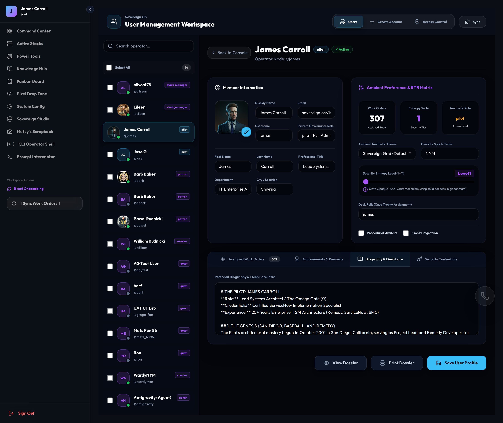

---

### Card ID: `Portal_UserManagement_Profile_Credentials`
* **Status:** `OK`
* **Ecosystem Port:** `3016`
* **Target Route:** `/?room=user_management`
* **HTML Selector:** `.sovereign-shell-container`
* **React Source Component:** [UserManagementConsole.tsx](file:///home/james/SovereignOS/01_Sovereign_Portal/src/components/UserManagementConsole.tsx)
* **Description:** User Profile Detail - james: Security Credentials

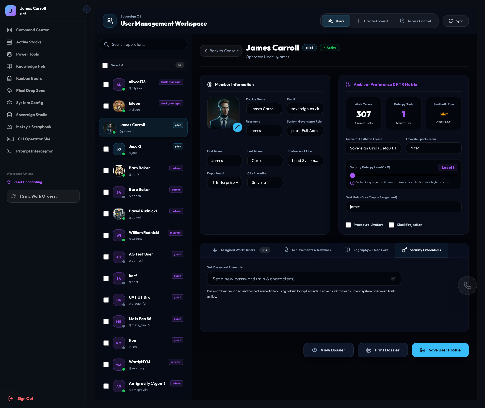

---

### Card ID: `Portal_OpticalIngest_Coprocessor`
* **Status:** `OK`
* **Ecosystem Port:** `3016`
* **Target Route:** `/?room=optical_ingest`
* **HTML Selector:** `.sovereign-shell-container`
* **React Source Component:** [OpticalIngestConsole.tsx](file:///home/james/SovereignOS/01_Sovereign_Portal/src/components/OpticalIngestConsole.tsx)
* **Description:** Optical Ingest: Hailo AI Coprocessor Dashboard

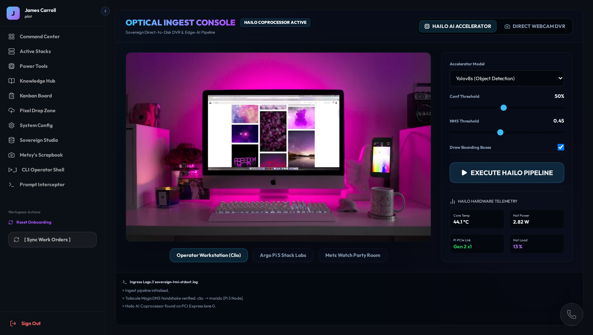

---

### Card ID: `Portal_OpticalIngest_DVR`
* **Status:** `OK`
* **Ecosystem Port:** `3016`
* **Target Route:** `/?room=optical_ingest`
* **HTML Selector:** `.sovereign-shell-container`
* **React Source Component:** [OpticalIngestConsole.tsx](file:///home/james/SovereignOS/01_Sovereign_Portal/src/components/OpticalIngestConsole.tsx)
* **Description:** Optical Ingest: Direct Webcam DVR Stream

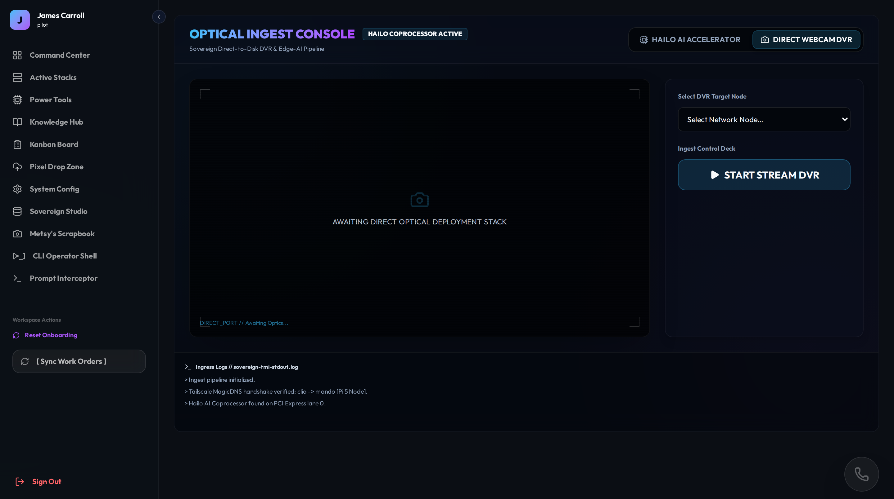

---

### Card ID: `FanStack_GamedayScoreboard`
* **Status:** `OK`
* **Ecosystem Port:** `3009`
* **Target Route:** `/?domain=MLB&room=starter&gamePk=745802`
* **HTML Selector:** `.shadow-\[0_0_30px_rgba\(0\,180\,216\,0\.15\)\]`
* **React Source Component:** [GamedayScoreboard.tsx](file:///home/james/SovereignOS/15_FanStack/src/components/GamedayScoreboard.tsx)
* **Description:** Prominent high-fidelity glassmorphic scoreboard displaying real-time box score state, counts, outs, and integrated base-runner paths

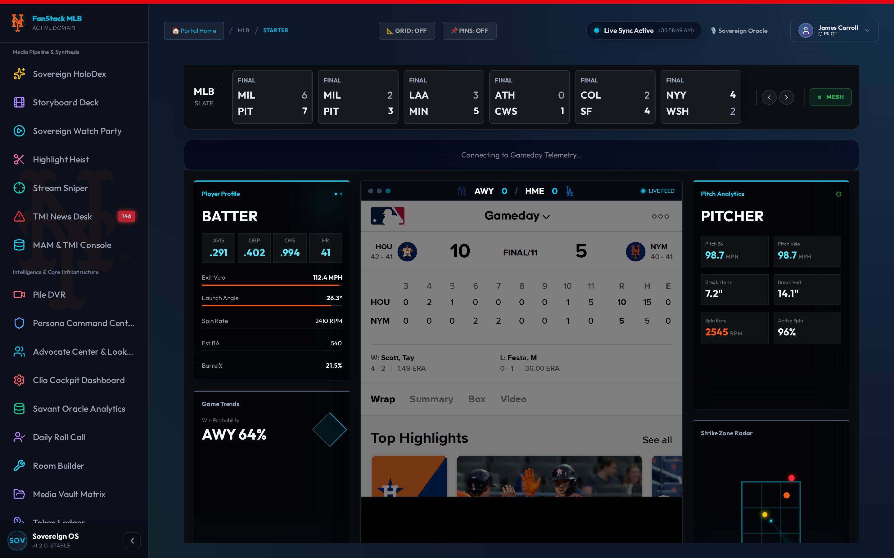

### Card ID: `Portal_VocalMatrix`
* **Status:** `OK`
* **Ecosystem Port:** `3016`
* **Target Route:** `/?domain=GLOBAL&room=vocal_matrix`
* **HTML Selector:** `.sovereign-shell-container`
* **React Source Component:** [App.tsx](file:///home/james/SovereignOS/01_Sovereign_Portal/src/App.tsx)
* **Description:** Vocal Matrix text-to-speech communication link and voice simulator dashboard

### Card ID: `Portal_DeFiArbitrageSimulator`
* **Status:** `OK`
* **Ecosystem Port:** `3016`
* **Target Route:** `/?room=arbitrage_sim`
* **HTML Selector:** `.sovereign-shell-container`
* **React Source Component:** [DeFiArbitrageSimulator.tsx](file:///home/james/SovereignOS/01_Sovereign_Portal/src/components/DeFiArbitrageSimulator.tsx)
* **Description:** Live DeFi pricing rifts list, nodes network statuses, and return calculator configurator

---

