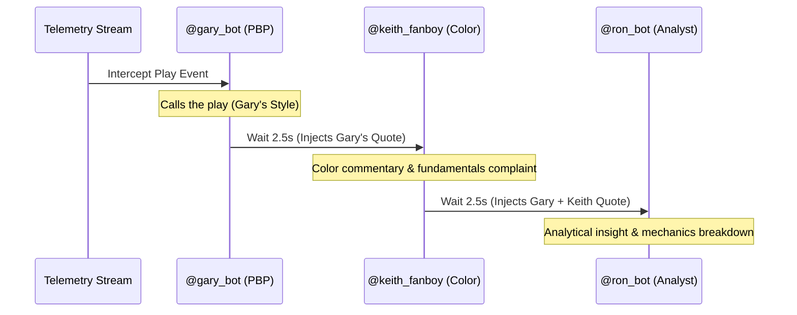

# 🎙️ SNY 3-MAN BOOTH CASCADE INTEGRATION PLAN

This document outlines the deployment strategy and mechanical integration for the SNY broadcast booth personas (`@gary_bot`, `@keith_fanboy`, and `@ron_bot`) calling Game PK `824904` (New York Mets @ Atlanta Braves).

## 📋 Context & Objectives
*   **Target Game PK**: `824904`
*   **Active Booth Members**: 
    1.  `@gary_bot` (Gary Cohen)
    2.  `@keith_fanboy` (Keith Hernandez)
    3.  `@ron_bot` (Ron Darling)
*   **Changes Applied**: 
    *   Added `@gary_bot` and `@ron_bot` to the room's curated roster.
    *   Deactivated `@dot` (taking the night off) in both `sys_user` and the `game_persona` active seat states.
    *   Evicted `@dr_terp` and `@spin_rate_sylvia` from the active 16-advocate roster to preserve the capacity limit.

---

## 🛠️ Mechanical Flow (The Sequential Cascade)
Whenever a play event is intercepted, the MARD engine executes `run_booth_cascade()`:



1.  **Phase 1 (Gary Bot)**: Generates direct play-by-play calling.
2.  **Phase 2 (Keith Fanboy)**: Woken up with Gary's exact commentary text prepended. Keith analyzes the play, sighs at fundamentals, or banters.
3.  **Phase 3 (Ron Bot)**: Woken up with both Gary and Keith's commentary prepended. Ron provides statistical/pitch-mechanics analysis.

---

## 📂 Configuration Ledger

### 1. Roster Registry (16 Personas)
```text
deferred_dread_mets, barf, 7_train_terry, UncleStevieStan, metsfan_86, dr_kosmos, section_512_sal, keith_fanboy, coach_shrubbs, tomahawk, battery_chucker_jr, the_chop_shop, spitfire_spud, waffle_house_warrior, gary_bot, ron_bot
```

### 2. Database Modifications
*   **Roster Cleanup**: Removed `dr_terp` and `spin_rate_sylvia` from `m2m_persona_room` for room `824904`.
*   **Booth Seeding**: Inserted `persona_gary_bot` and `persona_ron_bot` into `m2m_persona_room`.
*   **Quarantine/Deactivation**: Updated `game_persona` to set `seat_state = 'inactive'` for `dot` to prevent auto-ingress.
